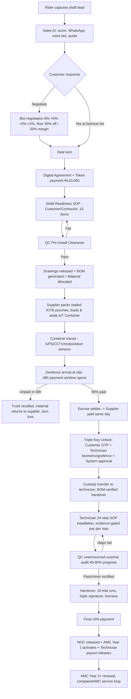
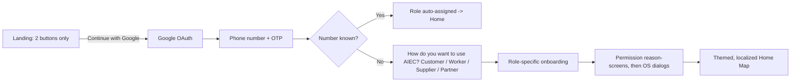
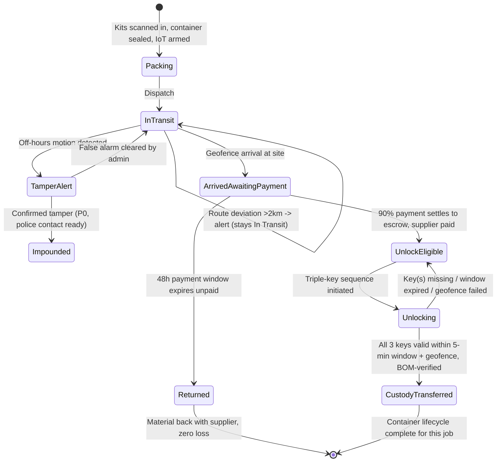
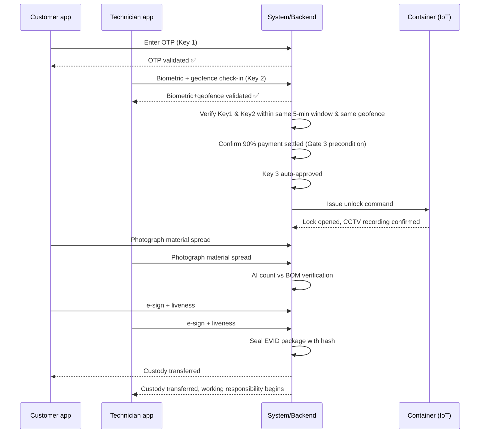
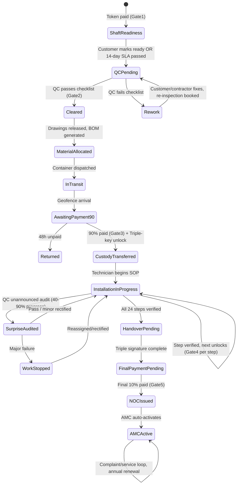

# AIEC PLATFORM — MASTER PRODUCT REQUIREMENTS DOCUMENT (PRD)

**Source of truth:** AIEC Platform Operating Manual v3.0 (Owner: Mr. Prashant Vasant Wable, Pune, Maharashtra). All business rules, terminology, IDs, amounts and workflows below are extracted from that manual unless explicitly tagged otherwise.

**Legend used throughout this PRD:**

| Tag | Meaning |
|---|---|
| **[SOURCE]** | Stated directly in the Operating Manual — a hard requirement |
| **[INFERENCE]** | Reasonable product inference from the source, not stated verbatim |
| **[RECOMMENDED IMPLEMENTATION — NOT SOURCE REQUIREMENT]** | A technical recommendation added to make the source buildable; not mandated by the manual |
| **[LEGAL/COMPLIANCE DEPENDENCY]** | Requires legal, regulatory, or licensing resolution before or during build |
| **«TBD / PRODUCT DECISION REQUIRED»** | Not defined in the source; must not be invented |

Example figures from the source (e.g. ₹6,15,000 deal value, ₹40/lead, ₹10,000 token) are **illustrative configuration values from the manual's worked example**, not immutable code constants. Every monetary amount in this PRD must be implemented as admin-configurable rate-card data (Section 10, Section 31/A7), versioned and audited — never hard-coded.

---

## HOW TO READ THIS PRD

This PRD mirrors the manual's own structure: **the system is the manager.** Twelve non-negotiable "Laws" (Section 4) are compiled into every screen and every service. Five payment gates make money flow only in one direction: forward, and only on verified evidence. This document translates that operating philosophy into buildable specification — data model, state machines, APIs, RBAC, offline architecture, and a Claude Code implementation backlog — without softening, generalizing, or silently altering any of it.

---

# SECTION 1 — EXECUTIVE SUMMARY

**Product name:** AIEC Platform (All India Elevators Company) **[SOURCE]**

**Product purpose [SOURCE]:** A software platform that runs the entire lift (elevator) sales-to-installation-to-maintenance lifecycle as an automated, evidence-gated production line — from a field rider spotting a ready shaft, through AI-driven sales, milestone-gated payments, IoT-secured material logistics, SOP-enforced installation, to handover, NOC, and AMC.

**Business model [SOURCE]:** Asset-light aggregator. AIEC owns no lifts, no inventory, no vehicles, no warehouses, and employs no installation labour directly. It owns the platform, the customer relationship, and the evidence/payment rails that make three independent parties (customer, supplier, technician) transact with near-zero counterparty risk. Revenue is the margin embedded in the sale price of each lift (worked example: ~19–23% net/contribution margin on a ₹6,15,000 deal — **illustrative, not fixed** **[SOURCE, illustrative]**).

**Target users [SOURCE]:** 9 roles — Rider, Sales AI (mostly automated, one human "Sales Desk operator"), Customer, QC Inspector, Supplier, Technician (L1–L4), Admin, Owner, plus a "New Worker" onboarding funnel that feeds the Technician/QC pipeline.

**Core problem [SOURCE/INFERENCE]:** Traditional elevator businesses in India suffer from unverifiable field work, slow lead-to-shaft-ready cycles, disputed installation quality, cash-flow risk from carrying inventory and 60–90 day supplier credit, and un-provable liability when something goes wrong. The manual explicitly states the goal is a "no liability, zero risk model" for **financial, material, and disputational** risk — while the manual itself flags that **statutory safety liability cannot be eliminated by technology alone** (Section 4, Law 12 honest limit; Part 14 Risk Register).

**Proposed solution [SOURCE]:** A single mobile/web platform where every entity (lead, customer, lift, agreement, container, technician, evidence, rupee) carries a location-aware unique ID; every role works from a live map, not a list; an AI Master Controller runs each role's daily schedule and gates money to verified evidence only; and five hard payment gates make fraud and non-payment structurally difficult rather than merely policed.

**Operating model [SOURCE]:** `Rider finds shaft → Bot sells lift → Customer pays token → QC clears shaft → Container ships → Customer pays 90% → Technician installs → QC audits → Handover → Final 10% → NOC → AMC`. This sequence is the literal information architecture of the product — see Section 3.

**Automation philosophy [SOURCE]:** Target ≥95% of state transitions occur with zero human involvement (the System Efficiency Index, Section 32). Humans are deliberately inserted at exactly three points: manual negotiation below the 30%-discount / above-20%-margin line, evidence disputes, and safety escalations. The Admin console is exception-only by design — "if the admin is watching things go right, the automation has failed."

**Major differentiators [SOURCE]:**
- Camera-only, geofenced, server-timestamped evidence on every claim of work (no gallery upload exists anywhere in evidence flows).
- A hard-coded 20% margin floor that no human below Owner, and no bot, can cross.
- Triple-key container unlock (customer OTP + technician biometric+geofence + system approval) — 2 of 3 opens nothing, with no override at any level.
- Phase-sealed, barcoded material pouches (`KITB`) that only unlock at the SOP step they belong to.
- A worked money map showing every rupee's origin and destination on a single deal (Section 11 of the manual).
- Three-language (English/Marathi/Hindi) parity across UI, legal documents, SOP text, and voice/AI — not just UI strings.

**Success definition [SOURCE]:** System Efficiency Index ≥95% automated state transitions, admin human interventions <20/day, admin hours <4/day, AI evidence accuracy ≥97%, SLA adherence tracked, rework rate minimized, and — per Part 14 — an honest acknowledgment that "zero liability" is a financial/material/disputational claim, not a statutory-safety claim.

---

# SECTION 2 — PRODUCT VISION

### What AIEC is **[SOURCE]**
A production-line operating system for the elevator installation business, where software — not a human manager — sequences work, verifies it, and releases money against it. The manual's own framing: *"This document describes a business in which the system is the manager. Every rule ... exists to remove a human decision from the loop, and every workflow point ... is a station on a production line with a gate at the entrance and a gate at the exit."*

### What AIEC is not **[SOURCE/INFERENCE]**
- Not a CRM or ticketing system bolted onto a traditional elevator company.
- Not an inventory-holding, capital-intensive manufacturer or installer — it aggregates independent suppliers and technicians rather than employing them.
- Not (per the manual's own honest caveat) a legal shield against statutory lift-safety liability. It reduces **financial, material, and disputational** risk to near zero; it explicitly does **not** and cannot eliminate **statutory/safety** liability under Maharashtra's Lifts, Escalators and Moving Walkways Act (Part 14, Risk #1) **[LEGAL/COMPLIANCE DEPENDENCY]**.
- Not a system where any actor — including the platform's own Admin — can unilaterally waive a payment gate, override the margin floor, or approve a container unlock with only 2 of 3 keys present.

### Why the platform exists **[SOURCE]**
Elevator sales-to-install cycles in this market lose weeks to unverifiable shaft readiness, undocumented installation quality, and slow-moving receivables. The manual's thesis: if every action produces a location-, time-, and identity-stamped evidence record, and every payment is gated to a verifiable milestone, disputes become forensic (`pull one ID, replay its timeline`) instead of adversarial, and the business can run on aggregated, independent capacity instead of payroll.

### How software controls the physical lift-project lifecycle **[SOURCE]**
Through five gates that money and material cannot cross without: (1) token payment before any agreement/project exists, (2) QC clearance before drawings or material release, (3) 90% payment before the container unlocks, (4) verified SOP evidence before any worker is credited, (5) final 10% payment before the NOC is released. Each gate is enforced server-side, is evidenced with camera/GPS/biometric proof where applicable, and is immutable once passed (Section 4).

### How AI, payments, evidence, and automation interact **[SOURCE]**
The AI Master Controller (Law 3) dispatches tasks on a timed schedule per role, verifies GPS/timestamp/photo content/SOP order before allowing "Done," escalates on a fixed ladder (nudge → warning → penalty → reassign → flag), gates money to verification, and learns from outcomes. Evidence (Section 26) is the currency that unlocks payment; payment is the currency that unlocks the next physical stage (drawings, material, custody transfer, NOC).

---

# SECTION 3 — BUSINESS WORKFLOW

**Full lifecycle [SOURCE]:**
`Lead discovery (Rider) → Sales AI qualification/quote/negotiation → Digital agreement + Token payment → Shaft-readiness SOP (Customer) → QC pre-install clearance → Drawings released → BOM & material packing (Supplier) → Container dispatch & IoT transit → 90% payment gate → Triple-key unlock & custody transfer → Technician SOP installation (24 steps) → QC surprise audit → Handover (10 trial runs, triple signature) → Final 10% payment → NOC release → AMC (Year 1 included, Year 2+ renewal)`



**Stage table [SOURCE, structured per PRD template]:**

| Stage | Actor | Trigger | Input | System Action | Human Action | Payment Gate | Evidence | Output | Next State |
|---|---|---|---|---|---|---|---|---|---|
| 1. Lead capture | Rider | Rider spots a shaft, taps Capture | 3 photos, GPS, floor count, owner contact | Creates `LEAD` ID; duplicate check (50m); quality score; auto-forwards to Sales queue | Rider frames photo, taps submit (~11s target) | None (company pays rider ₹40/lead-scale reward) | 3 `EVID` photos, GPS, timestamp | `LEAD` record, Sales-queue entry | Lead: New → Scored |
| 2. Lead scoring & first contact | Sales AI | Lead lands in queue | Lead data | Scoring engine (weighted: shaft readiness, floors, zone history, contact quality, builder type, photo clarity); routes Hot/Warm/Cold | None | None | Score log | Hot leads enter WhatsApp sequence in ≤60s | Lead: Scored → Contacted |
| 3. WhatsApp + voice qualification | Sales AI / Customer | Hot lead scored | Site photos, template message | Sends WhatsApp with site's own photo; branches on quick-reply; voice bot calls within 2 min on "Yes"; collects 6 data points | Customer taps quick-reply / answers 6 voice questions | None | `CHAT` transcript + call recording | Lead qualified with spec (floors, capacity, type, finish, timeline, decision-maker) | Lead: Contacted → Qualified |
| 4. Quotation generation | Sales AI | Qualification complete | Site photos (AI vision), voice answers, zone logistics cost, supplier rate card, material index | Computes base cost; applies 60% list markup; generates `QUOT` PDF (versioned) | None | None | `QUOT` ID, PDF | Quotation delivered | Lead: Qualified → Quoted |
| 5. Negotiation | Sales AI / Sales Desk (human) | Customer responds to quote | Quote, customer objections | Negotiation bot concedes in decreasing steps to a 30%-discount / ~20–23% margin floor; escalates to human desk if customer pushes below floor or asks for a person | Human desk negotiates 20–30% margin band only; <20% requires Owner override with written reason | Margin floor: **hard-blocked below 20%**, code-enforced | Full transcript, quote version history | Deal Won or Deal Lost (with reason) | Lead: Quoted → Won/Lost |
| 6. Agreement + Token | Sales AI / Customer | Deal won | Final price | Auto-generates digital agreement; opens OTP + e-sign + liveness selfie flow; opens ₹10,000 (illustrative) token payment in the same flow | Customer reads (3-language), OTP-verifies, e-signs, pays token | **GATE 1: No token → no agreement/project** | Signed `AGMT` PDF (hashed), liveness selfie, payment receipt | `CUST`, `LIFT`, `AGMT` created; 8 automatic cascades fire (rider commission, QC auto-scheduled, supplier notified, AMC pre-enrolled, etc.) | Project: None → Active (Shaft Readiness) |
| 7. Shaft readiness | Customer / Contractor | Token cleared | 10-item photo checklist | AI pre-checks each upload (shaft visibility, tape legibility, geotag); tracks 14-day target with day 3/7/10/13 reminders | Customer or delegated contractor (guest link) uploads photos per item | None (readiness gates QC scheduling, not money) | 10 geofenced/camera-only `EVID` items | Shaft marked Ready or still Pending | Project: Shaft Readiness → QC Pending |
| 8. QC pre-install clearance | QC Inspector | Shaft marked ready (or 14-day SLA passed) | 18-item dimensional/electrical/safety checklist | Auto-assigns nearest available inspector; AI cross-checks measurements vs GA drawing tolerance | Inspector geofence check-in, works checklist with mandatory photo per item, signs report | **GATE 2: No QC clearance → no drawings, no material** | `QCIN` report + photos, digital signature | Cleared → drawings released, material allocated; Failed → rework list, re-inspection booked | Project: QC Pending → Cleared / Rework |
| 9. BOM, packing, dispatch | Supplier | QC clearance | GA drawing, order allocation | Weighted allocation engine ranks suppliers; BOM computed (exact cable length etc.); phase-sealed `KITB` pouches generated per SOP step | Supplier packs pouches, loads & seals container, arms IoT array | None | Packing photos, seal photo, container-load photo | `CONT` sealed and dispatched | Material: Allocated → In Transit |
| 10. Transit & arrival | System / IoT | Container dispatched | GPS, motion, door sensor, CCTV streams | Live tracking; route-deviation and off-hours-motion alerts; geofence arrival opens 48h payment window | None (customer notified) | — | Telemetry log, alert history | Container geofenced at site | Container: In Transit → Awaiting Payment |
| 11. 90% payment | Customer | Container arrives | Payment amount (90% of price) | Payment or NBFC EMI decisioning; on success settles to escrow, auto-pays supplier same day; on non-payment in 48h recalls truck | Customer pays or applies for EMI | **GATE 3: No 90% payment → container never unlocks** | Payment receipt, escrow ledger entry | Unlock eligible / Container returned to supplier | Container: Awaiting Payment → Unlock-Eligible / Returned |
| 12. Triple-key unlock & custody transfer | Customer + Technician + System | 90% cleared, all parties present | OTP, biometric, geofence | Validates 3 keys within same 5-min window & geofence; AI verifies item count vs BOM; seals evidence package with hash | Customer enters OTP; technician biometric; both photograph and e-sign with liveness | Implicit continuation of Gate 3 | Full `EVID` package (photos, signatures, liveness, hash) | Material custody transfers to technician under site responsibility | Container: Unlock-Eligible → Unlocked/Custody Transferred |
| 13. Installation (24-step SOP) | Technician | Custody transferred | Kit contents, GA drawing, SOP definitions | Each step gated by prior-step verification; AI checks geofence/timestamp/content/alignment/torque/hash/sequence/face-match; instant per-step pay on pass | Technician executes step, captures required evidence, submits | **GATE 4: No verified SOP evidence → no worker credit** | Per-step `EVID` set (photos/video), `SOPX` record | Step Verified → next step unlocks; job Ahead/On-track/Slipping tracked against 14-day SLA | Job: In Progress (step N) |
| 14. QC surprise audit | QC Inspector | Random trigger between 40–90% progress | Installation state | Randomly selects timing/inspector; enforces 90-day no-repeat rotation and different-zone rule; assigns ≤60 min before arrival | Inspector audits SOP adherence, torque, alignment, wiring, safety gear, material usage vs BOM, unannounced | Gate: **payout release conditioned on pass** | Audit checklist + photos + signature | Pass → payout releases on completion; Fail → work stopped, payout frozen | Job: In Progress → Audited (Pass/Fail) |
| 15. Handover | Customer + Technician + QC | Installation + audit complete | 10 trial-run protocol | Logs each run (floor, timing, levelling, ride quality); opens final-10% payment screen after triple signature | All three physically present (geofenced); customer performs 10 supervised runs, rates lift & technician; all three sign with liveness | Precondition for Gate 5 | Trial-run logs, ratings, 3 signatures with liveness | Handover complete, pending final payment | Project: Audited → Handover Pending Payment |
| 16. Final payment, NOC, AMC | Customer | Handover complete | Final 10% amount | On payment clearing: releases NOC + warranty + operating manual PDFs; activates AMC; releases technician's held payout; turns map pin green | Customer pays final 10% | **GATE 5: No final 10% → no NOC** | Payment receipt, NOC document (hash-stored) | Project: Handover → NOC Issued → AMC Active | Project: Complete |
| 17. AMC & service | Customer / Technician | NOC issued (Year 1) or annual renewal | Complaint or scheduled visit | Triages complaints (safety-critical bypasses all SLAs); predictive maintenance flags from IoT-style usage data | Technician attends service call, logs visit with evidence | Renewal payment (Year 2+) | `CMPL` records, service checklist photos | AMC Year N active / renewed | Project: AMC Ongoing |

### How the platform coordinates each function **[SOURCE]**
- **Demand discovery:** Rider module — map-first, 11-second capture target, AI duplicate/quality scoring, instant micro-reward.
- **Sales:** ~90% automated bot pipeline (WhatsApp → voice bot → quote engine → negotiation bot), human Sales Desk only below the 30%-discount line or on explicit customer request for a human.
- **Customer:** Progress-ring-first UI showing exactly one next action; drawings/container/installation/handover/AMC all surfaced without the customer needing to chase status.
- **QC:** Independent, non-installing role (Level-5 promoted technicians only) performing two distinct inspections — scheduled pre-install clearance and unannounced post-install audit — both evidence-gated and rotation-locked against collusion.
- **Supplier:** Weighted-ranked allocation, phase-sealed kit packing, IoT-secured container, paid same-day on delivery-and-customer-payment rather than on credit terms.
- **Container logistics:** A physical asset (GPS, motion, door sensor, dual CCTV, digital lock, battery+solar, siren) that is itself a state machine, gated by the triple-key protocol.
- **Technician:** AI-supervised, map-first, micro-money-per-step, 24-step SOP with sequence locks and multi-signal fraud detection.
- **Payments:** Five hard gates plus a Friday payout cycle, wallet ledger (Pending → Cleared), and a gamification budget cap enforced in code.
- **Evidence:** Every claim of work, arrival, payment-adjacent action, or signature produces a camera/GPS/time-stamped, hash-sealed `EVID` record.
- **AI:** Runs scoring, quoting, negotiation (bounded), evidence verification, fraud detection, scheduling/escalation, and SLA diagnostics — but never overrides a payment gate, the margin floor, or a missing unlock key.
- **Exceptions:** A 24-scenario playbook (Section 30) defines automatic vs human response for everything from GPS spoofing to a person trapped in a lift.
- **AMC:** Pre-enrolled at token payment, activates at NOC, renews annually, and feeds a predictive-maintenance loop from installation and service evidence.
- **Owner operations:** Four-panel strategic dashboard (cash, growth heatmap, System Efficiency Index, strategic alerts) — deliberately excludes anything actionable "today."

### Asset-light / aggregator / automated operating model **[SOURCE — Law 12]**
- **Asset-light:** No lifts, inventory, vehicles, or warehouses owned by AIEC. Material sits with the supplier until the customer's own payment funds its release.
- **Aggregator:** Suppliers and technicians are independent, rated partners with dynamic allocation — capacity scales by adding partners, not payroll.
- **Automated:** ≥95% of state transitions target zero human involvement; humans touch exactly three categories (sub-20%-margin negotiation, evidence disputes, safety escalations).
- **One-person monitored:** The Admin console is exception-only; a dashboard showing "everything is fine" is treated as a design failure.
- **Production line:** Every job moves through fixed stations with fixed entry/exit gates; no station has an unbounded queue.
- **Risk-reduced, honestly bounded:** Milestone payments, digital agreements, geo-verified handovers, triple-key locks, and evidence-gated payouts collapse financial/material/disputational risk near zero — but the manual is explicit that **statutory lift-safety liability in Maharashtra cannot be contracted away**, and that build order (compliance foundation before app features) matters (Part 14) **[LEGAL/COMPLIANCE DEPENDENCY]**.

---

# SECTION 4 — PRODUCT LAWS / NON-NEGOTIABLE RULES

These are compiled directly from the manual's "12 Laws" (Part 0) and the "5 Payment Gates" / "5 Non-Negotiables" (Part 15.3–15.4). **Every screen and every service must obey all of them; a violation is a bug, not a design choice — this is stated verbatim in the source.**

## 4.1 The 12 Laws

| Law | Rule **[SOURCE]** | Why it exists | Backend enforcement | Frontend behaviour | Failure behaviour | Audit requirement |
|---|---|---|---|---|---|---|
| **1** | Every entity has a location-aware unique ID (`STATE-CITY-ZONE-ENTITY-SERIAL-CHECK`); nothing exists without one | Enables search, auto-tagging, and forensic reconstruction of any dispute | ID generator service with Damm check-digit validation; immutable once issued; every child record (photo, chat, GPS ping, rupee, SOP step) stamped with parent ID at creation, not attached manually | Global search bar accepts any ID or QR scan and opens the Entity Card | Malformed/duplicate ID generation attempt is rejected server-side, never silently corrected | Every ID issuance is an immutable audit event |
| **2** | The map is the app; every role's home screen is a live GIS map, never a list-first view | Matches how field work actually happens; lists exist only as a toggle | Backend must serve live geo-queries (bounding box, radius, lasso polygon) performantly per role | Home screen = map with role-specific pin layer + universal colour legend (grey/blue/purple/orange/yellow/green/red/black); `☰ List` is a secondary toggle only | If map data fails to load, degrade to cached last-known state with an explicit "stale" banner — never silently show an empty list as home | Map-view analytics tracked for the "Confusing Screen" UX signal (Law 8) |
| **3** | The AI is the supervisor, not an assistant: a Daily Routine Schedule is pushed to every role; the controller dispatches, verifies, escalates, gates money, and learns | Automation-first operating philosophy; humans should not have to decide what to do next | Scheduler service pushes tasks with countdowns; escalation ladder is a state machine (Nudge@15min → Warning@30min → Penalty@60min → Reassign@90min → Flag@3x/30days) | Task Card UI (Law 5 format) surfaces the next task with a visible countdown | Escalation ladder fires automatically on missed SLA; no manual "snooze" that resets the clock | Every escalation transition logged with trigger, timestamp, and resulting action |
| **4** | Micro-money credits instantly on verified task completion (₹5–₹200 range in source examples), visible via a "Money Meter," subject to a hard Gamification Budget Cap | Immediate-reward psychology sustains the aggregated-workforce model; uncapped rewards would erode margin | Wallet ledger: credits land in `Pending`, move to `Cleared` on QC/AI verification; cap computed at deal-won time as % of that job's gross margin (recommended 2.5%, hard ceiling 4% — **[SOURCE, illustrative]**); system must refuse to issue credits beyond the cap and substitute non-cash rewards instead | Coin-drop animation + running counter on every credit event; visible Pending vs Cleared balance and payout countdown | If cap is reached, further "discretionary" rewards convert to badges/rank/priority-access, never blocked silently — surfaced to the worker | Full wallet ledger per worker, every line traceable to the evidence that earned it; cap-vs-actual tracked on Owner dashboard (gamification % of margin) |
| **5** | Every task shown as a 4-line Task Card (location/distance, task, time estimate, money) before acceptance; declining is free and unpenalised | Removes ambiguity that causes bad task-fit and forced failure | Task Card is a standard component consumed by rider/technician/QC/helper flows | Identical 4-field layout across roles; ACCEPT / SKIP always both available with no penalty flag on SKIP | — | Decline events logged (for supply-planning analytics) but never penalise the worker |
| **6** | Three languages (English, Marathi, Hindi) everywhere — UI, SOP text, safety warnings, AI voice, WhatsApp templates, notifications, Help content, training video subtitles/audio, all generated legal PDFs (quotation, agreement, NOC, AMC), and Indian numbering format | Field workforce and customers are not uniformly English-literate; safety content must never be English-only | i18n layer covers UI strings *and* generated-document templates *and* TTS/voice-bot scripts; language switch must be instant and non-destructive to in-progress form state | Globe icon in top bar on every screen; switching does not restart the app or lose data | Missing translation for any required string/document type is a release blocker, not a fallback-to-English silent default for safety content | Translation completeness must be part of Definition of Done (Section 44) |
| **7** | Each role gets a distinct, purpose-built theme (Sunlight/Rider, Slate/Technician-QC, Premium/Customer, Command/Admin, Executive/Owner) sized and contrasted for its physical working conditions, plus high-contrast and night-mode variants | Physical conditions differ radically by role (glare/one-hand/gloves vs boardroom-quality trust vs multi-monitor density) | Design-token system per role/theme (see Section 7 and frontend-design skill) | Enforced at the design-system level, not per-screen improvisation | — | — |
| **8** | A floating, draggable `?` Help button on every screen with 4 tabs: "What is this screen," "Show me" (20–40s recording), "Ask AI" (context-aware), "Call Admin" (one tap, auto-attaches screen/job/error context); every Help open is logged by `screen_id`, and 15+ opens on one screen in a week raises a "Confusing Screen" alert | Turns support into a live UX-defect detector | Help-open event stream aggregated by `screen_id`; threshold-based alert into Admin's Alert Queue | Never covers a primary action; always reachable | — | Screen-id-level Help analytics is a first-class dataset, not an afterthought |
| **9** | Adaptive across 5 breakpoints (<360px, 360–480px, 481–834px, 835–1440px, >1440px), portrait+landscape, 200% font scaling, one-handed use, cracked-screen dead zones (no critical control within 8px of any edge), works offline | The primary device is a low-cost Android in poor conditions, not a flagship phone in an office | Responsive layout system tested at each breakpoint; no critical control placed within 8px of any screen edge | See Section 7 for full device matrix | Degraded network/device conditions must degrade gracefully (image quality, GPS ping interval) without degrading the core capture/verification flow | Device/breakpoint test matrix is part of Definition of Done (Sections 42, 44) |
| **10** | Two login doors only — real (Google OAuth) and demo (no signup) — and they are never mixed: demo runs on a separate schema/tenant, no real money (mock payment provider, no gateway keys loaded), no real outbound messaging, a persistent orange "DEMO MODE" ribbon, 24-hour auto-reset, one-way conversion (demo→real data does not carry over; real can never enter demo), but genuinely live map/GPS/camera | Prevents demo contamination of production while still letting demo feel "alive" for investors/recruits | Tenant isolation at the data layer (`is_demo = true`, distinct schema); payment SDK swapped for mock provider with no live gateway keys reachable from demo tenant; outbound WhatsApp/SMS/voice APIs network-disabled for demo tenant | Persistent ribbon; role-grid selection screen; pre-seeded sandbox (40 leads, 12 jobs, 3 containers, ₹4,320 wallet — **[SOURCE, illustrative seed]**) | Any attempt to reach a live payment or messaging endpoint from a demo-flagged session must hard-fail, not silently succeed | Demo/production boundary crossing attempts are themselves a security-audit event (see Section 6) |
| **11** | Real map, real GPS, real camera from day one — no mock data in production paths, ever; permission reason-screens before OS dialogs; anti-spoofing: mock-location detection → auto-suspend, camera-only evidence (no gallery upload button exists on any evidence screen), server-side (not device) timestamp binding, 50m geofence tolerance, SOP sequence lock, perceptual-hash duplicate detection, liveness capture at signature moments | This is the load-bearing assumption behind every evidence-gated payment in the system | `isFromMockProvider` (or equivalent) checked on every GPS ping; evidence-capture UI has no gallery-import code path at all; EXIF/device time ignored, server receipt time is canonical; perceptual hashing service checks every uploaded photo against prior uploads | Permission reason-screen shown before the OS permission dialog for Location/Camera/Storage/Notifications/Microphone, each with an explicit "if denied" consequence shown to the user | Mock-location detection triggers immediate account suspension + admin alert, not a warning | Every anti-spoofing rejection is logged with the specific check that failed |
| **12** | Enterprise-grade, asset-light, aggregator, automated, "zero-risk" doctrine — with an explicit honest limit: this reduces financial/material/disputational risk near zero but **cannot** eliminate statutory lift-safety liability in Maharashtra; a platform cannot contract out of statutory safety duty | Sets the doctrine the rest of the system encodes, while preventing the product from over-claiming a legal protection it cannot deliver | N/A (doctrine-level; enforced via Sections 30/31/35 and the Risk Register in Section 48) | Marketing/legal copy must never claim "zero liability" without the statutory-safety caveat | — | Part 14 Risk Register must be reviewed before go-live; see Section 48 |

## 4.2 The Five Payment Gates **[SOURCE — the manual calls these "memorise these five"]**

| Gate | Rule | Enforced where | What it blocks if missing | Override authority |
|---|---|---|---|---|
| **1** | No token → no agreement, no project | Agreement/eSign service; `LIFT`/`CUST`/`AGMT` creation is transactionally dependent on token payment success | No `CUST`, `LIFT`, or `AGMT` record is created; no Shaft Readiness SOP is dispatched | None — no override exists in source |
| **2** | No QC clearance → no drawings, no material | Drawing-release service and material-allocation service both require a `QCIN` record with status = Cleared | Drawings stay locked; supplier allocation does not fire | None documented — Admin/Owner override not mentioned for this gate in source; treat as hard gate unless a future decision states otherwise «TBD / PRODUCT DECISION REQUIRED: is there ANY override path for QC clearance, e.g. Owner-forced release?» |
| **3** | No 90% payment → container never unlocks | Container unlock service requires payment-confirmed state before Key 3 (system approval) can even be attempted | Container stays sealed; after 48h, truck is recalled and material returns to supplier | None — explicitly "no override exists at any level" (Part 12, exception #9, applies to the unlock generally) |
| **4** | No verified SOP evidence → no worker credit | Wallet-credit service only fires on `SOPX` step status = Verified (post multi-signal AI check) | No `WLET` credit is created for that step; step remains locked for the next technician action | Admin review queue exists for 2nd AI-check failure (human judgement), but a step cannot be marked verified by declaration alone |
| **5** | No final 10% → no NOC | NOC-generation service requires final-payment-confirmed state | NOC/warranty/operating-manual documents remain unissued; technician's held payout does not release | Escalates to payment plan, then legal, per the signed agreement clause — value already delivered stays protected by the agreement, not by a workaround |

## 4.3 The Five Non-Negotiables **[SOURCE]**

| # | Rule | Enforcement note |
|---|---|---|
| 1 | Camera-only evidence — gallery upload does not exist on any evidence screen | This is a UI-code-path requirement, not a validation-only requirement: the "choose from gallery" affordance must not be built at all for evidence capture |
| 2 | The margin floor is code, not policy — 20% cannot be typed by any bot or any human below Owner | Must be enforced as a server-side numeric floor on the pricing/negotiation service, not a UI-level warning; Owner-level override requires a written, permanently logged reason |
| 3 | The person who does the work never approves the work | QC Inspectors are a structurally separate role (Level-5 promoted technicians who no longer install); RBAC must prevent a technician from self-certifying their own installation or auditing their own prior work |
| 4 | Safety steps are never time-bonused | The SOP/rewards engine must tag safety-critical steps and exclude them from any on-time/early-completion bonus calculation |
| 5 | Offline must work — concrete shafts have no signal | Offline-first is an architectural requirement (Section 27), not a "nice to have" degraded mode |

**Cross-cutting note [RECOMMENDED IMPLEMENTATION — NOT SOURCE REQUIREMENT]:** All 17 rules above (12 Laws + 5 Gates, noting the 5 Non-Negotiables overlap with the Laws) should be implemented as a shared, versioned "Policy Engine" library consumed by every backend service, rather than re-implemented per module, so that a change to (for example) the geofence tolerance or the escalation ladder timing is a single, audited configuration change (see Section 31, A7 SOP & Rate Configuration) rather than a multi-service code change.

---

# SECTION 5 — USER ROLES & RBAC

**Roles from the source [SOURCE]:** Rider, Sales AI (+ human Sales Desk operator), Customer, QC Inspector, Supplier, Technician (L1–L4), Admin, Owner. The manual also treats **QC Inspector as a Level-5 promotion path from Technician**, and describes a distinct **New Worker Onboarding** funnel feeding L1 Technicians. A **Helper** role (offered at company cost when a job slips 2+ days) and a **City Partner / franchise** entity (`PART` ID) are mentioned but not fully specified **[SOURCE, partially specified]**.

## 5.1 Role Definitions

### Rider **[SOURCE]**
- **Purpose:** Field lead discovery — find construction sites with a ready lift shaft.
- **Responsibilities:** Capture geofenced/camera-verified leads (shaft photo, building photo, contact info); follow AI-pushed daily zone schedule; log breaks.
- **Permissions:** Create `LEAD` records; view own leads' conversion status and commission; view own wallet/leaderboard.
- **Screens:** Ride Map, Capture, My Leads, Coverage, Earnings, Leaderboard, Schedule.
- **Data access:** Own leads only; own earnings; anonymized city leaderboard.
- **Money access:** Own wallet (Pending/Cleared), no visibility into other roles' pay.
- **Approval rights:** None.
- **Prohibited actions:** Cannot edit or delete a submitted lead's evidence; cannot see another rider's commission detail; cannot capture within 50m of an existing pin (blocked, not merely warned).
- **Escalation rights:** SOS/Help button → Ask AI or Call Admin.

### Sales AI (bot) + Sales Desk operator (human) **[SOURCE]**
- **Purpose:** Convert a scored lead into a signed, token-paid agreement; the bot does ~90% of this, a human only below the 30% discount / 20% margin floor or on explicit customer request for a person.
- **Responsibilities (bot):** Score leads; send WhatsApp with site photos; run voice-bot qualification (6 data points, scripted, logged); generate/version quotations; negotiate within an 8%→5%→3%→2%→final concession ladder with a hard 30% discount ceiling; hand off to human on defined triggers (explicit request, negative sentiment, out-of-script technical/safety/legal question, price challenged >2×).
- **Responsibilities (human Sales Desk):** Negotiate escalated deals in the 20–30% margin band with an AI-recommended counter and win-probability shown; cannot go below 20% margin without Owner approval (written, logged).
- **Permissions:** View/edit quote versions (bot: auto within floor; human: within 20–30% band); cannot ever set price below the 20% margin floor (code-enforced, not permission-enforced — even Owner-adjacent roles below Owner are blocked at the code level).
- **Screens:** Pipeline Map, Lead Card, Bot Console, Manual Desk, Quote Builder (Admin-locked config), Conversion Analytics.
- **Money access:** No wallet; Sales Desk operator earns per manually-closed deal above 20% margin, scaled to margin protected **[SOURCE]**.
- **Approval rights:** Human desk can approve deals in the 20–30% band; below 20% is Owner-only.
- **Prohibited actions:** Bot may never type a number below the 30%-discount floor (hard stop, code-level). Neither bot nor Sales Desk can bypass the token-payment gate to create an `AGMT`/`CUST`/`LIFT`.

### Customer **[SOURCE]**
- **Purpose:** Buy and receive a lift; keep the project moving by completing shaft readiness and paying milestones.
- **Responsibilities:** Shaft-readiness checklist (or delegate to a contractor via guest link); pay token/90%/final-10%; participate in triple-key unlock and handover (physically present, geofenced).
- **Permissions:** View own project status, documents, drawings, container tracking, installation progress (evidence, not worker pay data), AMC history; raise complaints; delegate shaft-readiness uploads via limited-scope guest link.
- **Screens:** Dashboard/progress ring, Shaft SOP, QC status, Drawings, Agreement, Container tracking, Installation Progress, Handover & NOC, Support Bot, AMC.
- **Data access:** Own project only.
- **Money access:** Own payment milestones and AMC billing; **explicitly cannot see technician's payment/penalty data** (deliberate boundary in source, to protect worker dignity and prevent interference).
- **Approval rights:** Approves/rates at handover (10 trial runs, star rating for lift and technician); disputes trigger independent re-inspection, not unilateral refusal.
- **Prohibited actions:** Cannot self-authorize NOC without final payment; cannot see other customers' data; cannot see internal margin/cost data.
- **Escalation rights:** Support Bot → triage (safety-critical bypasses all SLA) → human dispatch.

### QC Inspector **[SOURCE]**
- **Purpose:** Independent judge of shaft readiness (pre-install) and installation quality (post-install, unannounced). **Structurally forbidden from ever installing** — the person who does the work can never approve the work (Non-Negotiable #3).
- **Responsibilities:** Pre-install 18-item checklist with photo evidence per item; post-install unannounced audit (SOP adherence, torque, alignment, wiring, safety gear, BOM reconciliation, housekeeping, own-PPE compliance); handover attendance and sign-off.
- **Permissions:** Create `QCIN` inspection records; PASS/FAIL/CONDITIONAL per checklist item; sign digital reports.
- **Screens:** Inspection Map, Pre-Install Checklist, Post-Install Audit Checklist, Surprise Queue, Report Builder, Earnings & Rating.
- **Money access:** Own wallet (per-inspection fee + defect-catch bonus + accuracy bonus); penalties for missed defects found later.
- **Approval rights:** Sole authority to clear/fail a shaft or an installation; cannot be overridden by a technician or customer.
- **Prohibited actions:** Cannot audit the same technician twice within 90 days (rotation lock, anti-collusion); drawn from a different zone where possible; cannot self-audit own prior installation work (structurally impossible since QC never installs).
- **Escalation rights:** Escalates safety violations immediately (site stop, technician suspension, full incident report to Owner).

### Supplier **[SOURCE]**
- **Purpose:** Manufacture/fabricate and pack material; ship via IoT-secured container; get paid on delivery-and-customer-payment, not on credit.
- **Responsibilities:** KYC/GST onboarding; maintain rate card/lead time/quality data feeding the allocation ranking; pack phase-sealed `KITB` pouches; load and seal containers; accept scrap-return reconciliation.
- **Permissions:** View own order board, own container fleet, own payment/performance history.
- **Screens:** Order Board, Kit Packing, Container Loading, Live Fleet Map, Payments, Performance Rating.
- **Money access:** Own settlement ledger; no visibility into other suppliers' data or customer pricing detail beyond what's needed to fulfil.
- **Approval rights:** None over pricing or allocation (system-ranked, not relationship-based).
- **Prohibited actions:** Cannot exceed a configured allocation-share cap (Part 14, Risk #10: recommended cap at 40% of allocation per category — **[RECOMMENDED IMPLEMENTATION]**, not explicitly numeric in source beyond "cap any single supplier").
- **Escalation rights:** Late-delivery penalties and rejection-at-QC are system-applied; disputes route to Admin.

### Technician (L1–L4) **[SOURCE]**
- **Purpose:** Physically install the lift by executing the 24-step SOP, evidence-gated at every step.
- **Responsibilities:** Accept/decline job offers (free, unpenalised); daily geofenced check-in/out; execute steps in sequence; capture required evidence per step; scrap/wastage accounting; mentor L1 trainees (L4+).
- **Permissions:** View own job map, own SOP tree, own materials/kit status, own Money Meter, own leaderboard/level progress, training content.
- **Screens:** Job Map, Today's SOP Step, Full SOP Tree, Evidence Camera, Materials, Money Meter, Leaderboard & Rank, Training, Help/Escalate.
- **Money access:** Own wallet only (Pending/Cleared/penalties); paid weekly (Friday auto-payout).
- **Approval rights:** None over own work's certification (structurally separated from QC).
- **Prohibited actions:** Cannot open a `KITB` pouch before its gating SOP step is verified; cannot submit Step N+1 evidence before Step N is verified (sequence lock); cannot reuse a photo across jobs/steps (perceptual-hash blocked); cannot bypass geofence.
- **Escalation rights:** SOS button (injury/emergency, bypasses all normal flows); one-tap escalation to L4 mentor or Admin.

### Admin **[SOURCE]**
- **Purpose:** Exception handling only, for the entire city/region — "if Admin is doing routine work, the automation has failed."
- **Responsibilities:** Work the Alert Queue top-down; staff the Approval Desk (evidence disputes, sub-20% margin escalations routed to Owner, suspensions/reinstatements, penalty waivers, emergency payouts, refunds/goodwill); monitor Money Control; configure SOP/rate card (versioned, non-retroactive changes only).
- **Permissions:** City-wide visibility across all roles' live state; override authority strictly bounded to the categories above.
- **Screens:** Live City Map, Alert Queue, Role Monitors, Approval Desk, Money Control, Analytics, SOP & Rate Configuration, User Management, Audit Log.
- **Money access:** City-wide money control view; can authorize emergency payouts/refunds/waivers with a mandatory written reason.
- **Approval rights:** Evidence disputes; suspensions/reinstatements; penalty waivers; emergency payouts; refunds; margin overrides **within** a still-Owner-gated band (below-20% must route to Owner).
- **Prohibited actions:** Cannot approve a margin below 20% unilaterally; cannot approve a container unlock with fewer than 3 keys (no override exists at any level); every Admin decision is itself logged permanently — **"the admin is audited too."**
- **Escalation rights:** P0 alerts (safety incident, container tamper) ring the admin's phone directly; unacknowledged P0s escalate further **«TBD: to whom exactly, beyond the Part 14 recommendation that P0s escalate to Owner's phone if unacknowledged in 15 minutes»**.

### Owner **[SOURCE]**
- **Purpose:** Business development and strategy only — explicitly not daily operations. "If it can be acted on today, it does not belong here."
- **Responsibilities:** Monitor cash/growth/System Efficiency Index/strategic alerts; approve margin overrides below 20% with written reason; make expansion decisions from the growth heatmap.
- **Permissions:** Full visibility (can drill from a national number to a single bolt on a single site); sole authority to override the 20% margin floor.
- **Screens:** Cash Live, Growth Heatmap, System Efficiency Index, Strategic Alerts/Expansion.
- **Money access:** Full financial visibility; the only role that can authorize sub-20%-margin deals.
- **Approval rights:** Final authority on margin-floor exceptions; nothing else is described as owner-actionable by design.
- **Prohibited actions:** By design, the Owner UI does not expose day-to-day operational controls — this is a UX/scope constraint, not a technical permission constraint, so the backend RBAC for Owner is a superset, even though the UI deliberately doesn't surface most of it.

### New Worker (onboarding funnel, pre-`TECH`) **[SOURCE]**
- **Purpose:** Convert a job-seeker into a working, certified L1 Technician within 48 hours.
- **Flow:** Earnings-calculator hook (no signup) → 4-minute automatic filter (eligibility, skill self-declaration, picture-based aptitude test, non-negotiable safety screen — fail any one safety question = rejected, no exceptions) → same-day onboarding (Aadhaar eKYC, PAN, bank penny-drop, address proof, live selfie, emergency contact, optional police verification for higher levels, e-signed partner agreement) → AI training (6+ modules, paid ₹50/module on completion, vertical 60–120s videos, offline-watchable) → first 3 jobs shadow-only under an L4+ mentor (paid ₹1,000 to the mentor per successful trainee, 100% QC audit on all three).
- **Permissions during funnel:** Limited to training content and demo-sandbox practice (Module 4 uses the real app in demo mode) until KYC + first-job shadow completes.

## 5.2 Permission Matrix

| Capability | Rider | Sales AI/Desk | Customer | QC | Supplier | Technician | Admin | Owner |
|---|---|---|---|---|---|---|---|---|
| Create a `LEAD` | ✅ | — | — | — | — | — | — | — |
| View own leads/commission | ✅ | ✅ (all leads) | — | — | — | — | ✅ (all) | ✅ (all) |
| Generate/edit quotation | — | ✅ (bounded to floor) | View only | — | — | — | ✅ (rate-card config) | ✅ |
| Approve deal 20–30% margin | — | ✅ (human desk) | — | — | — | — | ✅ | ✅ |
| Approve deal <20% margin | — | — | — | — | — | — | — (routes to Owner) | ✅ only |
| Sign agreement / pay token | — | — | ✅ | — | — | — | — | — |
| Upload shaft-readiness evidence | — | — | ✅ (or delegated contractor via guest link) | — | — | — | — | — |
| Perform pre-install QC | — | — | — | ✅ | — | — | — | — |
| Perform post-install audit | — | — | — | ✅ | — | — | — | — |
| Pack/dispatch container | — | — | — | — | ✅ | — | — | — |
| Pay 90% / unlock key (customer) | — | — | ✅ | — | — | — | — | — |
| Unlock key (technician biometric) | — | — | — | — | — | ✅ | — | — |
| Unlock key (system approval) | — | — | — | — | — | — | 🤖 automatic | — |
| Execute SOP step | — | — | — | — | — | ✅ | — | — |
| View technician pay/penalty data | — | — | ❌ (explicit boundary) | — | — | ✅ (own only) | ✅ | ✅ |
| View customer margin/cost data | — | ✅ (internal) | ❌ | — | — | ❌ | ✅ | ✅ |
| Approve refunds / waivers | — | — | — | — | — | — | ✅ | ✅ |
| Suspend/reinstate a worker | — | — | — | — | — | — | ✅ | ✅ |
| Edit SOP/rate card config | — | — | — | — | — | — | ✅ (versioned) | ✅ |
| View Audit Log | — | — | — | — | — | — | ✅ | ✅ |
| View System Efficiency Index | — | — | — | — | — | — | ✅ | ✅ (primary consumer) |
| City-wide live map | — | ✅ (pipeline only) | — | — | — | — | ✅ (all roles) | ✅ (strategic heatmap) |

**RBAC implementation note [RECOMMENDED IMPLEMENTATION — NOT SOURCE REQUIREMENT]:** Object-level authorization (not just role-level) is required throughout — e.g., a Customer must only ever query their own `LIFT`/`AGMT`/`CMPL` records, a Rider only their own `LEAD` records, a Supplier only their own `CONT`/`PAYT` records. This should be enforced at the data-access layer (row-level security or equivalent), not solely in application logic, given the financial and evidentiary sensitivity of every entity in Section 37's data model.

---

# SECTION 6 — LOGIN, AUTHENTICATION & DEMO MODE

## 6.1 Production Login **[SOURCE]**



- **Identity key:** Phone number + OTP is the true identity key in India (not email) — Google OAuth is the entry door, phone OTP is the actual identity binding **[SOURCE]**.
- **Role-specific onboarding [SOURCE]:**
  - Customer → site address + basic lift requirement (2 screens).
  - Worker → full aggregator onboarding funnel (Section 8/19 detail: eligibility filter, aptitude test, safety screen, KYC, training).
  - Supplier → GST, product catalogue, capacity, bank details.
  - Partner (city/franchise) → city, territory, royalty agreement **[SOURCE, thinly specified — see Section 48 TBDs]**.
- **KYC required for:** Aadhaar/PAN for workers, GST for suppliers **[SOURCE]**; optional police verification for higher technician levels **[SOURCE]**.
- **Silent first-login side effects [SOURCE]:** Unique Location ID generated from GPS/declared address; wallet ledger opened; subscribed to the correct Daily Routine Schedule; first permanent timeline entry written. None of this is shown to the user — they land on a map.

## 6.2 Demo Mode **[SOURCE — Law 10]**

- **Entry:** Tap "Try Demo" → role grid (8 tiles: Rider, Sales, Customer, Technician, QC, Supplier, Admin, Owner) → instant entry, no password/OTP/wait.
- **Sandbox contents (illustrative seed values from source):** 40 fake leads, 12 fake running jobs, 3 fake containers in transit, a fake wallet (~₹4,320 example).
- **Coach overlay:** 4-card onboarding overlay on first entry (map, Money Meter, next task, Help button).
- **Persistent indicator:** Orange "DEMO MODE" ribbon on every screen for the entire session.
- **Conversion nudge:** Slim bottom bar — "Liked it? Create your real account →" on every demo screen.
- **Isolation rules (hard, source-stated):**

| Rule | Implementation requirement |
|---|---|
| Separate database | Demo runs on a distinct schema/tenant flagged `is_demo = true`; **no shared tables** with production |
| No real money | Payment SDK swapped for a mock provider; no live gateway keys loaded into the demo tenant's runtime at all |
| No real messages | WhatsApp/SMS/voice simulated in-app only; outbound messaging APIs disabled at the network layer for demo sessions |
| Visually obvious | Persistent orange "DEMO MODE" ribbon, cannot be dismissed |
| Auto-reset | Demo tenant resets to a clean seeded state every 24 hours |
| One-way door | Demo can convert to real (no data carryover); a real account can never enter demo mode |
| Real map/GPS/camera | These remain genuinely live even in demo — **only money and messaging are simulated** |

**Security boundary requirement [RECOMMENDED IMPLEMENTATION — NOT SOURCE REQUIREMENT, elaborating on SOURCE isolation rules]:** The demo/production boundary should be enforced at multiple layers so that no single bug can cross it:
1. **Network layer:** demo-tenant traffic cannot resolve/reach live payment-gateway or messaging-provider endpoints (egress allow-listing per tenant).
2. **Data layer:** separate schema or database, not a shared table with a boolean flag alone — a flag-based approach is a single point of failure for a query that forgets to filter it.
3. **Auth layer:** demo sessions issue tokens scoped to the demo tenant only; a demo token must be structurally incapable of authorizing a production API call.
4. **Config layer:** demo tenant's runtime configuration simply does not contain production gateway/API keys (not "keys present but code path skipped").

---

# SECTION 7 — DEVICE & UX REQUIREMENTS

**Breakpoints [SOURCE — Law 9]:**

| Breakpoint | Device | Layout behaviour |
|---|---|---|
| < 360px | Old budget Android | Single column, essential actions only, images degraded |
| 360–480px | Standard phone (most riders/technicians) | Single column, bottom nav, map full-bleed |
| 481–834px | Tablet / large phone | Map + side panel |
| 835–1440px | Laptop | Map + two panels + persistent filters |
| > 1440px | Admin desktop / TV wall | 3–4 panel command view, live alert ticker |

**Non-negotiables [SOURCE]:** portrait and landscape both supported; survives font scaling to 200%; survives one-handed use; survives a cracked screen with a dead zone (no critical control within 8px of any edge); works offline (Section 27); low-cost Android target explicitly named (~₹8,000 device example); 2G/poor-connectivity tolerance.

**Per-role theme requirement [SOURCE — Law 7]:**

| Role | Theme | Design rationale from source |
|---|---|---|
| Rider | *Sunlight* | High-contrast white/orange, 72px buttons, 22pt minimum text, one action per screen, voice input everywhere — outdoor glare, one-handed, helmet on |
| Technician / QC | *Slate* | Dark grey/cyan, checklist-first, camera occupies 60% of screen, large tick targets — dim shafts, dirty/gloved hands, low glare |
| Customer | *Premium* | White/gold, generous whitespace, large photography, elegant serif headings — must feel like an ₹8-lakh purchase |
| Admin | *Command* | Dark mode, dense data, multi-panel, keyboard shortcuts — one person monitors a whole city on 2–3 monitors |
| Owner | *Executive* | Dark mode, very few numbers, very large type, charts over tables — nothing that takes >10 seconds to read |

Each theme ships a high-contrast accessibility variant and a night mode **[SOURCE]**.

**Role-by-role UX adaptation [SOURCE, consolidated]:**
- **Rider:** Sunlight theme; capture flow must complete in ≤15 seconds or riders stop capturing (11s is the stated design target); voice input on every field for Marathi-first, low-literacy usability.
- **Technician/QC:** Slate theme; must function with gloves, in the dark, one-handed, on a cracked ₹8,000-class device on 2G.
- **Customer:** Premium theme; must work equally well on a builder's office desktop and a site-visit tablet.
- **Supplier:** Command (light) theme; warehouse tablet + office desktop + driver's phone all in scope.
- **Admin:** Command (dark) theme; full console on desktop, a cut-down mobile version limited to P0/P1 alerts only **[SOURCE]**.
- **Owner:** Executive theme; readable on a phone in 10 seconds and on a desktop in 10 minutes **[SOURCE]**.

**[RECOMMENDED IMPLEMENTATION — NOT SOURCE REQUIREMENT]:** Implement the 5 role themes as a shared design-token system (colour, spacing, type scale, minimum tap target) per the `frontend-design` skill, rather than 5 independent stylesheets, so that Law 9's breakpoint behaviour and Law 6's instant language switching apply uniformly across all themes without duplicated logic.

---

# SECTION 8 — RIDER MODULE

**Screens [SOURCE]:** Ride Map (R1, home), Capture (R2), My Leads (R3), Coverage (R4), Earnings (R5), Leaderboard (R6), Schedule (R7).

## 8.1 Screen Specifications

| Screen | Purpose | Components | Primary CTA | Secondary CTA | Validation | Empty state | Error state | Offline state |
|---|---|---|---|---|---|---|---|---|
| **R1 Ride Map** | Live position + today's route + captured pins + opportunity heatmap | Blue live dot, blue route trail, orange AI-predicted heat blobs, grey pins (own captures), Money Meter strip | START RIDE / (during ride) tap-to-Capture | View R3 My Leads | GPS must be available to start ride | "No leads yet today — start your ride" | GPS unavailable: capture button greys with reason text **[SOURCE]** | Map shows last-cached tiles + trail; new captures queue locally |
| **R2 Capture** | 3-tap lead capture flow (target ≤15s, design target 11s) | Camera (shaft photo, building photo, contact/board photo), auto floor-count field with voice-note option, shaft-status toggle, auto-generated `LEAD` ID display | SUBMIT | Add voice note (optional) | Duplicate check within 50m radius (blocks submission with "already captured by X on [date]"); at least the required photo set present | N/A (action screen) | Duplicate detected → 🔒 blocked, shown inline, not a toast that disappears | Full offline capture: photos + GPS queued locally, syncs automatically, wallet shows "₹[amount] (syncing)" **[SOURCE]** |
| **R3 My Leads** | Every pin the rider dropped + conversion status | List/map toggle of own `LEAD` records with funnel-stage colour, tap-through to Entity Card showing photos + current sales stage + commission status | Tap pin → Entity Card | Filter by status | — | "No leads captured yet" | — | Cached list available offline |
| **R4 Coverage** | Distance, area covered, zones done vs pending | Daily/weekly distance, km² covered, km² new ground, quality score | Navigate to suggested zone | — | — | — | — | Distance/area computed from locally logged GPS trail even if offline |
| **R5 Earnings** | Wallet, Pending vs Cleared, payout countdown | Today/week totals, itemised credits (each with `WLET` ID and tap-through to originating evidence), Friday payout countdown | View ledger detail | — | — | — | — | Shows last-synced balance with a "syncing" indicator for queued credits |
| **R6 Leaderboard** | City rank, zone rank, streaks, badges | Rank list, streak counter, badge gallery | — | — | — | — | — | Cached last-known ranking |
| **R7 Schedule** | Today's AI-pushed routine | Timed task list (start ride, zone sweep target, break, end ride), potential-earnings summary | START RIDE | — | — | — | — | Cached schedule usable offline |

## 8.2 Core Flows

**Lead capture [SOURCE, full trace]:**
`Actor: Rider → Trigger: taps Capture on R1 → Preconditions: ride started, GPS available, camera permission granted → UI: R2 Capture → User action: photographs shaft + building + contact info, confirms floor count, confirms shaft-status, optional voice note, taps Submit → System action: creates LEAD id (MH-PUN-{ZONE}-LEAD-nnnn-x format), tags 3 EVID records, runs 50m duplicate check, computes AI quality score (photo clarity, shaft visibility, contact readability, floor-count confidence), pushes to Sales queue immediately (no batching) → Validation: quality score threshold — below threshold pays ₹10 instead of ₹40 with a "retake for full ₹40?" prompt [SOURCE, illustrative amounts] → State change: Lead created, status = New → Payment impact: instant micro-credit to Pending wallet → Evidence: 3 EVID (shaft, building, contact/board) + GPS + timestamp → Notification: coin-drop animation + running total → Next state: Lead enters Sales scoring (Section 9) → Failure handling: duplicate within 50m → 🔒 blocked; GPS unavailable → capture button disabled with reason; offline → queued locally, synced on reconnect`

**Duplicate detection [SOURCE]:** AI checks all pins within 50m radius; a second capture of the same shaft is blocked, and the first capture retains the commission.

**Fraud handling [SOURCE]:** Mock-location (`isFromMockProvider`) detected on any GPS ping → account auto-suspended immediately, admin alert raised, no warning step. Stationary 90+ minutes → welfare-check ping; no response in 15 min → admin alert (explicitly framed as safety, not surveillance, in the source).

**Rewards [SOURCE, illustrative amounts]:**

| Trigger | Amount | Clears when |
|---|---|---|
| Valid lead captured | ₹40 | AI quality score passes (instant) |
| Low-quality lead | ₹10 | Instant |
| Daily target hit (8 leads example) | ₹240 | End of day |
| Break logged | ₹30 | Instant |
| New-ground bonus (unvisited grid) | ₹15/lead | Instant |
| Lead converts to won deal | ₹1,500 | Token payment received |
| Lead reaches full installation | ₹1,000 | NOC issued |
| 7-day streak | ₹500 | Sunday |
| Monthly zone #1 | ₹5,000 | Month end |

**Design intent note [SOURCE]:** the two large amounts (conversion, NOC) are deliberately back-loaded so riders are aligned with revenue, not raw photo count — "capture volume pays lunch money; conversion pays rent."

## 8.3 Failure / Exception Table **[SOURCE]**

| Situation | System response |
|---|---|
| No network | Full offline capture; photos + GPS queued locally; syncs automatically; wallet shows "₹40 (syncing)" |
| GPS unavailable indoors | Capture button greys out: "Step outside — GPS needed for this lead" |
| Duplicate shaft within 50m | 🔒 Blocked: "Already captured by [rider] on [date] — see pin" |
| Mock location detected | 🔒 Account suspended immediately, admin alert raised |
| Camera permission denied | 🔒 Cannot capture; permission reason-screen re-shown |
| Phone battery < 10% | Switches to low-power mode: map simplifies, GPS interval drops, capture stays full-quality |
| Rider stationary 90+ min | Welfare-check ping; no response in 15 min → admin alert |

---

# SECTION 9 — AI SALES MODULE

**Automation split [SOURCE]:** ~90% machine (bot handles scoring, contact, quoting, negotiation to floor); the single human "Sales Desk operator" handles only deals escalated below the 30%-discount line, or where the customer explicitly asks for a person.

## 9.1 Lead Scoring **[SOURCE]**

| Signal | Weight |
|---|---|
| Shaft readiness (AI vision on the photo) | 25% |
| Floor count | 20% |
| Zone conversion history | 15% |
| Contact quality (mobile/landline/none) | 15% |
| Builder type (individual/small builder/developer) | 15% |
| Photo clarity & completeness | 10% |

Routing: Score ≥70 → Hot (automated sequence within 60s); 40–69 → Warm (next 10:00 or 16:00 batch); <40 → Cold (held for rider re-visit request).

## 9.2 Customer Contact **[SOURCE]**

- **WhatsApp (T+60s):** Business API template with the site's own photos (shaft + building), pre-approved per language, 3 quick-reply buttons, no typing required from customer. This is called out in-source as the psychological core of the sales motion.
- **Response branches:** "Yes" → voice bot calls within 2 minutes; "Later" → scheduled callback via quick-replies; "No" → marked lost, suppressed for 180 days; No response → follow-ups at +24h, +72h (different angle: finance/EMI), +7d final, then stop (**three attempts maximum** — both a WhatsApp policy requirement and, per source, "simple respect").
- **Voice bot (T+4min):** Multilingual, scripted, not a sales pitch — collects 6 data points (floors/stops, capacity, door type, cabin finish, target timeline, decision-maker) and books next step; full transcript + audio saved as a `CHAT` record; hands off to human immediately on: explicit request for a person, negative sentiment, out-of-script technical question, price challenged >2×, any safety/legal question.

## 9.3 Quote Generation **[SOURCE]** — see Section 10 for the full pricing ladder.

## 9.4 Negotiation **[SOURCE]**

| Rule | Behaviour |
|---|---|
| Never opens with a discount | Opens with value: warranty, install-time guarantee, IoT-secured material |
| Concedes in decreasing steps | 8% → 5% → 3% → 2% → final (never one large drop) |
| Every concession needs an exchange | Faster payment, AMC add-on, referral, or testimonial |
| Uses only real scarcity | e.g. "this supplier rate is locked for 72 hours" — must be genuinely true |
| Hard stop at 30% discount | 🔒 Bot **cannot** type a lower number — code-level floor |
| Detects fatigue | 3 rounds with no movement → offers a human call instead of continued grinding |

**Manual-negotiation / margin-exception behaviour [SOURCE]:** Escalated deals surface on the Manual Desk with full transcript, all quote versions, stated objection, exact margin position, and an AI-recommended counter-offer with predicted win probability. Human operator negotiates 20–30% margin. **Below 20% requires Owner approval with a written reason, permanently recorded.**

## 9.5 Token Collection & Agreement Creation **[SOURCE]**

`Deal Won → auto-generate Aadhaar-eSign/DSC-compliant agreement → customer receives WhatsApp + app link → reads (3 languages, side-by-side view) → OTP verification → e-signature → selfie liveness capture → AGMT ID generated, PDF locked, hash stored, copies sent to both parties → ₹10,000 token payment screen opens immediately in the same flow.`

**Why the token is collected inside the signature flow [SOURCE, stated rationale]:** ₹10,000 on an ~₹8-lakh deal is <1.3% — low enough to pay without a committee, but the *psychological* function (flips "considering vendors" to "our project has started") is what matters; collecting inside the signature flow (vs. a later payment link) roughly doubles collection per the source.

**The token-payment cascade — 8 automatic actions [SOURCE]:**
1. `CUST` ID created, customer account activated, Premium theme loaded.
2. `LIFT` ID created.
3. Map pin turns purple.
4. Shaft Readiness SOP dispatched to customer.
5. QC inspection auto-scheduled for shaft-ready + 1 day.
6. Supplier notified; material tentatively allocated.
7. Rider credited ₹1,500 conversion commission with a named push notification.
8. AMC pre-enrolment created (activates at NOC).

## 9.6 What AI May Automate vs What Must Go to Humans **[SOURCE]**

| Automated (bot) | Requires human |
|---|---|
| Lead scoring, routing, WhatsApp sequencing | Deals pushed below 30% discount / 20% margin |
| Voice qualification (6 data points) | Explicit customer request for a human |
| Quote generation and versioning | Sentiment turning negative during any bot conversation |
| Negotiation down to the 30%-discount floor | Out-of-script technical, safety, or legal questions |
| Agreement generation, OTP/e-sign orchestration | Below-20%-margin approval (Owner only, written reason) |
| Token-payment cascade (8 actions) | — |

---

# SECTION 10 — PRICING & MARGIN ENGINE

**Worked example from source (₹6,15,000 deal) — illustrative, not a code constant:**

```
BASE COST                                    ₹ 5,00,000
+ 60% negotiation margin (list price)        ₹ 8,00,000   ← what the customer first sees
                                                  │
                                   bot may discount up to 30%
                                                  ▼
Bot's floor (auto-approved)                  ₹ 6,15,000   ← ≈23% margin retained
                                                  │
                             below this → 🔒 HUMAN DESK ONLY
                                                  ▼
Absolute minimum margin (hard-locked)        ₹ 6,00,000   ← 20% floor. System cannot go lower.
                                                          Not even Admin. Only Owner override.
```

## 10.1 Cost Components **[SOURCE]**

`BASE COST = Rider's photos (shaft width/depth estimated by AI vision) + Voice-bot answers (floors, capacity, type, finish) + Zone-based logistics cost + Live supplier rate card + Current steel/copper index`

## 10.2 Selling Price / Margin Ladder **[SOURCE]**

- **List price = base cost + 60% negotiation headroom** — deliberately inflated so the customer experiences "winning" a negotiation, which the source states is what closes deals in this market.
- **Bot floor = up to 30% discount off list**, which nets to ~20–23% retained margin in the worked example.
- **Absolute minimum margin = 20% (hard-locked, code-level, not policy-level)** — not even Admin can cross it; only Owner, with a written and permanently logged reason.
- **Market-sanity check [SOURCE]:** if the list price exceeds the zone's 90th-percentile competitor quote for the same configuration, the engine automatically reduces the starting markup — "fake discounts on a fake price only work once."

## 10.3 Discounts, Incentives, Approvals **[SOURCE]**

| Threshold | Who can approve |
|---|---|
| 0–30% discount off list (down to ~20–23% margin) | Bot, automatically |
| Deals requiring negotiation below the bot floor but ≥20% margin | Human Sales Desk operator |
| <20% margin | Owner only, written reason, permanently logged |

**Customer-side incentives [SOURCE, illustrative]:** shaft ready in <10 days → ₹5,000 off; full payment upfront → 2% off; verified referral that converts → ₹10,000 credit; 5★ review with photo → free AMC quarter.

## 10.4 Price Versioning & Audit History **[SOURCE/INFERENCE]**

Every quotation revision increments a version and is retained (`QUOT` ID format `...QUOT-0447-01-R` implies a versioned suffix) **[SOURCE]**. **[RECOMMENDED IMPLEMENTATION — NOT SOURCE REQUIREMENT]:** store every price change (list price, discount applied, margin resulting) as an immutable, append-only ledger entry tied to the `QUOT` ID and the actor (bot/human/Owner) who made it, so that Section 4.3's "margin floor is code, not policy" claim is independently auditable after the fact, not just enforced at write-time.

## 10.5 Rules

- **Do NOT hard-code the ₹6,15,000/₹5,00,000/60%/30%/20% example figures as code constants** — implement them as admin-configurable rate-card and margin-policy data (versioned, non-retroactive per Section 4/31's change-control rule), consumed by the pricing/negotiation service.
- The 20% margin floor specifically must be a **server-side numeric constraint**, never a client-side/UI-only validation, since it is explicitly described as "code, not policy."

---

# SECTION 11 — CUSTOMER MODULE

**Screens [SOURCE]:** C1 Dashboard (progress ring), C3 Shaft Readiness SOP, (QC status inline), C4 Drawings, Agreement, C6 Container/Material tracking, C7 Installation Progress, C8 Handover & NOC, C9 Support Bot, C10 AMC.

**Design principle [SOURCE]:** the customer UI shows exactly one primary action at a time — "never more than one primary action on this screen at a time."

## 11.1 Journey Stages **[SOURCE, full trace]**

| Stage | What the customer sees | Key mechanic |
|---|---|---|
| Day 0 — Welcome | Gold progress ring (e.g. "12% · TOKEN PAID · Next: Prepare shaft · Target: 25 Aug"), site pin on map, `LIFT` ID, one primary action | Progress ring is the single element carrying the whole relationship state |
| Days 0–14 — Shaft Readiness | 10-item illustrated checklist, each with camera button; "Share with my contractor" guest-link option; AI pre-check on every upload (shows a shaft, tape legible, geotag on-site); progress reminders on days 3/7/10/13 | 14-day target; beyond 14 days, material allocation releases to another customer and schedule re-baselines (disclosed upfront) |
| Day ~14 — QC Clearance | Inspector name/photo/rating/live ETA on map; signed clearance report after visit; rework list with photos + re-inspection date if failed | Customer never gets "a phone call and an argument" — gets a structured rework list instead |
| Day 15 — Drawings Released | GA drawing, shaft section, pit/headroom detail, power single-line diagram, civil requirement sheet, cabin finish render, door schedule, equipment spec — all downloadable, versioned, watermarked with `LIFT` ID | Released only after QC clearance, explicitly to prevent rework from unverified-shaft drawings |
| Days 15–20 — Material Dispatch & Live Container | Live map of truck moving, ETA, digital lock status, internal+external CCTV live, motion sensor status, container temp, "Due on arrival" amount with Pay Now / Apply for EMI | Watching material physically move builds trust ("does more for trust than any brochure") |
| Arrival Day — 90% Payment Gate | Container geofence-arrives → customer notified → pays 90% or activates pre-approved EMI → funds settle to escrow → supplier auto-paid → lock becomes eligible for triple-key unlock | **48-hour window**; unpaid → container never unlocks, truck recalled, material returns to supplier, token forfeited/credited per agreement clause |
| Arrival Day — Triple-Key Handover | 3-of-3 unlock UI (Section 18); both parties photograph material spread; AI counts/verifies vs BOM; both e-sign with liveness; `EVID` package hash-sealed | Company's material liability ends here, with photo/video/biometric/GPS/dual-signature proof — "the strongest liability document in the entire system" |
| Days 20–34 — Watching the Install | Day-by-day SOP progress with photos and verification timestamps; overall % complete and days-remaining shown | Customer explicitly does NOT see technician's pay/penalty data — deliberate role boundary |
| Day ~34 — Handover | All three parties geofenced on site; 10 supervised trial runs (auto-logged: floor, door timing, levelling accuracy, ride quality); customer rates lift & technician; triple signature with liveness; final-10% payment screen opens; NOC + warranty + operating manual released only after payment clears; AMC auto-activates; technician's held payout releases; pin turns green | NOC withheld until final payment is explicitly described as the self-collecting mechanism for the last receivable — **must be explicitly stated in the day-0 agreement**, not a surprise |
| Year 1+ — AMC & Complaints | Complaint via bot chat/voice note/one-tap "Lift not working"; safety-critical (person trapped) → immediate emergency dispatch, all SLAs bypassed; non-critical → nearest technician with map ETA; every complaint gets a `CMPL` ID with full evidence trail; predictive maintenance from IoT-style usage data (door cycles, motor current, levelling drift) | AMC schedule shows every past visit's photos and checklist |

## 11.2 Money — Customer Side **[SOURCE, illustrative amounts on the ₹6,15,000 example]**

| Milestone | Amount | Trigger |
|---|---|---|
| Token | ₹10,000 | At agreement signature |
| Material payment | ₹5,53,500 (90%) | Container arrives at gate |
| Final payment | ₹51,500 (10% less token) | At handover, before NOC |
| AMC Year 1 | Included | From NOC date |
| AMC Year 2+ | ₹18,000–₹28,000/yr | Annual renewal |

## 11.3 Failure / Exception Table **[SOURCE]**

| Situation | System response |
|---|---|
| Shaft not ready in 14 days | Material allocation released; schedule re-baselines; no penalty, but queue position lost |
| QC fails the shaft | Rework list with annotated photos; re-inspection auto-scheduled; drawings held |
| 90% not paid in 48h | 🔒 Container returns to supplier; company and supplier both unharmed |
| EMI rejected by NBFC | Alternative NBFCs auto-tried; then split-payment option; then reschedule |
| Customer absent at container arrival | Nominee can be pre-authorised in-app; otherwise truck waits max 4h, then returns (waiting charges per agreement) |
| Customer absent at handover | 🔒 Handover cannot complete; no NOC; technician's payout holds; rescheduled within 72h |
| Dispute on quality at handover | Independent QC re-inspection within 24h; final 10% held in escrow, not forfeited |

---

# SECTION 12 — AGREEMENT & DIGITAL SIGNATURE

**Generation [SOURCE]:** Auto-generated on deal-won, Aadhaar eSign/DSC-compliant. **[LEGAL/COMPLIANCE DEPENDENCY]** — exact eSign/DSC provider and compliance framework is not named in source; see Section 48.

**Flow [SOURCE]:** `Customer receives WhatsApp + app link → reads (3-language, side-by-side view available) → OTP verification → e-signature → selfie liveness capture → AGMT ID generated, PDF locked, hash stored, copies sent to both parties → token payment opens immediately in the same flow.`

**Versions/amendments [SOURCE]:** Every quotation revision is versioned and retained (`QUOT` ID includes a version suffix); **[RECOMMENDED IMPLEMENTATION]** apply the same versioning discipline to `AGMT` if an amendment is ever needed post-signature (not explicitly covered in source — treat any post-signature amendment path as «TBD / PRODUCT DECISION REQUIRED»).

**Legal documents requiring 3-language generation [SOURCE — Law 6]:** quotation, agreement, NOC, AMC certificate.

**Evidence/audit trail [SOURCE]:** OTP verification record, e-signature, liveness selfie, server timestamp, immutable hash of the final PDF, delivery confirmation to both parties.

**Critical disclosed-term requirement [SOURCE, explicit warning]:** the NOC-withheld-until-final-payment mechanism (Section 11, Stage 9) "must be explicitly stated in the agreement the customer signs on day 0 — an undisclosed document lever is a dispute; a disclosed one is a payment term." This is a **hard content requirement** for the `AGMT` template, not optional legal boilerplate.

---

# SECTION 13 — PAYMENT ENGINE

## 13.1 Payment Types **[SOURCE]**

| Type | Amount (illustrative) | Trigger | Recipient |
|---|---|---|---|
| Token | ₹10,000 | Agreement signature | Company (commitment device, not material revenue) |
| Material / 90% payment | ₹5,53,500 (on ₹6.15L example) | Container geofence-arrives at site | Settles to escrow → auto-pays supplier same day |
| Final 10% | ₹51,500 | Handover complete, before NOC | Company; unlocks technician's held payout |
| Supplier settlement | 100% of invoice | Same day as customer's 90% payment clears | Supplier |
| Technician payout | Per-step (₹1,200–₹3,500/step) + bonuses | Weekly (every Friday), from Cleared wallet balance | Technician |
| Rewards (rider/technician/QC micro-credits) | ₹5–₹200 range per event | Instant on verification | Respective wallet, Pending → Cleared |
| Penalties | Varies (see Sections 15, 21) | On confirmed shortfall/violation | Deducted from Pending first, then Cleared |
| AMC | ₹18,000–₹28,000/yr (Year 2+; Year 1 included) | Annual renewal | Company |

## 13.2 Payment Gates — Recap (full detail in Section 4.2) **[SOURCE]**

1. No token → no agreement/project.
2. No QC clearance → no drawings, no material.
3. No 90% payment → container never unlocks.
4. No verified SOP evidence → no worker credit.
5. No final 10% → no NOC.

## 13.3 Wallet Mechanics **[SOURCE]**

- Micro-credits land in **Pending**, become **Cleared** after QC or AI verification.
- Cleared balance auto-pays out **every Friday** to the linked bank account.
- Penalties deduct from **Pending first, then Cleared**.
- Full ledger visible to the worker; every line carries a `WLET` ID and taps through to the evidence that earned it.
- **Gamification Budget Cap [SOURCE]:** total micro-rewards on any job are capped at a fixed % of that job's gross margin — recommended 2.5%, hard ceiling 4% (illustrative from source); computed at deal-won time; system will not issue credits beyond the cap and substitutes non-cash rewards (badges, rank, priority job access) instead. **Correct ledger classification [SOURCE, explicit correction in Part 11.3]:** conversion commissions and completion bonuses must be classified as **direct cost of sale**, not discretionary gamification — only streaks/leaderboard/target/wastage bonuses count against the 2.5–4% discretionary cap. Getting this classification wrong makes gamification spend look uncontrolled to an auditor or investor.

## 13.4 Refunds, Failed Payments, Reconciliation **[SOURCE, partially specified]**

- **Token forfeiture/credit:** if a customer disappears after the shaft-readiness SLA lapses, the token is "treated per agreement clause" **[SOURCE — the exact rule is a contractual term, not specified numerically in the manual; treat the precise forfeiture-vs-credit logic as «TBD / PRODUCT DECISION REQUIRED», to be defined by the actual agreement text]**.
- **Non-payment at container arrival:** truck recalled, material returns to supplier, zero loss to company or supplier (Gate 3).
- **Payment gateway outage [SOURCE]:** auto-retry across alternate rails; customer notified; SLA clocks pause.
- **Dispute at handover:** final 10% held in escrow, not forfeited to either side, pending independent re-inspection within 24h.
- **Customer refuses final 10% [SOURCE]:** 🔒 no NOC; escalates to a payment plan, then to legal per the signed agreement; value already delivered is secured by the agreement document, not by any platform workaround.

## 13.5 Payment Webhooks & Idempotency **[RECOMMENDED IMPLEMENTATION — NOT SOURCE REQUIREMENT]**

The source does not specify webhook or idempotency architecture. Given the gate-based design (each of the 5 gates is a one-way, irreversible state transition triggered by a payment event), the following is recommended:
- Every payment-provider callback must be idempotent (a duplicate webhook for the same `PAYT` ID must not double-credit escrow, double-pay a supplier, or double-fire a gate's cascade).
- Gate-triggering cascades (e.g., the 8-action token cascade in Section 9.5) should be implemented as an idempotent, resumable saga/workflow, not a single synchronous transaction, given the number of downstream side effects (ID creation, notification, scheduling) — a partial failure must not leave the system in a state where money moved but the gate's consequences didn't fire, or vice versa.
- Reconciliation job should run against the payment provider's settlement report daily and flag any `PAYT` record whose local status disagrees with the provider's — surfaced on Admin's Money Control (Section 31, A5).

## 13.6 Legal/Compliance Boundary **[LEGAL/COMPLIANCE REVIEW REQUIRED]**

The manual is explicit and repeated on this point (Part 4/Section 3, Part 14 Risk #3): collecting the customer's 90% payment and paying the supplier from it **may make the platform a principal in the sale rather than a marketplace/aggregator**, which changes GST treatment, may trigger RBI payment-aggregator obligations, and affects who legally owns goods in transit. **This PRD does not assume any specific escrow, nodal-account, or payment-aggregator legal structure** — that decision requires a payments lawyer and CA before the first large payment moves, per the source's own explicit instruction. See Section 48 Open Questions.

---

# SECTION 14 — QC MODULE

**Role separation [SOURCE — Non-Negotiable #3]:** QC Inspectors are Level-5 promoted technicians who **no longer install**. The person who does the work never approves the work.

## 14.1 Shaft QC (Pre-Installation Clearance) — B1, scheduled/announced **[SOURCE]**

`Actor: QC Inspector → Trigger: auto-assignment on QC-eligible shaft (nearest available inspector by distance+rating+availability) → Preconditions: shaft marked ready by customer, or 14-day SLA passed → UI: Q1 Inspection Map → Task Card accepted → System action: geofence check-in required within 50m → User action: works Q2, an 18-item checklist across 8 groups (dimensions, pit, headroom, machine room, electrical, openings, safety, site), each item PASS/FAIL/CONDITIONAL with mandatory photo and mandatory note if not PASS → Validation: AI cross-checks measurements against GA drawing tolerance → State change: digital signature → report generated with its own QCIN ID → Payment impact: ₹450 instant on report; +₹150 bonus if a genuine defect is later confirmed → Evidence: 18+ photos, geofence check-in, digital signature → Notification: customer sees inspector name/photo/rating/ETA, then the signed report → Next state: ALL PASS → 🟢 Cleared → drawings released, material allocated (Gate 2); ANY FAIL → 🔴 rework list to customer with annotated photos, re-inspection auto-booked → Failure handling: see anti-rubber-stamp mechanism below`

**Checklist groups [SOURCE]:**

| Group | Items |
|---|---|
| Dimensions | Width, depth, plumb, diagonal, at 3 heights |
| Pit | Depth, waterproofing, drainage, cleanliness |
| Headroom | Clear height, obstructions |
| Machine room | Space, ventilation, access, floor strength |
| Electrical | 3-phase supply, earthing, DB rating, cable route |
| Openings | Landing door sizes at every floor |
| Safety | Barricading, access, scaffold |
| Site | Container approach, storage, water, light |

**Anti-rubber-stamp mechanism [SOURCE, explicit design intent]:** an inspector who passes everything is *not* rewarded — the bonus is paid for **catching** confirmed defects. If a shaft passes clearance but the technician later reports a dimensional problem, an **Inspector Accountability Review** fires: rating drops, and repeat offences revoke Level-5 status. "Passing is not the profitable behaviour; being correct is."

## 14.2 Final QC (Post-Installation Surprise Audit) — B2, unannounced **[SOURCE]**

**How "surprise" is engineered [SOURCE]:**

| Mechanism | Detail |
|---|---|
| Random timing | Between 40% and 90% installation progress, exact hour randomised |
| Random selection | 100% of first-3 jobs for any new technician; 30% baseline thereafter; 100% for anyone flagged |
| Zero advance notice | Neither technician nor customer told; task appears ≤60 min before arrival |
| Rotation lock | 🔒 Same inspector cannot audit the same technician twice within 90 days — anti-collusion |
| Distance rule | Inspector drawn from a different zone where possible |
| Silent arrival | Technician's app shows nothing until the inspector is physically present |

**Audit scope [SOURCE]:** SOP sequence adherence, torque and fastener verification (torque wrench, photographed), guide rail alignment (laser, photographed), wiring routing/termination quality, safety gear installation, material usage vs BOM, scrap accounting, housekeeping and site safety, technician's own PPE compliance.

**Outcomes [SOURCE]:**

| Result | Consequence |
|---|---|
| ✅ Pass | Technician's held payout releases; rating up; streak preserved |
| ⚠️ Minor issues | Rectification list with 48h window; payout holds until re-verified |
| ❌ Major failure | 🔒 Work stopped immediately; payout frozen; admin alerted; job may be reassigned |
| 🚨 Safety violation | 🔒 Immediate site stop; technician suspended; full incident report to Owner |

**Handover attendance:** QC is one of the three geofenced, liveness-signing parties at handover (Section 24).

**Money — QC side [SOURCE, illustrative]:**

| Trigger | Amount |
|---|---|
| Shaft clearance inspection | ₹450 |
| Genuine defect caught (later confirmed) | +₹150 |
| Surprise post-install audit | ₹800 |
| Emergency/priority inspection | ₹1,200 |
| Handover attendance & sign-off | ₹500 |
| Missed defect found later | −₹1,000 + rating drop |
| Monthly accuracy above 95% | +₹3,000 |

---

# SECTION 15 — SUPPLIER MODULE

**Screens [SOURCE]:** P1 Order Board, P2 Kit Packing, P3 Container Loading, P4 Live Fleet Map, P5 Payments, P6 Performance Rating.

## 15.1 Onboarding **[SOURCE]**

KYC/GST, product catalogue, capacity, and bank details collected at real (Google OAuth) onboarding as a Supplier role. Vendor agreement signature creates the `SUPP` ID.

## 15.2 Allocation (automatic) **[SOURCE]**

On QC clearance, the system allocates the order via a weighted score: price · lead time · quality rating (returns/defects) · distance to site · current capacity · past on-time %. Suppliers are ranked, not chosen by relationship. Top-ranked supplier gets a 4-hour acceptance window before it cascades to the next.

## 15.3 Phase-Sealed Barcoded Kits (`KITB`) — the micro-theft firewall **[SOURCE]**

| Pouch | Contents | Unlocks at |
|---|---|---|
| KIT-A | Guide rail brackets, fasteners, shims | SOP Step 4 |
| KIT-B | Guide rails, fishplates | SOP Step 6 |
| KIT-C | Machine mounting hardware | SOP Step 9 |
| KIT-D | Control panel, wiring harness, exact cable length | SOP Step 12 |
| KIT-E | Car frame, cabin panels | SOP Step 15 |
| KIT-F | Landing doors (per floor, individually sealed) | SOP Step 18 |
| KIT-G | Safety gear, governor, ARD | SOP Step 21 |
| KIT-H | Trims, finishing, commissioning consumables | SOP Step 23 |

**Design rationale [SOURCE]:** micro-theft in this industry is individually trivial (a length of copper cable, a box of fasteners) but collectively 3–5% of material cost. A pouch openable only *at* the site, *by* the assigned technician, *at* the correct verified SOP stage, with a mandatory open-photo, removes both opportunity and deniability. The BOM algorithm computes exact cable length from shaft height, so a request for extra cable is a flagged anomaly, not a routine phone call.

## 15.4 Container Loading & Sealing **[SOURCE]**

Every kit scanned into the container → loaded-container photo → digital seal applied → IoT array armed (see Section 17 for full sensor spec).

## 15.5 Transit → Arrival → Payment (see Section 17/18 for detail) **[SOURCE]**

Supplier is paid on delivery-and-collection, not 60/90-day credit — the source calls this "the single most persuasive argument for supplier onboarding," and it costs the company nothing because the customer's money arrives first.

## 15.6 Material Reconciliation, Scrap & Wastage **[SOURCE]**

At job end, technician photographs and bags all unused material/scrap. AI compares against BOM expectations:

| Outcome | Consequence |
|---|---|
| Within tolerance | 💰 Zero-Wastage Bonus ₹500 to technician |
| Shortfall | Market price +20% penalty auto-deducted from technician's wallet |
| Excess scrap copper | Returned to supplier, credited back to the job's margin |
| Pattern of shortfalls across jobs | 🚨 Fraud flag, admin review |

## 15.7 Fraud Detection / Penalties / Bonuses / Settlement **[SOURCE]**

| Trigger | Effect |
|---|---|
| Container delivered + customer paid | 100% supplier invoice, same day |
| Early delivery | +1% bonus |
| Late delivery | −2%/day, capped at 10% |
| Material rejected at QC | Full replacement at supplier cost |
| Quality rating > 4.7 for 3 months | Priority allocation in the ranking engine |

**Concentration risk [SOURCE — Part 14 Risk #10]:** if one supplier holds most volume, they eventually dictate terms. Recommended mitigation: minimum three active suppliers per product category, cap any single supplier at 40% of allocation **[RECOMMENDED IMPLEMENTATION — the "minimum 3 / cap 40%" figures are the manual's own stated recommendation, but not described as a hard system rule the way the 20% margin floor is]**.

---

# SECTION 16 — BOM & MATERIAL ENGINE

## 16.1 BOM Generation **[SOURCE]**

Computed from the GA drawing and confirmed shaft dimensions at QC clearance. Explicitly called out: **exact cable length is computed from shaft height** — this is both a cost-accuracy mechanism and a fraud-detection mechanism (a request for "extra" cable is then an anomaly, not routine).

## 16.2 Phase Packages **[SOURCE]**

BOM is broken into 8 phase-sealed `KITB` pouches (KIT-A through KIT-H, see Section 15.3), each gated to unlock only at its corresponding SOP step.

## 16.3 Versioning **[SOURCE/INFERENCE]**

`KITB` and `QCIN`/`QUOT` records carry versioned IDs in the source's ID scheme; **[RECOMMENDED IMPLEMENTATION]** the BOM itself should be versioned per `LIFT` ID (BOM v1 at QC-clearance time; any subsequent revision — e.g., a shaft dimension correction — should produce BOM v2 with a diff, not overwrite v1), since the BOM is the reference dataset the entire theft-firewall and reconciliation system checks against.

## 16.4 Issued / Unused Material, Scrap, Shortfall, Excess Reconciliation **[SOURCE]**

See Section 15.6 for the full mechanism (AI comparison against BOM expectations, zero-wastage bonus, shortfall penalty, excess-copper credit, fraud-pattern flagging).

## 16.5 AI Verification **[SOURCE]**

- At the triple-key unlock, AI counts and verifies delivered items against the BOM (Section 18).
- At job end, AI compares unused/scrap material against BOM expectations (Section 15.6).
- During the SOP, kit pouches can only be opened at the gating step — a structural check, not merely an AI check.

---

# SECTION 17 — CONTAINER / IoT MODULE

## 17.1 Sensor Array **[SOURCE]**

| Sensor | Function |
|---|---|
| GPS | Continuous position, geofence alerts |
| Accelerometer / motion | Detects movement, tilt, impact |
| Door sensor | Detects any open attempt |
| Internal HD CCTV | Records interior on any trigger |
| External HD CCTV | Records approach and surroundings |
| Digital lock | Triple-key controlled (Section 18) |
| Battery + solar | 30-day autonomy |
| Siren | 110 dB local alarm on unauthorised movement |

## 17.2 Container State Machine **[SOURCE, structured]**



## 17.3 Alerting Behaviour **[SOURCE]**

- Departure → live tracking visible to customer, admin, supplier.
- Route deviation >2km → alert.
- Off-hours motion → 🚨 siren + push to Admin + Customer + Supplier, CCTV clip attached.
- Geofence arrival at site → 48-hour customer payment window opens.

## 17.4 Payment Window Behaviour **[SOURCE]** — see Section 4.2 Gate 3 and Section 11.1 Stage 6 for full detail.

---

# SECTION 18 — TRIPLE-KEY CONTAINER UNLOCK

**Source description [SOURCE]:** "digital Lock only open when Customer and technician and admin permission in app with cctv evidence."

## 18.1 The Three Keys **[SOURCE]**

| Key | Holder | Verification method |
|---|---|---|
| Key 1 | Customer | OTP sent via SMS to registered number |
| Key 2 | Technician | Biometric (fingerprint) + geofence |
| Key 3 | System/Admin | Automatic if Keys 1+2 are valid and 90% payment is confirmed |

**Hard requirements [SOURCE]:** all three keys must be present **within the same 5-minute window and within the same geofence**. There is **no override at any level** if only 2 of 3 keys are present (Part 12, exception #9).

## 18.2 Unlock Screen UI (from source) **[SOURCE]**

```
╔══════════════════════════════════╗
║   CONTAINER UNLOCK — 3 OF 3      ║
╠══════════════════════════════════╣
║  🔑 1  Customer OTP        ✅     ║
║        (SMS to registered no.)   ║
║  🔑 2  Technician biometric ✅    ║
║        (fingerprint + 📍geofence)║
║  🔑 3  Admin system approval ⏳   ║
║        (auto if 1+2 valid & paid)║
╠══════════════════════════════════╣
║  📹 CCTV recording · both cams   ║
║  🔓 UNLOCK IN 3... 2... 1...     ║
╚══════════════════════════════════╝
```

## 18.3 Post-Unlock Sequence **[SOURCE]**

1. Both parties photograph the full material spread.
2. AI counts and verifies items against the BOM.
3. Customer and technician both e-sign the digital handover receipt with liveness selfies.
4. `EVID` package sealed with a hash and stored permanently.
5. From this moment, material custody transfers to the customer's site under the technician's working responsibility — "the company's material liability ends here."

## 18.4 Unlock Sequence Diagram



## 18.5 Exception Scenarios **[SOURCE where stated; INFERENCE for full-9 elaboration requested by the master prompt]**

| # | Scenario | Behaviour |
|---|---|---|
| 1 | **Happy path** | All 3 keys valid within 5-min window & geofence → unlock, photo/AI-count/signatures/hash-seal (Section 18.3) **[SOURCE]** |
| 2 | **Missing customer key** | Unlock does not proceed; system waits within the 5-minute window; if window expires, sequence resets and must be re-initiated **[SOURCE: "2 of 3 keys present" is explicitly blocked with no override; exact reset/retry mechanics beyond that are «TBD / PRODUCT DECISION REQUIRED»]** |
| 3 | **Missing technician key** | Same as above — unlock blocked, no override **[SOURCE + INFERENCE]** |
| 4 | **Failed geofence** (any party outside the site radius) | Key attempt rejected; UI shows a geofence failure reason **[INFERENCE, consistent with Law 11's 50m geofence tolerance elsewhere in source]** |
| 5 | **Expired 5-minute window** | All previously-validated keys within that attempt expire; sequence must restart from Key 1 **[INFERENCE from the "same 5-minute window" hard requirement]** |
| 6 | **Failed liveness** (at the post-unlock signature step) | Signature step blocked; retry allowed; repeated failure escalates to Admin, consistent with the source's general "2 fails → admin review, 3 fails → access revoked" SOP-evidence pattern applied by analogy **[INFERENCE — the source states this exact 3-tier pattern for SOP-step evidence in Section 20, not explicitly for unlock liveness; treat the exact retry count for unlock liveness as «TBD / PRODUCT DECISION REQUIRED»]** |
| 7 | **BOM mismatch** (AI count vs BOM disagrees) | Flagged as a material-discrepancy exception; consistent with Section 15.6/16.5's shortfall-handling pattern (BOM validates; anomalous → penalty staged, admin review) — routed to Admin before custody transfer is finalized **[INFERENCE from adjacent source mechanics; exact unlock-time BOM-mismatch flow is not spelled out verbatim in source]** |
| 8 | **Tampering detected** (during transit, prior to arrival) | 🚨 Siren + CCTV clip + P0 alert to Admin/Customer/Supplier; route locked; police contact ready **[SOURCE — Part 12, exception #7]** |
| 9 | **Offline scenario** (network unavailable at unlock time) | The manual's offline-first law (Law 12) and the general SOP offline pattern (queue locally, sync on reconnect) suggest evidence capture should queue, but **the unlock command itself is a security-critical, real-time, 3-party-coordinated action** — whether the unlock can complete fully offline (with deferred server confirmation) or must wait for connectivity is not specified in source. Recommend treating this as «TBD / PRODUCT DECISION REQUIRED», given the tension between "offline must work" (Law 12) and the unlock's real-time cross-party synchronization requirement. **[RECOMMENDED IMPLEMENTATION — NOT SOURCE REQUIREMENT]:** if offline unlock must be supported, design a signed, time-boxed local unlock token that both devices can validate against each other via Bluetooth/local mesh without a server round-trip, with server reconciliation on reconnect — but this is an architectural proposal, not a source requirement. |

**Note on Gate 3 interaction:** Key 3 (system approval) is automatic **only if** Keys 1+2 are valid **and** the 90% payment has cleared — this makes the triple-key mechanism the actual enforcement point of Payment Gate 3, not a separate control.

---

# SECTION 19 — TECHNICIAN APP

**Philosophy [SOURCE]:** "AI-supervised + map-first + micro-money + role clarity." Called out as the highest-risk role in the business — "read this part twice."

**Screens [SOURCE]:** T1 Job Map (home), T2 Today's SOP Step, T3 Full SOP Tree, T4 Evidence Camera, T5 Materials, T6 Money Meter, T7 Leaderboard & Rank, T8 Training, T9 Help/Escalate.

## 19.1 Onboarding **[SOURCE]** — see Section 8 (New Worker funnel: earnings calculator hook → 4-min automatic filter → same-day onboarding → AI training with paid modules → 3 shadow jobs under mentor).

## 19.2 Job Acceptance **[SOURCE]**

```
NEW JOB · MH-PUN-KOT-LIFT-0089
📍 Kothrud · 4.2 km from you
G+4 · 6-person · Auto door · SS
Start: 22 Aug   Deadline: 5 Sep
Your level required: L3 ✅
💰 Total job value    ₹42,000
💰 On-time bonus      ₹5,000
💰 Zero-wastage bonus ₹500
💰 5★ customer bonus  ₹2,000
──────────────────────────────
💰 MAX POSSIBLE       ₹49,500
[ ACCEPT ]        [ DECLINE ]
```
Declining is free and unpenalised — forcing a technician into a job they can't do produces exactly the failure this system exists to prevent **[SOURCE]**.

## 19.3 Daily Routine (example day) **[SOURCE]**

```
08:00  📍 Site check-in (geofence)
08:15  📷 Site condition photo (start-of-day state)
08:20  Open Step N · [step name] · ⏱ Est. Xh · 💰 ₹Y
11:30  Progress photo
13:00  Break (auto-detected, 💰₹30)
14:00  Next step
17:30  📷 End-of-day photo + tools secured + 📍 check-out
17:35  🤖 AI verification → 💰 wallet credit
```

## 19.4 Navigation & Check-in **[SOURCE]** — Job Map (T1) shows assigned sites, route, today's step; check-in is geofenced.

## 19.5 Site Readiness Handling **[SOURCE]** — see Section 8.3-equivalent for technician: if site isn't ready on arrival, photo evidence pauses the clock, delay is attributed to the customer, and a ₹500 wasted-trip fee is paid to the technician.

## 19.6 SOP Execution & Evidence — see Section 20 (SOP Engine) for full detail.

## 19.7 Earnings — see Section 21 (Rewards & Penalties).

## 19.8 Support / Offline / Language / Progression / Ratings **[SOURCE]**
- **Offline:** Full offline mode — steps, photos, checklists cached; syncs on exit; wallet shows "syncing."
- **Language:** SOP text, safety warnings, videos, voice prompts in MR/HI/EN; safety instructions never English-only.
- **Progression:** T7 shows a live progress bar to the next level at all times (Section 22).
- **Ratings:** Customer rates the technician at handover (⭐); feeds level-progression thresholds.
- **Support:** SOS button (injury/emergency) on every screen; one-tap escalation to an L4 mentor or Admin.

## 19.9 Failure / Exception Table **[SOURCE]**

| Situation | System response |
|---|---|
| No network in the shaft | Full offline mode: steps, photos, checklists cached; syncs on exit; wallet shows "syncing" |
| Kit pouch won't unlock | Because the prior SOP step isn't verified; Help button explains exactly which step is pending |
| Material genuinely short | In-app request → BOM validates → legitimate → supplier dispatches; anomalous → flagged |
| Site not ready on arrival | Photo evidence → clock pauses, delay attributed to customer → ₹500 wasted-trip fee paid |
| Injury or emergency | Red SOS button on every screen → admin call + location + nearest hospital + emergency contact |
| Technician abandons mid-job | Completed verified steps paid; remaining work rebroadcast with surge; abandonment recorded on profile |
| Dispute with customer on site | One-tap escalation; admin joins a 3-way call; both positions recorded |

---

# SECTION 20 — TECHNICIAN SOP ENGINE

**Scope [SOURCE]:** a 24-step installation sequence, evidence-gated at every step, ~90 evidence photos per job in total (source estimate).

## 20.1 Per-Step Structure (worked example, Step 6) **[SOURCE]**

```
STEP 6 of 24 · GUIDE RAIL ALIGNMENT       💰 ₹2,800
🔓 Unlocked — Step 5 verified at 11:04 today
📖 INSTRUCTIONS (localized)
1. Scan KIT-B
2. Set rail plumb line with laser
3. Fit rail on bracket — clip torque 45 Nm
4. Check alignment every 1.5m (±0.5mm)
5. Tighten fishplate joints
▶ Watch 90-sec video     ⚠️ Safety: harness mandatory
📷 REQUIRED EVIDENCE (4)
[1] Laser line on rail, full height
[2] Torque wrench reading on clip
[3] Fishplate joint close-up
[4] Full shaft wide shot
🔒 Step 7 unlocks only after all 4 pass AI check
[ START STEP ]
```

**Per-step field template [PRD structuring of SOURCE content]:** step number · objective (e.g. "Guide Rail Alignment") · prerequisite (prior step verified) · instruction text (localized, numbered) · evidence requirement (N specific photo/video shots, each named) · camera requirement (in-app camera only) · GPS requirement (geofence, 50m) · geofence (site radius) · AI verification (see 20.2 table) · expected duration (shown as ⏱ estimate) · reward (💰 shown before starting) · failure handling (retry/escalation ladder, 20.3) · next step (unlocks only after current step's evidence passes all checks).

## 20.2 AI Verification Checks **[SOURCE]**

| Check | What it catches |
|---|---|
| 📍 Geofence (50m) | Photos taken anywhere but the site |
| ⏱ Server timestamp | Backdating, batch-uploading a week's work in one evening |
| 🔍 Content classification | A wall photographed as a rail; another job's rail submitted |
| 📐 Alignment/plumb detection | Rails visibly out of true |
| 🔩 Torque marking detection | Reads the wrench display; verifies paint-mark on tightened fasteners |
| 🖼 Perceptual hash | Same photo reused across steps or jobs |
| 🎭 Screen-of-a-screen detection | Photographing a photo on another phone |
| 🔗 Sequence integrity | Step N+1 evidence appearing before Step N was verified |
| 👤 Face match (spot checks) | Someone other than the assigned technician doing the work |

## 20.3 Retry / Escalation Ladder **[SOURCE]**

```
ALL PASS  → ✅ Step verified → 💰 credited (Pending) → 🔓 next step unlocks
1 FAIL    → 🔁 "Retake photo N — [specific reason]" (2 retries allowed)
2 FAILS   → 🚨 Admin review queue; step frozen pending human decision
3 FAILS   → 🔒 Access revoked; job broadcast to nearby technicians with surge bonus
```

## 20.4 Step Skip Prevention **[SOURCE]** — kit pouches (`KITB`) are physically/digitally gated to unlock only at their assigned step, and Step N+1 evidence is rejected (sequence-integrity check) if submitted before Step N is verified. This is a structural, not merely policy-level, prevention of step-skipping.

## 20.5 The 8 Phase Gates (kit unlock points) **[SOURCE]** — see Section 15.3 table (KIT-A through KIT-H, mapped to Steps 4/6/9/12/15/18/21/23).

**Note on full 24-step enumeration «TBD / PRODUCT DECISION REQUIRED»:** the source names Step 6 (Guide Rail Alignment) and Step 24 (10 trial runs / commissioning) explicitly, and references Steps 4, 5, 6, 7, 8, 9, 12, 15, 18, 21, 23 in passing (bracket layout marking = Step 4, bracket fixing = Step 5, guide rail alignment = Step 6, etc., from the technician day-in-life walkthrough). **The complete, authoritative list of all 24 SOP step names, exact evidence requirements, and exact per-step payment values is not fully enumerated in the source manual** — only a representative subset is shown via worked examples. Before backend implementation of the SOP engine's step catalogue, this full 24-step definition (names, instructions, evidence lists, durations, payments, safety-flag status) must be authored by AIEC's own installation SOP documentation and loaded as configuration data — it should not be invented by engineering or by this PRD.

---

# SECTION 21 — TECHNICIAN REWARDS & PENALTIES

**All amounts below are illustrative source examples — implement as admin-configurable rate-card data, versioned, non-retroactive per Section 4/31.**

## 21.1 Base Earnings **[SOURCE]**

| Trigger | Amount |
|---|---|
| Per verified SOP step | ₹1,200 – ₹3,500 (24 steps ≈ ₹42,000/job) |

## 21.2 Step Rewards — see 21.1 (per-step credit is itself the step reward; no separate category in source).

## 21.3 Performance Bonuses **[SOURCE]**

| Trigger | Amount |
|---|---|
| On-time completion (≤14 days) | ₹5,000 |
| Early completion (≤12 days) | ₹1,000 extra |
| Zero-wastage bonus | ₹500 |
| 5★ customer rating | ₹2,000 |
| Perfect SOP accuracy (no retakes) | ₹1,500 |

## 21.4 Streak Rewards **[SOURCE]**

| Trigger | Amount |
|---|---|
| Weekly streak (5 days, all steps on time) | ₹800 |

## 21.5 Referral Rewards **[SOURCE]**

| Trigger | Amount |
|---|---|
| Referring a technician who reaches L2 | ₹3,000 |
| Mentoring a trainee through their first 3 shadow jobs | ₹1,000 per trainee |

## 21.6 Penalties **[SOURCE]**

| Trigger | Effect |
|---|---|
| Material shortfall | Market price + 20% |
| Missed check-in | −₹200 |
| Failed AI evidence twice | Step frozen, no credit |
| Safety violation | −₹5,000 + suspension |
| QC major failure | Job payout frozen pending review |

**Payout cycle [SOURCE]:** every Friday, automatically, to the linked bank account; T6 Money Meter always shows the countdown.

**Configurability requirement [RECOMMENDED IMPLEMENTATION — NOT SOURCE REQUIREMENT]:** implement all of 21.1–21.6 as rows in a single versioned rewards/penalties configuration table (keyed by trigger type, level, and effective-date range) consumed by the wallet-credit service, per Section 4/31's change-control rule (edits take effect only for jobs created after the change, never retroactively).

---

# SECTION 22 — TECHNICIAN LEVEL PROGRESSION

**Source rule [SOURCE]:** "Direct entry into senior roles is locked." Everyone starts at L1 unless demonstrably proven otherwise via testing — prior-experience claims accelerate testing, never the level itself.

| Level | Role | Work permitted | To reach the next level | Earnings multiplier (approx.) |
|---|---|---|---|---|
| **L1** | Trainee Helper | Material handling, site cleanup, assisting | 20 sites @ 4.2★ + SOP module 1 passed | 1× |
| **L2** | Junior Technician | Bracket fitting, shaft alignment, wiring | 50 sites @ 4.5★ + module 2 + 95% SOP accuracy | 1.8× |
| **L3** | Senior Technician | Motor install, control panel, ARD testing | 100 sites @ 4.7★ + module 3 + 98% accuracy | 2.6× |
| **L4** | Master Technician | Full assembly, diagnostics, commissioning | 150 sites + zero safety incidents + mentoring 3 juniors | 3.5× |
| **L5** | QC Inspector / Site Lead | Independent auditing, sign-off authority | — (terminal / lateral path into the separate QC role) | 4× |

**Promotion eligibility and auditability [SOURCE/INFERENCE]:** each threshold (site count, rating, accuracy %, module completion, safety-incident count, mentoring count) is drawn from data the system already collects (QCIN outcomes, SOPX verification records, customer ratings, incident reports), so promotion should be **system-computed and auditable**, not a manual sign-off — **[RECOMMENDED IMPLEMENTATION — NOT SOURCE REQUIREMENT]:** promotion eligibility should be a scheduled/triggered computation against the technician's full verified history, surfaced to the technician as a live progress bar (T7, per source) and logged as an audit event when a promotion actually fires, with the exact threshold values and dates recorded permanently.

**Retention mechanism [SOURCE, explicit design intent]:** "T7 shows a live progress bar to the next level at all times... that bar is the strongest retention mechanism in the entire product, and it costs nothing."

---

# SECTION 23 — INSTALLATION SLA

**Target [SOURCE]:** 14-day installation window from job start to commissioning.

## 23.1 SLA Status Behaviour **[SOURCE]**

| Status | Response |
|---|---|
| **Ahead** | 💰 "You're X days ahead — on-time bonus locked. ₹1,000 extra if you finish 2 days early." |
| **On track** | Silent — "no noise when things are fine" |
| **Slipping 1 day** | 🤖 Diagnostic push: "Which is blocking you — material, site access, or a technical issue?" (3 tappable answers) |
| **Slipping 2 days** | 🚨 Admin notified; helper offered at company cost; on-time bonus at risk |
| **Slipping 3+ days** | 🔒 Reassignment review; completed steps paid, remaining work rebroadcast |

## 23.2 Why the Deadline Is Enforceable **[SOURCE, explicit design rationale]**

"Every delay has an owner in the data: if the customer's shaft was wet, there is a photo; if material arrived late, there is a container GPS log; if the technician was absent, there is a missing geofence check-in. The deadline is enforceable because the blame is attributable — that is the actual innovation, not the deadline itself."

## 23.3 Notifications, Diagnostics, Admin Intervention, Helper Assignment, Reassignment Review **[SOURCE]**

- **Notifications:** Diagnostic push at 1-day slip; Admin alert at 2-day slip; Reassignment review trigger at 3+ day slip.
- **Diagnostics:** 3-tappable-answer diagnostic (material / site access / technical issue) drives the system's next automated action.
- **Admin intervention:** at 2-day slip, admin is notified and a helper is offered at company cost.
- **Helper assignment:** a Helper role is offered "at company cost" when slipping 2+ days **[SOURCE, role not otherwise detailed — see Section 48]**.
- **Reassignment review:** at 3+ day slip, completed verified steps remain paid to the original technician; remaining work is rebroadcast to nearby technicians (consistent with the general abandonment-handling pattern in Section 19.9).

---

# SECTION 24 — HANDOVER

**Source trigger:** *"after installation handover of lift Customer and Installation technician and QC inspector must Available and digital signature taken."*

## 24.1 Sequence **[SOURCE]**

```
👤 All three physically present (📍 all three phones geofenced on site)
   ↓
👤 Customer performs 10 supervised trial runs — app counts them live
   ↓ each run logs: floor, door open/close time, levelling accuracy, ride quality
👤 Customer rates the lift ⭐ and the technician ⭐
   ↓
👤 Customer signs · 👤 Technician signs · 👤 QC signs — all with 📷 liveness
   ↓
💰 Final 10% (illustrative ₹61,500 in one source example) payment screen opens
   ↓
🔒 NOC + warranty + operating manual released ONLY after payment clears
   ↓
🤖 AMC auto-activates · 🤖 Technician's held payout releases · 🤖 Pin turns 🟢 green
```

## 24.2 Handover Components — from Section 24.1 and 19/24 cross-references **[SOURCE]**

- **10 supervised trial runs:** auto-logged (floor, door open/close timing, levelling accuracy, ride quality) — see Section 20's "Step 24" commissioning reference.
- **Safety equipment test, ARD test, overload test:** all camera-recorded (Section 19.3 / manual's Day 14 commissioning description).
- **QC attendance:** mandatory; QC is one of the three geofenced parties.
- **Signatures:** triple digital signature, each with liveness (front-camera face capture).
- **Customer acceptance:** star rating for both the lift and the technician.
- **Final payment:** opens automatically as the next screen after triple signature.
- **NOC:** released only after final payment clears — see Section 25.
- **Technician payout:** the technician's **held** payout (accumulated Pending balance from the whole job) releases into Cleared only on a clean handover + final payment.

## 24.3 Why the NOC Lever Works — and its disclosure requirement **[SOURCE, explicit]**

"The customer cannot legally obtain the operating licence from the Electrical Inspectorate without the installer's completion documentation. Withholding the NOC until the final 10% clears makes the last payment effectively self-collecting... It must, however, be explicitly stated in the agreement the customer signs on day 0 — an undisclosed document lever is a dispute; a disclosed one is a payment term." **[SOURCE + LEGAL/COMPLIANCE DEPENDENCY — this ties directly to the Electrical Inspectorate licensing workflow in Part 14, Risk #1, which the source itself flags as currently missing from the app entirely and needing to be built in as a customer-facing workflow stage.]**

---

# SECTION 25 — NOC & AMC

## 25.1 NOC Prerequisites & Generation **[SOURCE]**

Preconditions: clean handover (10 trial runs, safety/ARD/overload tests passed, triple signature with liveness) + final 10% payment cleared (Gate 5). On satisfaction: NOC + warranty + operating manual PDFs release automatically; technician's held payout releases; AMC auto-activates; map pin turns green.

## 25.2 Final Payment Gate **[SOURCE]** — see Section 4.2, Gate 5.

## 25.3 Year 1 AMC **[SOURCE]** — included from NOC date, auto-activated as part of the NOC cascade (pre-enrolled at token payment per Section 9.5, activated at NOC per Section 24/25.1).

## 25.4 Year 2+ AMC **[SOURCE]** — ₹18,000–₹28,000/yr (illustrative), annual renewal.

## 25.5 AMC Contract, Renewal, Service Workflow **[SOURCE]**

- **Complaint intake:** bot chat, voice note, or one-tap "Lift not working."
- **Triage:** safety-critical (person trapped) → immediate emergency dispatch, all SLAs bypassed, admin phone rings, fire-services number surfaced; non-critical → nearest available technician assigned with a map ETA.
- **Every complaint gets a `CMPL` ID and a full evidence trail.**
- **AMC schedule:** visible to customer with every past visit's photos and checklist.
- **Predictive maintenance:** IoT-style usage data (door cycles, motor current, levelling drift) flags likely failures before a breakdown.
- **Renewal:** Year 2+ is a paid annual renewal — exact renewal workflow (auto-renew vs opt-in, grace period, lapse handling) is **not detailed in source** — «TBD / PRODUCT DECISION REQUIRED».

---

# SECTION 26 — EVIDENCE PLATFORM

**Core unit:** `EVID` — "A single piece of geo- and time-stamped photo/video evidence" **[SOURCE]**.

## 26.1 Evidence Attributes **[SOURCE, consolidated across the manual]**

| Attribute | Requirement |
|---|---|
| Photo/video | Captured only via the in-app camera; no gallery-upload path exists anywhere in evidence flows |
| GPS | Attached at capture; must be within the applicable geofence (50m tolerance stated for site/lead capture) |
| Timestamp | Server-assigned on receipt; device/EXIF timestamp is ignored and not trusted |
| Actor | The authenticated user who captured it (with face-match spot checks against the assigned technician for SOP evidence) |
| Device | Implicit in the capture session; **[RECOMMENDED IMPLEMENTATION]** device fingerprint should be logged for forensic reconstruction, though not explicitly named in source |
| Geofence | Site-radius check, enforced before the capture is accepted as valid |
| Hash | Evidence packages (e.g., the triple-key unlock package, the handover package) are sealed with a hash for immutability |
| Perceptual hash | Every photo checked against prior uploads to catch reuse across steps/jobs |
| Liveness | Front-camera face capture required at every digital-signature moment (agreement, unlock, handover) |
| Verification | AI multi-signal check (Section 20.2 for the SOP-step example); human review on repeat failure |
| Rejection | Specific, actionable reason returned instantly ("Retake photo 2 — torque reading not legible"), not a generic failure |
| Dispute | Human appeal path — Part 14 Risk #6 requires this within 4 hours of any AI rejection, with the worker paid while the appeal is pending |
| Immutable package | Once verified/sealed, an `EVID` record and any bundled package (unlock, handover) cannot be altered — only appended-to via a dispute/appeal record |
| Audit trail | Every `EVID` is queryable by its parent chain — lead → sale → project → SOP step, per Law 1's "Layer 3 forensic reconstruction" |

## 26.2 Anti-Spoofing Mechanisms **[SOURCE — Law 11, consolidated]**

- **Mock-location detection** (`isFromMockProvider` or equivalent) on every GPS ping → auto-suspend, no warning step.
- **Camera-only capture** — the "choose from gallery" UI affordance does not exist on evidence screens.
- **EXIF + server-timestamp binding** — device time is untrusted; server stamps time on receipt.
- **Geofence tolerance** — evidence must be captured within 50m of the relevant site pin.
- **Sequence lock** — e.g., Step 8 photo cannot be taken before Step 7 is verified.
- **Perceptual-hash duplicate check** — same photo reused on a different job is detected and flagged.
- **Liveness for signature moments** — front-camera face capture at every digital-signature event.
- **Screen-of-a-screen detection** — catches a photo of a photo taken on another device.
- **Content classification** — AI vision confirms the photo actually depicts what it claims to (shaft vs wall vs ceiling vs screenshot).

## 26.3 Verification, Rejection, Dispute, Immutable Package, Audit Trail — mechanics detail **[SOURCE]**

See Section 20.3's retry ladder (ALL PASS → verified & credited; 1 FAIL → retake with specific reason, 2 retries; 2 FAILS → admin review queue, step frozen; 3 FAILS → access revoked, job rebroadcast). This same escalation shape recurs for evidence generally per the source's design language, though the exact retry counts are stated specifically for SOP-step evidence — apply the same shape to other evidence types (shaft-readiness uploads, QC checklist photos) unless a different explicit rule is given **[INFERENCE where not explicitly restated per evidence type]**.

**False-positive protection [SOURCE — Part 14 Risk #6, treated as a first-class requirement]:** "If the vision model wrongly rejects a legitimate photo, an honest technician goes unpaid. This is the fastest possible way to destroy trust in the platform." Required: a human appeal path within 4 hours on every rejection; the worker is paid while the appeal is pending, not after; false-positive rate must be tracked as a first-class KPI on the Owner dashboard.

---

# SECTION 27 — OFFLINE-FIRST ARCHITECTURE

**Status [SOURCE — Law 12 / Part 14 Risk #11]:** "Offline must work. Concrete shafts have no signal" is one of the Five Non-Negotiables, and Part 14 states this is "not optional — it is architecture," recommending the app be tested in a real basement shaft before launch.

## 27.1 What Must Work Offline **[SOURCE]**

| Role | Offline capability |
|---|---|
| Rider | Full offline lead capture: photos + GPS queued locally, syncs automatically, wallet shows "syncing" state |
| Technician | Full offline mode: steps, photos, checklists all cached; syncs on exit |
| QC | **[SOURCE via Part 12, exception #11]** — offline technician work is explicitly handled (queue syncs on exit; sync gap >12h flags for spot QC), implying QC's own offline capture should follow the same local-queue pattern as technician/rider, though QC-specific offline behaviour is not separately detailed in source **[INFERENCE]** |

## 27.2 Core Mechanics **[SOURCE + RECOMMENDED IMPLEMENTATION where source is silent on exact mechanics]**

- **Local queue:** photos, GPS pings, checklist state, and step-completion attempts are written to a local, durable queue when offline **[SOURCE]**.
- **Local state:** the app must be able to render the user's current task/step/schedule from cache with no network **[SOURCE, implied by "cached" schedule/SOP tree]**.
- **Operation IDs [RECOMMENDED IMPLEMENTATION]:** every offline-originated action (a photo capture, a step-completion attempt) should be assigned a client-generated idempotency key at creation time, so that a retried sync after a partial failure cannot double-submit or double-credit — the source does not name this mechanism explicitly but it is a direct architectural consequence of "syncs automatically" plus the system's evidence-gated payment design.
- **Retry:** automatic sync on network recovery **[SOURCE: "syncs automatically," "syncs on exit"]**.
- **Sync:** all queued evidence uploads and state changes are pushed once connectivity returns; wallet shows a "syncing" state until server-side verification completes **[SOURCE]**.
- **Conflict handling [RECOMMENDED IMPLEMENTATION — source does not specify]:** given the sequence-lock rule (Step N+1 cannot be evidenced before Step N is verified), the sync order for offline-queued SOP evidence must preserve the original capture sequence (by client timestamp within the offline session, then reconciled against server truth) — the server should reject out-of-order syncs the same way it would reject a live out-of-order submission, rather than silently reordering them.
- **Duplicate prevention:** perceptual-hash and idempotency-key checks apply equally to synced-offline evidence as to live evidence **[INFERENCE, consistency requirement]**.
- **Evidence upload:** queued locally with full metadata (GPS, local timestamp) but the **server timestamp on receipt is still the canonical time** per Law 11 — offline capture time is informational only, not authoritative **[SOURCE + INFERENCE]**.
- **Network recovery:** triggers automatic background sync **[SOURCE]**.
- **Clock issues [RECOMMENDED IMPLEMENTATION]:** since device time is explicitly untrusted (Law 11), a device with a badly skewed clock should not be able to game sequencing via its local timestamp — the server should validate offline-queued item ordering by upload sequence and internal consistency, not trust the device clock for anything beyond informational display.
- **Failed uploads:** should surface distinctly from "syncing" (a permanently-failed upload, e.g. corrupted file, must not sit invisibly in a queue forever) **[RECOMMENDED IMPLEMENTATION — not detailed in source]**.
- **Partial synchronization [RECOMMENDED IMPLEMENTATION]:** if a technician has multiple offline-queued steps and only some sync successfully before another interruption, remaining items must stay queued and clearly flagged, not silently dropped.

## 27.3 Sync Gap Flag **[SOURCE]**

If a technician's offline sync gap exceeds 12 hours, the job is flagged for spot QC (Part 12, exception #11) — this is an explicit fraud/quality safeguard against a technician doing a full day's undocumented work and batch-uploading later.

## 27.4 Offline Workflows by Role — Rider, Technician, QC

- **Rider:** capture → local queue (photo+GPS+metadata) → auto-sync on reconnect → wallet updates from "syncing" to credited once server-side quality scoring completes.
- **Technician:** full day's schedule/SOP tree cached at check-in → each step's evidence captured and queued locally in sequence → syncs on exit (or on reconnect) → server re-runs the full AI verification chain against synced evidence, in original capture order → 12h+ gap flags for spot QC.
- **QC:** **[INFERENCE, per 27.1]** checklist and evidence capture should follow the same cache-and-queue pattern; given QC visits are typically shorter and single-session, the sync-gap flag threshold may or may not apply identically — «TBD / PRODUCT DECISION REQUIRED» whether QC has its own sync-gap threshold or inherits the technician's 12h rule.

---

# SECTION 28 — UNIQUE ID SYSTEM

**Format [SOURCE]:** `STATE-CITY-ZONE-ENTITY-SERIAL-CHECK`

**Example [SOURCE]:** `MH-PUN-KOT-LIFT-0089-K`

```
MH - PUN - KOT - LIFT - 0089 - K
 │     │     │      │      │     │
 │     │     │      │      │     └─ Check character (Damm algorithm, catches typos & verbal errors)
 │     │     │      │      └─────── Serial, 4-digit, unique per zone + per entity type
 │     │     │      └────────────── Entity type code (4 letters)
 │     │     └───────────────────── Zone / locality code (3 letters, from GIS ward polygon)
 │     └─────────────────────────── City code (3 letters)
 └───────────────────────────────── State code (2 letters, ISO 3166-2:IN)
```

## 28.1 Entity Type Codes **[SOURCE]**

| Code | Entity | Created when |
|---|---|---|
| `LEAD` | Raw site lead | Rider taps Capture |
| `CUST` | Customer account | Token payment succeeds |
| `LIFT` | The physical lift unit | Deal won |
| `QUOT` | Quotation version | Bot generates price |
| `AGMT` | Digital agreement | Customer e-signs |
| `CONT` | Smart IoT container | Supplier seals it |
| `KITB` | Barcoded material pouch | Packed at supplier |
| `RIDR` | Field rider | Onboarding approved |
| `TECH` | Technician | Level 1 certification |
| `QCIN` | QC inspector | Level 5 promotion |
| `SUPP` | Supplier | Vendor agreement signed |
| `PART` | City partner / franchise | Royalty agreement signed |
| `PAYT` | Any payment | Transaction initiated |
| `WLET` | Wallet ledger entry | Any credit/debit |
| `CMPL` | Complaint | Customer or system raises |
| `CHAT` | Conversation thread | First message |
| `SOPX` | SOP step execution record | Technician opens a step |
| `EVID` | Photo/video evidence | Shutter pressed |
| `AMCX` | AMC contract | NOC issued |

## 28.2 Three-Layer Consequence of the ID System **[SOURCE]**

1. **Search:** typing any ID fragment (e.g. `KOT-LIFT-0089`) anywhere in the app opens that lift's record.
2. **Auto-tagging:** every photo, chat, GPS ping, rupee, and SOP step is stamped with its parent ID **at creation** — "there is no 'attach to job' step." The app infers context from location/session.
3. **Forensic reconstruction:** any dispute is settled by pulling one ID and replaying its complete timeline — who stood where, at what minute, with what photo, and which rupee moved. This is explicitly what makes the liability model defensible.

**QR everywhere [SOURCE]:** every ID renders as a QR sticker — containers, material pouches, the lift machine-room plate, the technician's badge, the customer's welcome card. Scanning a QR opens that record.

## 28.3 Generation, Validation, Uniqueness, Check Character, Immutability **[SOURCE + RECOMMENDED IMPLEMENTATION]**

- **Generation:** server-side ID generator; zone code derived from a GIS ward polygon lookup at creation-location (or declared address for non-field entities) **[SOURCE]**.
- **Validation:** Damm-algorithm check character validates the full ID and catches typos/verbal transcription errors (e.g. read aloud over a phone call) **[SOURCE]**.
- **Uniqueness:** serial is a 4-digit sequence, unique per zone **and** per entity type **[SOURCE]** — «TBD / PRODUCT DECISION REQUIRED: what happens when a zone+entity-type combination exceeds 9999 serials; the source does not specify serial-exhaustion handling».
- **Immutability [RECOMMENDED IMPLEMENTATION]:** once issued, an ID must never be reused, reassigned, or regenerated for a different entity, even if the original record is later cancelled/voided — voided records should be marked as such, not deleted or their ID recycled, to preserve the forensic-reconstruction guarantee.
- **Display format:** full dashed format for official documents/search; QR for physical-world scanning **[SOURCE]**.
- **Search behaviour:** partial-match search (e.g., just `LIFT-0089`) should resolve to the correct record, consistent with the source's own casual-reference example `KOT-LIFT-0089` (without the state/city prefix) **[SOURCE example, generalized]**.

---

# SECTION 29 — STATE MACHINES

The manual describes these transitions narratively throughout Parts 1–13; this section formalizes them as explicit state machines per the master-prompt's required format: `STATE → EVENT → GUARD → ACTION → NEXT STATE`.

## 29.1 Lead

| State | Event | Guard | Action | Next State |
|---|---|---|---|---|
| — | Rider taps Capture | GPS available, camera permitted, no duplicate within 50m | Create `LEAD`, tag 3 `EVID`, compute quality score | New |
| New | Scoring engine runs | — | Weight signals (shaft/floors/zone/contact/builder/photo) | Scored (Hot/Warm/Cold) |
| Scored (Hot) | Auto-sequence trigger | Score ≥70 | Send WhatsApp within 60s | Contacted |
| Contacted | Customer quick-reply / voice-bot outcome | — | Branch per reply | Qualified / Callback-Scheduled / Lost / Follow-up-Pending |
| Qualified | Quote generated | 6 data points collected | Generate `QUOT` v1 | Quoted |
| Quoted | Negotiation concludes | — | — | Won / Lost |
| Any (Contacted/Quoted) | No response after 3 attempts (24h/72h/7d) | — | Mark lost with reason; suppress contact 180 days | Lost |

## 29.2 Quote

| State | Event | Guard | Action | Next State |
|---|---|---|---|---|
| — | Sales AI generates quote | Base cost computed | Create `QUOT` v1 at list price (base + 60%) | Draft/Sent |
| Sent | Customer/bot negotiation round | Discount ≤30% off list | Bot concedes per ladder (8/5/3/2/final) | Sent (new version) |
| Sent | Discount would exceed 30% off list / margin <20–23% band | — | Escalate to human Sales Desk | Escalated |
| Escalated | Human negotiates | Margin ≥20% | Human sets price | Sent (new version) |
| Escalated | Customer wants <20% margin | — | Route to Owner, require written reason | Pending Owner Approval |
| Pending Owner Approval | Owner decision | — | Approve or reject | Sent (new version) / Rejected |
| Any Sent | Customer accepts | — | — | Won |

## 29.3 Agreement

| State | Event | Guard | Action | Next State |
|---|---|---|---|---|
| — | Deal Won | Final quote version exists | Auto-generate `AGMT` draft | Draft |
| Draft | Sent to customer | — | WhatsApp + app link | Awaiting Signature |
| Awaiting Signature | Customer completes OTP+esign+liveness | All 3 sub-steps pass | Lock PDF, hash, distribute copies | Signed |
| Signed | Token payment | Payment succeeds | Fire 8-action cascade (Section 9.5) | Active (Gate 1 passed) |
| Awaiting Signature | Token payment fails / not attempted | — | Remains unsigned/incomplete; no `CUST`/`LIFT` created | Awaiting Signature |

## 29.4 Project (composite, `LIFT`-level)



## 29.5 QC (Inspection)

| State | Event | Guard | Action | Next State |
|---|---|---|---|---|
| — | Auto-assignment fires | Nearest available inspector | Task Card issued | Assigned |
| Assigned | Inspector accepts | — | — | En Route |
| En Route | Geofence check-in | Within 50m | — | In Progress |
| In Progress | All checklist items completed | Each item has PASS/FAIL/CONDITIONAL + evidence | AI cross-check vs GA drawing tolerance | Pending Signature |
| Pending Signature | Inspector signs | — | Generate `QCIN` report | Cleared (all PASS) / Failed (any FAIL) |
| Cleared | — | — | Release drawings, allocate material (Gate2) | (terminal for this inspection) |
| Failed | — | — | Rework list issued, re-inspection auto-booked | (returns Lead/Project to Rework) |

## 29.6 Material (BOM/Kit)

| State | Event | Guard | Action | Next State |
|---|---|---|---|---|
| — | QC clears shaft | Gate2 passed | BOM computed from GA drawing + confirmed dimensions | Generated |
| Generated | Allocation engine ranks suppliers | — | Top supplier gets 4h acceptance window | Allocated |
| Allocated | Supplier packs kits | Each `KITB` sealed with phase gate | — | Packed |
| Packed | Container loaded & sealed | All kits scanned in | IoT array armed | Sealed/Dispatched |
| Sealed/Dispatched | (see Container state machine, Section 17.2) | — | — | — |
| — | Technician requests kit unlock | Prior gating SOP step verified | Pouch opens, open-photo required | Kit Opened |
| Kit Opened | Job ends | Scrap/unused material photographed | AI compares vs BOM expectation | Reconciled (bonus/penalty applied) |

## 29.7 Container — see Section 17.2 for full diagram.

## 29.8 Unlock (Triple-Key) — see Section 18.4 sequence diagram; as a state machine:

| State | Event | Guard | Action | Next State |
|---|---|---|---|---|
| Sealed | Gate3 (90% payment) confirmed | — | Unlock sequence becomes available | Unlock-Eligible |
| Unlock-Eligible | Customer enters OTP | OTP valid | Key 1 = ✅ | Awaiting Key 2 |
| Awaiting Key 2 | Technician biometric+geofence | Valid, within same 5-min window & geofence as Key 1 | Key 2 = ✅ | Awaiting Key 3 |
| Awaiting Key 3 | System check | Keys 1+2 valid, payment confirmed | Key 3 auto-approved | Unlocking |
| Awaiting Key 2/3 | 5-minute window expires | — | Reset keys | Unlock-Eligible |
| Unlocking | Photos + AI BOM count + dual e-sign+liveness | All pass | Seal `EVID` package with hash | Custody Transferred |

## 29.9 Technician Job

| State | Event | Guard | Action | Next State |
|---|---|---|---|---|
| Offered | Technician response | Level requirement met | — | Accepted / Declined (unpenalised) |
| Accepted | Day 1 check-in | Geofence | — | In Progress (Step 1) |
| In Progress (Step N) | Step N evidence passes | AI multi-signal check | Credit wallet (Pending), unlock Step N+1 | In Progress (Step N+1) |
| In Progress (Step 24) | Commissioning/trial runs complete | — | — | Awaiting Handover |
| Awaiting Handover | Handover sequence completes | Gate5 | Held payout releases | Complete |
| In Progress (any) | 3+ day SLA slip | — | Reassignment review; verified steps stay paid | Reassigned (remaining steps only) |
| In Progress (any) | Technician abandons | — | Verified steps paid; remainder rebroadcast with surge | Reassigned |

## 29.10 SOP Step — see Section 20.3 retry ladder; formalized:

| State | Event | Guard | Action | Next State |
|---|---|---|---|---|
| Locked | Prior step verified | — | Unlock | Unlocked |
| Unlocked | Technician starts step | — | — | In Progress |
| In Progress | Evidence submitted | AI checks (9-signal, Section 20.2) | — | Verified / Rejected |
| Rejected | Retake (attempt ≤2) | — | Specific reason shown | In Progress |
| Rejected | 2nd failure | — | Freeze step, admin review queue | Frozen |
| Frozen | Admin decision | — | Approve or escalate | Verified / Access-Revoked |
| Access-Revoked | — | 3rd failure | Job broadcast to nearby technicians with surge bonus | (job reassigned) |
| Verified | — | — | Credit wallet (Pending), unlock next step | (terminal for this step) |

## 29.11 Evidence (`EVID`)

| State | Event | Guard | Action | Next State |
|---|---|---|---|---|
| Captured | Upload | Camera-only, geofence, server-timestamp | Perceptual-hash + content-classification checks | Pending AI Verification |
| Pending AI Verification | AI check completes | — | — | Verified / Rejected |
| Rejected | Human appeal within 4h | — | Worker paid pending appeal | Under Appeal |
| Under Appeal | Admin decision | — | — | Verified (override) / Rejected (upheld) |
| Verified | Bundled into a package (e.g. unlock, handover) | — | Hash-seal package | Sealed/Immutable |

## 29.12 Payment (`PAYT`)

| State | Event | Guard | Action | Next State |
|---|---|---|---|---|
| Initiated | Customer/system triggers payment | — | Call payment provider | Processing |
| Processing | Provider callback | Idempotency key matches | — | Settled / Failed |
| Failed | Auto-retry across alternate rails | — | — | Processing / Failed (exhausted) |
| Settled | Gate-specific cascade fires | — | (e.g., escrow release to supplier) | Reconciled |

## 29.13 Handover

| State | Event | Guard | Action | Next State |
|---|---|---|---|---|
| Not Started | Installation + audit complete | All 24 steps verified, QC audit passed | Schedule handover | Scheduled |
| Scheduled | All 3 parties geofenced present | — | — | Trial Runs In Progress |
| Trial Runs In Progress | 10 runs logged | Each run: floor, timing, levelling, ride quality | — | Rating & Signature |
| Rating & Signature | Customer rates lift+technician; triple signature+liveness | All 3 signatures + liveness pass | — | Payment Pending |
| Payment Pending | Final 10% paid | Gate5 | Release NOC/warranty/manual, activate AMC, release technician payout | Complete |

## 29.14 NOC

| State | Event | Guard | Action | Next State |
|---|---|---|---|---|
| Not Eligible | Handover incomplete or payment pending | — | — | Not Eligible |
| Eligible | Final 10% clears | Gate5 | Generate NOC PDF (hash-stored, 3-language) | Issued |

## 29.15 AMC

| State | Event | Guard | Action | Next State |
|---|---|---|---|---|
| Pre-Enrolled | Token payment (Section 9.5, cascade action 8) | — | — | Pre-Enrolled |
| Pre-Enrolled | NOC issued | — | Activate Year 1 (included) | Active (Year 1) |
| Active (Year N) | Annual anniversary | Renewal payment (Year 2+) | — | Active (Year N+1) / Lapsed «TBD renewal grace-period rule» |
| Active (any year) | Complaint raised | — | Triage (safety-critical bypasses SLA) | Service Dispatched |
| Service Dispatched | Technician completes visit | Evidence logged | — | Active (same year) |

## 29.16 Exception — see Section 30 for the full 24-scenario table; as a generic shape:

| State | Event | Guard | Action | Next State |
|---|---|---|---|---|
| Normal | Anomaly detected (any of the 24 source scenarios) | Severity/owner determined per Section 30 | Automatic response fires (per scenario) | Flagged |
| Flagged | Automatic response sufficient | — | Resolve | Resolved |
| Flagged | Human judgement required | Routed to Admin/Owner per scenario's defined owner | Human decision + written reason (if override) | Resolved / Escalated Further |

---

# SECTION 30 — EXCEPTION MANAGEMENT

**Source:** Part 12, "Exception Playbook" — "Every one of these is a coded system behaviour, not a policy document." All 24 source scenarios below, with severity/owner/SLA structured per the master-prompt template; SLA and severity labels are **[INFERENCE]** structuring of source content unless a timing is explicitly stated in source.

| # | Scenario | Severity | Owner | Automated response **[SOURCE]** | Human response | Evidence | Resolution | Audit |
|---|---|---|---|---|---|---|---|---|
| 1 | Rider fakes GPS | High | Admin (review only) | Instant suspension, all pending credits frozen, admin alert | Review only | GPS ping flagged `isFromMockProvider` | Suspension stands pending review | Logged |
| 2 | Two riders capture the same shaft | Low | System | Second capture blocked at 50m radius; first capture holds the commission | None | Both capture attempts logged | Automatic | Logged |
| 3 | Customer never responds after quote | Low | System | 3 follow-ups (24h/72h/7d) then marked lost with reason; re-engagement at 90 days | None | `CHAT` log | Automatic | Logged |
| 4 | Customer demands below 20% margin | High | Owner | 🔒 Hard block | Owner override only, written reason logged | Quote version history | Owner decision | Permanently logged |
| 5 | Token paid, customer disappears | Medium | System | 14-day shaft SLA lapses → material released → token treated per agreement clause | None | Shaft-readiness upload history | Automatic per contract terms | Logged |
| 6 | Shaft fails QC clearance | Low | System | Annotated rework list to customer; drawings held; re-inspection auto-booked; material not shipped | None | `QCIN` report + photos | Automatic re-inspection cycle | Logged |
| 7 | Container tampered in transit | Critical (P0) | Admin | 🚨 Siren + CCTV clip + P0 alert to admin/customer/supplier; route locked; police contact ready | Admin required | CCTV clip, motion/door sensor log | Admin-led investigation | Permanently logged, police-contact-ready |
| 8 | Customer doesn't pay 90% in 48h | Low | System | Container never unlocks; truck recalled; supplier made whole; zero loss | None | Payment window log | Automatic | Logged |
| 9 | Only 2 of 3 unlock keys present | Critical | System | 🔒 Lock stays sealed. **No override exists at any level** | None | Key-attempt log | Sequence must restart | Logged |
| 10 | Technician submits a reused photo | Medium | Admin on 2nd offence | Perceptual-hash catch → step rejected → 2nd offence freezes the job | Admin on 2nd | Perceptual-hash match record | Admin review on repeat | Logged |
| 11 | Technician works with no network all day | Low | System (spot QC on gap) | Offline queue syncs on exit; sync gap >12h flags for spot QC | QC spot-check if flagged | Sync-gap log | Automatic + conditional QC | Logged |
| 12 | Technician abandons mid-job | Medium | System | Verified steps paid; remainder rebroadcast within 5–10km with surge bonus; profile flagged | None | Job status history | Automatic | Logged, profile-flagged |
| 13 | Site not ready when technician arrives | Low | System | Photo evidence → clock pauses → delay attributed to customer → ₹500 wasted-trip fee paid | None | Photo evidence | Automatic | Logged |
| 14 | Material genuinely short | Low–Medium | Admin if anomalous | BOM validates; legitimate → supplier dispatches; anomalous → penalty staged | Admin if anomalous | BOM comparison | Automatic or admin-reviewed | Logged |
| 15 | QC and technician collude | High | Admin on pattern | Rotation lock (90-day) + different-zone rule + random re-audit of passed jobs | Admin on pattern detection | Re-audit results | Admin investigation | Logged |
| 16 | Injury on site | Critical (immediate) | Immediate | 🚨 SOS → admin call + location + nearest hospital + emergency contact + insurance claim opened | Immediate human response | Location, SOS log | Immediate incident handling | Logged, insurance claim opened |
| 17 | Person trapped in a lift (post-handover) | Critical (P0) | Immediate | All SLAs bypassed, nearest technician dispatched, admin phone rings, fire-services number surfaced | Immediate human response | Complaint log, dispatch record | Immediate emergency dispatch | Logged |
| 18 | Customer disputes quality at handover | Medium | Admin | Independent re-inspection within 24h; final 10% held in escrow, not forfeited to either side | Admin coordinates re-inspection | Re-inspection report | Escrow-held pending resolution | Logged |
| 19 | Customer refuses final 10% | Medium | Admin | 🔒 No NOC. Escalates to payment plan, then legal per agreement | Admin, then legal | Agreement clause reference | Legal escalation per contract | Logged |
| 20 | Payment gateway outage | Low | System | Auto-retry across alternate rails; customer notified; SLA clocks pause | None | Gateway retry log | Automatic | Logged |
| 21 | WhatsApp template rejected by Meta | Low | Admin | Falls back to SMS + voice; admin alerted to fix | Admin fixes template | Rejection notice | Admin remediation | Logged |
| 22 | App-wide outage | Medium | Engineering | Field roles operate offline; all evidence queues locally; nothing is lost; sync on restore | Engineering restores service | Outage log | Automatic recovery + engineering fix | Logged |
| 23 | Supplier fails to deliver on time | Low | System | Penalty applied; order cascades to next-ranked supplier; customer notified with revised date | None | Delivery timestamp vs SLA | Automatic | Logged |
| 24 | Fraud pattern across multiple jobs | High | Admin + Owner | Anomaly detection flags → accounts frozen → full evidence package assembled for review | Admin + Owner | Full cross-job evidence package | Admin+Owner investigation | Permanently logged |

**[RECOMMENDED IMPLEMENTATION — NOT SOURCE REQUIREMENT]:** implement this table as a rules-engine configuration (scenario → detection query → automatic action → escalation owner → SLA), so new exception types can be added by Admin (Section 31, A7) without an engineering release, consistent with the versioned/non-retroactive change-control pattern already required elsewhere.

---

# SECTION 31 — ADMIN

**Design principle [SOURCE, explicit and central]:** "The Admin console shows exceptions, not operations... If the admin is watching things go right, the automation has failed." Theme: *Command* — dark, dense, multi-panel, keyboard-driven, built for 2–3 monitors.

**Screens [SOURCE]:** A1 Live City Map · A2 Alert Queue · A3 Role Monitors · A4 Approval Desk · A5 Money Control · A6 Analytics · A7 SOP & Rate Configuration · A8 User Management · A9 Audit Log.

## 31.1 A1 — Live City Map **[SOURCE]**

Everything, live: riders with trails, technicians geofenced at sites (coloured by SOP progress), containers in transit, QC inspectors en route, every active job as a pin (universal Law-2 colour legend). Red pins pulse; everything else is calm. Filters: role, zone, status, date range, value band, SLA-breach-only, alerts-only, specific person/job ID. Lasso tool for bulk filter/export/action.

## 31.2 A2 — Alert / Exception Queue **[SOURCE]**

| Priority | Alert | Auto-action already taken |
|---|---|---|
| 🚨 P0 | Safety incident / person trapped | Emergency dispatch fired, admin phone ringing |
| 🚨 P0 | Container tamper detected | Siren active, CCTV clip attached, police contact ready |
| 🔴 P1 | AI evidence failed twice | Step frozen, technician notified, awaiting human call |
| 🔴 P1 | Payment gateway failure | Retries exhausted, customer notified |
| 🟠 P2 | Job slipping 2+ days | Helper offered, customer notified |
| 🟠 P2 | Margin override request (<20%) | Held for approval, routed to Owner if needed |
| 🟡 P3 | Material shortfall anomaly | Penalty staged, awaiting confirmation |
| 🟡 P3 | Worker rating below threshold | Training module auto-assigned |
| ⚪ P4 | "Confusing screen" UX alert (Law 8) | Logged for the product backlog |

Every alert card carries: ID, map location, full evidence, what the system already did, and 2–3 one-tap decisions. **Target: median resolution time under 90 seconds** **[SOURCE]**.

## 31.3 A4 — Approval Desk **[SOURCE]**

Handles exactly: evidence disputes (side-by-side photo + AI reason + rules), margin overrides below 20% (escalates to Owner), worker suspensions/reinstatements, penalty waivers, emergency payouts outside the Friday cycle, customer refunds/goodwill credits. **Every decision requires a written reason and is written permanently to the Audit Log with the admin's ID and timestamp — "the admin is audited too."**

## 31.4 A5 — Money Control **[SOURCE]**

Live view of: tokens collected today, 90% payments pending/cleared, supplier payouts due, technician wallets (Pending vs Cleared), Friday payout total, penalties collected, gamification spend against the Law 4 budget cap, escrow balance and reconciliation. Red-flag automation surfaces: wallet balance anomalies, duplicate payment attempts, unusual penalty patterns, implausible earnings spikes.

## 31.5 A6 — Analytics **[SOURCE]**

Funnel conversion by stage/zone/rider; average deal value and margin trend; installation cycle-time distribution; SOP accuracy by technician and by step ("which step fails most often is a training signal, not a discipline signal"); QC defect rates; customer satisfaction/NPS; worker retention and level progression; System Efficiency Index.

## 31.6 A7 — SOP & Rate Configuration **[SOURCE]**

Where the admin edits the business itself: SOP steps and their evidence requirements, per-step payment values, gamification amounts and the budget cap, rate card and margin rules, SLA windows, QC sampling percentages, escalation timings, WhatsApp templates.

**Change control [SOURCE, hard requirement]:** every edit is versioned, requires a reason, takes effect **only for jobs created after the change**, and never retroactively alters what a worker was promised. "Changing the deal after work has started is the fastest way to destroy trust in a gig workforce."

## 31.7 A8 — User Management / A9 — Audit Log **[SOURCE, thinly detailed — reasonable scope inferred from adjacent sections]**

- **A8 User Management [INFERENCE]:** role assignment, KYC status review, suspension/reinstatement actions (surfaced also via A4), level-progression overrides «if any — not explicitly granted in source; default assumption is that progression is system-computed per Section 22, and A8's role is administrative account management, not level-setting».
- **A9 Audit Log [SOURCE]:** permanent, immutable record of every Admin/Owner decision (with actor ID, timestamp, written reason where applicable) — explicitly including Admin's own actions.

---

# SECTION 32 — OWNER DASHBOARD

**Design rule [SOURCE]:** "If it can be acted on today, it does not belong here." Answers exactly four questions: *Am I making money? Where should I grow? Is the system running itself? What is about to break?* Theme: *Executive* — dark, very large type, charts over tables, readable in 10 seconds while standing.

## 32.1 Panel 1 — Cash, Live **[SOURCE, illustrative figures]**

```
TODAY
Tokens collected     ₹  1,20,000   (12 deals)
Material cleared     ₹ 42,15,000   (7 sites)
Final payments       ₹  3,08,000   (5 NOCs)
─────────────────────────────────────
Gross inflow         ₹ 46,43,000
Supplier out         ₹ 33,72,000
Worker payouts       ₹  4,10,000
═══════════════════════════════════
NET MARGIN           ₹  8,61,000    (18.5%)
MTD net   ₹1.42 Cr  ▲ 22% vs last month
```

## 32.2 Panel 2 — Growth Heatmap **[SOURCE]**

Maharashtra, then India. Every region scored on: construction density, lift penetration, competitor presence, average deal value, conversion rate, current coverage. Drill: state → city → ward; each cell shows estimated addressable lifts/year and rider headcount needed. "This panel is how the next city gets chosen — with data, not instinct."

## 32.3 Panel 3 — System Efficiency Index (SEI) — the source calls this "the single most important number" **[SOURCE]**

```
SYSTEM EFFICIENCY INDEX
      94.2%
▲ 1.8 pts this month   Target: 95%

Automated transitions      96.1%  ✅
Human interventions/day      14   (target <20)
Admin hours/day             3.2   (target <4)
AI evidence accuracy       97.4%  ✅
SLA adherence               91.8%  ⚠️
Rework rate                  2.1%  ✅

Biggest drag: shaft-readiness delays (38% of all SLA misses)
→ Suggested: strengthen customer SOP incentives in [zones]
```

**Rationale [SOURCE, explicit]:** "Revenue can be bought with spending. Efficiency cannot. The SEI is the measure of whether this is genuinely a system-run business or a manual business with an app on top. If SEI falls while revenue rises, the company is quietly turning into a labour-heavy operation... Watch this number before watching revenue." **Target: ≥95% automated state transitions [SOURCE].**

**Metrics required [SOURCE]:** automated state transitions %, human interventions/day, admin hours/day, AI evidence accuracy %, SLA adherence %, rework rate %, plus a computed "biggest drag" diagnostic with a suggested action.

## 32.4 Panel 4 — Strategic Alerts / Expansion **[SOURCE]**

Weekly, not daily — "things that change decisions, not days": material-index shift → margin exposure across open quotes; competitor activity → conversion impact; technician-supply utilization thresholds → recruit-before-constraint signal; NBFC approval-rate trend; franchise/city-partner pipeline with royalty projections; forward-looking module ideas (predictive IoT maintenance, AR lift preview, dynamic raw-material price sync, partner royalty automation) **[SOURCE — these are noted as future modules, not committed scope]**.

---

# SECTION 33 — NOTIFICATION SYSTEM

**Channels named in source:** WhatsApp (Business API, template-based, primary sales channel), SMS (fallback + OTP delivery), voice/IVR (voice bot calls, fallback), push notifications (task dispatch, alerts), in-app (Help, coach overlays, alerts). Email is **not explicitly named** in source as a channel — treat email as «TBD / PRODUCT DECISION REQUIRED, RECOMMENDED IMPLEMENTATION optional channel» for any use case the source doesn't cover via the above.

## 33.1 Notification Catalogue (derived from source events)

| Trigger | Recipient | Priority | Purpose | Channel(s) |
|---|---|---|---|---|
| Daily routine schedule push | Rider/Technician/QC | Routine | Dispatch today's tasks | Push + voice prompt (localized) |
| Lead WhatsApp with site photos | Customer | Routine | Sales qualification | WhatsApp |
| Voice bot qualification call | Customer | Routine | Collect 6 data points | Voice/IVR |
| Quote delivery | Customer | Routine | Present pricing | WhatsApp + app |
| Follow-up sequence (24h/72h/7d) | Customer | Routine | Re-engage non-responder | WhatsApp |
| Agreement + token payment link | Customer | High | Close the deal | WhatsApp + app |
| Rider conversion commission | Rider | Routine (positive) | Reward notification, names the site | Push |
| Shaft-readiness reminders (day 3/7/10/13) | Customer | Routine | Progress nudge | Push/App |
| QC inspector ETA | Customer | Routine | Trust/visibility | App |
| Container live tracking updates | Customer | Routine | Trust/visibility | App |
| 90% payment window opened | Customer | High | Payment gate | Push + WhatsApp |
| Route deviation / off-hours motion alert | Admin, Customer, Supplier | Critical (P0 for tamper) | Security | Push + Admin console |
| Task escalation ladder (nudge/warning/reassign) | Rider/Technician/QC | Escalating | SLA enforcement | Push + voice |
| SOP step evidence rejection | Technician | Routine (actionable) | Retake instruction | App (immediate, specific reason) |
| Admin review queue entry | Admin | High | Human decision needed | Console + push (mobile cut-down) |
| SOS / injury | Admin | Critical (P0) | Emergency response | Direct call + push |
| Person trapped in lift | Admin, emergency services | Critical (P0) | Emergency response | Direct call, surfaces fire-services number |
| Handover trial-run completion | Customer/Technician/QC | Routine | Progress | App |
| Final payment / NOC release | Customer | High | Document delivery | App + WhatsApp |
| AMC complaint triage | Customer, Technician | Escalating (safety-critical bypasses SLA) | Service dispatch | App + push + voice for critical |
| WhatsApp template rejection | Admin | Medium | Remediation needed | Console alert |

## 33.2 Per-Notification Requirements Template **[RECOMMENDED IMPLEMENTATION — NOT SOURCE REQUIREMENT, structuring the master-prompt's required fields]**

For every notification type: **trigger** (the state-machine event), **recipient** (role + specific record ownership), **priority** (P0–P4 per Section 31.2's scale, extended to non-admin notifications), **message purpose** (one line), **retry** (channel-specific — e.g., WhatsApp template failure retries via SMS), **fallback** (explicit fallback chain, e.g. WhatsApp → SMS → voice per Part 14 Risk #12), **deduplication** (idempotency key per triggering event, so a retried backend job doesn't double-send).

## 33.3 WhatsApp Template Rejection Handling **[SOURCE]**

"Meta can reject templates or restrict the number. A core sales channel sits outside your control" (Part 14, Risk #12). **Required:** maintain SMS, IVR, and RCS fallbacks that are **live and tested, not theoretical**. On rejection (Part 12, exception #21): falls back to SMS + voice automatically; Admin is alerted to fix the template.

---

# SECTION 34 — MULTI-LANGUAGE

**Languages [SOURCE — Law 6]:** English, मराठी (Marathi), हिंदी (Hindi).

## 34.1 What Must Be Localized **[SOURCE, exhaustive list from Law 6]**

- All UI labels, buttons, menus.
- All SOP step text and safety warnings.
- All AI voice prompts and the outbound sales voice bot.
- All WhatsApp message templates (pre-approved per language).
- All push notifications.
- The floating Help Button's explanations.
- Training video subtitles and audio tracks.
- Generated PDFs: quotations, agreements, NOC, AMC certificates.
- Number and date formatting (Indian numbering: ₹1,50,000 not ₹150,000).

## 34.2 Switching Behaviour **[SOURCE]**

Globe icon in the top bar of every screen and in Settings. Switching is **instant** and **does not restart the app or lose in-progress form data**.

## 34.3 Default Language by Role **[SOURCE]**

Rider and Technician default to Marathi; Customer defaults to English; Admin/Owner default to English — **all overridable**.

## 34.4 Safety-Critical Rule **[SOURCE, hard requirement]**

"Safety instructions are never English-only." This is a release blocker, not a fallback default — any safety-critical SOP warning or checklist item must have all 3 language variants shipped before that content goes live.

## 34.5 Localization Coverage for Documents **[SOURCE]** — every generated legal/compliance document (agreement, NOC, AMC certificate, quotation) must render in the customer's/worker's chosen language — treated in-source as a legal-clarity requirement, not a cosmetic one.

---

# SECTION 35 — SECURITY

## 35.1 Authentication **[SOURCE]** — Google OAuth entry + phone OTP as the true identity binding (Section 6); demo mode structurally isolated (Section 6.2).

## 35.2 RBAC & Object-Level Authorization **[SOURCE + RECOMMENDED IMPLEMENTATION]** — see Section 5.2's permission matrix. Object-level authorization (a Customer can only ever see their own `LIFT`/`AGMT`/`CMPL`; a Rider only their own `LEAD`; a Supplier only their own `CONT`/`PAYT`) must be enforced at the data-access layer given the financial/evidentiary sensitivity of every entity **[RECOMMENDED IMPLEMENTATION]**.

## 35.3 Encryption, Secrets, PII **[RECOMMENDED IMPLEMENTATION — NOT SOURCE REQUIREMENT, standard practice for the sensitivity level implied by source]**

The source does not specify an encryption/secrets-management stack. Given the data categories in scope (Aadhaar/PAN KYC, biometrics, CCTV, continuous GPS, payment data), the following is recommended: encryption at rest and in transit for all PII and payment data; a dedicated secrets manager for payment-gateway/WhatsApp-API/NBFC-integration credentials (never in application config repos); field-level encryption for Aadhaar/PAN numbers specifically, given DPDP Act sensitivity (Part 14, Risk #5).

## 35.4 Payment Security **[SOURCE + LEGAL/COMPLIANCE DEPENDENCY]** — see Section 13.6. Exact PCI/payment-aggregator compliance posture depends on the unresolved marketplace-vs-principal legal structure question.

## 35.5 Biometric / Liveness **[SOURCE]** — fingerprint biometric for technician unlock key; front-camera liveness selfie at every digital-signature moment (agreement, unlock, handover). **[LEGAL/COMPLIANCE DEPENDENCY]** — biometric data handling must comply with DPDP Act consent/retention requirements (Part 14, Risk #5); exact biometric-processing vendor is «TBD / PRODUCT DECISION REQUIRED», see Section 48.

## 35.6 CCTV **[SOURCE]** — internal + external HD CCTV on every container, live-streamed to customer/admin/supplier during transit and recorded on any trigger event. **[LEGAL/COMPLIANCE DEPENDENCY]** — retention period is «TBD / PRODUCT DECISION REQUIRED», see Section 48.

## 35.7 Location Data **[SOURCE, hard rule from Part 14, Risk #5]**

"Location tracking must stop at check-out — tracking a worker's off-hours movement is both unlawful and a guaranteed way to lose your workforce." This is a **hard technical requirement**, not a policy note: the location-tracking service must structurally stop collecting/transmitting a field worker's GPS the moment they check out, not merely stop displaying it.

## 35.8 Audit Logs **[SOURCE]** — A9 Audit Log (Section 31.7); every Admin/Owner decision permanently logged with actor, timestamp, and reason; every ID issuance, evidence verification, escalation transition, and payment gate crossing is itself an audit event per Sections 4, 26, 28, 29.

## 35.9 Fraud & Abuse Prevention **[SOURCE]** — see Section 26.2 (anti-spoofing), Section 30 (24-scenario exception playbook), and the QC/technician collusion rotation-lock (Section 14.2).

## 35.10 Session Security & Device Security **[RECOMMENDED IMPLEMENTATION — NOT SOURCE REQUIREMENT]** — the source does not specify session-timeout, token-refresh, or device-binding policy. Given the payment-adjacent and biometric-adjacent nature of technician/customer sessions, standard practice is recommended: short-lived access tokens with refresh, device-binding for biometric-unlock sessions specifically (Key 2 of the triple-key unlock should be bound to a registered technician device, not any device the technician happens to be holding), and forced re-authentication for high-value actions (payment confirmation, unlock key entry, Owner margin override).

---

# SECTION 36 — AI REQUIREMENTS

## 36.1 AI Components Named in Source

| Component | Input | Output | Confidence handling | Human fallback | Failure behaviour |
|---|---|---|---|---|---|
| **Lead scoring engine** | Shaft-readiness photo (AI vision), floor count, zone history, contact quality, builder type, photo clarity | Hot/Warm/Cold score + routing | Weighted score (Section 9.1 weights) **[SOURCE]** | N/A (scoring only, no irreversible action) | Low-confidence leads simply route to Cold, not blocked |
| **Sales voice bot** | Customer speech (multilingual) | 6 qualification data points, `CHAT` transcript | Scripted, no improvisation on price/spec **[SOURCE]** | Immediate handoff on: explicit human request, negative sentiment, out-of-script technical/safety/legal question, price challenged >2× | All claims logged; no silent failure mode described — handoff is the failure-handling mechanism itself |
| **Quote/pricing engine** | Base cost inputs (Section 10.1) | List price, floor price, margin | Market-sanity check against 90th-percentile competitor quote **[SOURCE]** | Sub-20%-margin requests route to Owner | Cannot output below the 20% floor — hard-coded, not a confidence threshold |
| **Negotiation bot** | Customer objections | Concession ladder responses | Hard stop at 30% discount (code-level) **[SOURCE]** | 3 rounds no movement → offers human call | Cannot go below floor under any circumstance |
| **Evidence AI (vision)** | Photos/video per SOP step, QC checklist item, shaft-readiness upload | PASS/FAIL + specific rejection reason | 9-signal check (Section 20.2) **[SOURCE]** | 2nd failure → admin review queue; false-positive appeal path within 4h, worker paid pending appeal (Part 14, Risk #6) | Must not silently reject without a specific, actionable reason |
| **Duplicate detection** | New lead location vs existing pins; new photo vs perceptual-hash index | Block/allow | 50m radius for leads; perceptual hash for photos **[SOURCE]** | N/A | Blocks are shown with the original capturer's name/date, not a generic error |
| **BOM verification AI** | Item count at unlock, scrap/unused material at job end | Match/mismatch vs BOM | Tolerance-based **[SOURCE, exact tolerance not numerically specified]** | Anomalous shortfall → admin review | Legitimate shortfall (validated) → supplier dispatches automatically |
| **Fraud/anomaly detection** | Cross-job patterns (earnings spikes, shortfall patterns, wallet anomalies) | Flag → freeze | Pattern-based **[SOURCE]** | Admin + Owner investigation on flag | Frozen pending investigation, not auto-penalized |
| **SLA diagnostics** | Job progress vs 14-day burn-down | Ahead/On-track/Slipping-N-days classification | Threshold-based (1/2/3+ day slip tiers) **[SOURCE]** | 2-day slip → admin notified, helper offered; 3+ day → reassignment review | — |
| **"Confusing Screen" UX detector** | Help-button open events per `screen_id` | Alert when 15+/week on one screen | Threshold-based **[SOURCE]** | Logged to product backlog | — |

## 36.2 What AI May Not Override **[SOURCE — explicit design philosophy stated throughout, and required by the master prompt]**

- Cannot override the 20% margin floor (code-level, not AI-decision-level).
- Cannot approve a container unlock with fewer than 3 valid keys (no override at any level, not even by AI/system).
- Cannot mark an SOP step verified without passing its evidence checks (2 fails routes to human, not AI override).
- Cannot release a NOC without confirmed final payment.
- Cannot silently reject evidence without a specific, human-appealable reason.
- Cannot make a statutory-safety determination — "AI must not silently override statutory safety, financial truth, authorization, or immutable evidence" **[per master-prompt instruction, consistent with the manual's own Law-12 honest limit and Part 14 Risk #1/#8]**.

## 36.3 Model/Version, Audit **[RECOMMENDED IMPLEMENTATION — NOT SOURCE REQUIREMENT]** — the source does not name specific ML model architectures, vendors, or version-pinning policy. Recommend: every AI decision (score, verification pass/fail, fraud flag) is logged with the model/ruleset version that produced it, so that a later dispute or false-positive-rate audit (Part 14, Risk #6 KPI) can be traced to the exact decision logic in effect at the time — this is necessary to satisfy the source's own audit and forensic-reconstruction requirements (Law 1, Layer 3) for AI-originated decisions specifically.

---

# SECTION 37 — DATA MODEL

**Note:** Entity field lists below combine explicit source detail with **[RECOMMENDED IMPLEMENTATION]** fields necessary to satisfy source-stated behaviours (e.g., versioning, audit fields, immutability) that the manual describes functionally but does not enumerate as a schema. All entities inherit a common audit envelope: `created_at` (server time, canonical per Law 11), `created_by`, `is_demo` (tenant isolation flag, Section 6.2), and — where the source explicitly requires immutability (IDs, signed agreements, sealed evidence packages) — a `locked_at`/`hash` pair.

| Entity | Purpose | Key fields | Relationships | Ownership | Lifecycle | Immutable fields | Audit fields |
|---|---|---|---|---|---|---|---|
| **User** | Base identity for every human actor | `user_id`, `phone` (OTP-verified, primary identity key **[SOURCE]**), `google_oauth_id`, `role`(s), `preferred_language`, `kyc_status` | 1:1 with Rider/Technician/Customer/Supplier/QC/Admin/Owner sub-profiles | Self + Admin (A8) | Created at first login → active → suspended/reinstated | `phone` (identity key), `user_id` | `created_at`, role-change history |
| **Role** | RBAC role assignment | `user_id`, `role_type`, `granted_by`, `granted_at` | Many:1 User | Admin | Assigned at onboarding; can be suspended | — | Full assignment/suspension history |
| **KYC** | Aadhaar/PAN/GST/bank verification record | `user_id`, `doc_type`, `doc_ref` (encrypted), `verification_status`, `penny_drop_result` | 1:1 User (worker/supplier) | Self (submit) + Admin (verify) | Submitted → Verified/Rejected | Verified `doc_ref` should not be editable post-verification without a new submission | Verification decision log |
| **Partner** (`PART`) | City partner / franchise | `part_id`, `city`, `territory`, `royalty_terms` | 1:many Leads/Projects in territory | Owner/Admin | Signed → Active | `part_id` | — |
| **Location** | Reusable geo entity (zone/ward polygon, site address) | `zone_code`, `ward_polygon`, `lat/lng`, `address` | Referenced by Lead/Project/Container/etc. | System (GIS-derived) | Static reference data | `zone_code` | — |
| **Lead** (`LEAD`) | Raw site lead | `lead_id`, `rider_id`, `location`, `floor_count`, `shaft_status`, `contact_info`, `quality_score`, `funnel_stage` | 1:many EVID; 1:1 (eventually) Quote/Agreement/Lift | Rider (creator) | New → Scored → Contacted → Qualified → Quoted → Won/Lost | `lead_id`, capture GPS/timestamp | Full funnel-stage transition history |
| **Customer** (`CUST`) | Customer account | `cust_id`, `user_id`, `site_address`, `lift_id` | 1:1 User; 1:1 Lift | Self + Admin | Created at token payment (Gate1) | `cust_id` | — |
| **Quote** (`QUOT`) | Quotation version | `quot_id` (versioned, e.g. `...QUOT-0447-01-R`), `lead_id`, `list_price`, `floor_price`, `margin_pct`, `version`, `pdf_hash` | Many:1 Lead | Sales AI/Desk | Draft → Sent → (new version on negotiation) → Won/Rejected | Every prior version is immutable once superseded | Full version history with actor (bot/human/Owner) |
| **Agreement** (`AGMT`) | Signed digital agreement | `agmt_id`, `quot_id`, `pdf_hash`, `otp_verification_ref`, `esign_ref`, `liveness_evid_id`, `signed_at` | 1:1 Lift; 1:1 final Quote version | Customer (signs) + System (generates) | Draft → Awaiting Signature → Signed | `pdf_hash`, `signed_at`, all signature evidence | Full generation/delivery/signature timestamp trail |
| **Project / Lift** (`LIFT`) | The physical lift unit and its whole lifecycle state | `lift_id`, `cust_id`, `agmt_id`, `spec` (floors/capacity/door-type/finish), `project_state` (Section 29.4), `installation_deadline` | 1:1 Customer/Agreement; 1:many QCIN/CONT/SOPX/EVID/PAYT/CMPL/AMCX | Customer + assigned Technician(s)/QC | Active (Shaft Readiness) → ... → Complete (Section 29.4 full state machine) | `lift_id` | Full state-transition history (this is the primary forensic-reconstruction root per Law 1) |
| **QC Inspection** (`QCIN`) | A single inspection record (pre-install or post-install) | `qcin_id`, `lift_id`, `inspector_id`, `type` (pre-install/post-install), `checklist_results` (item→PASS/FAIL/CONDITIONAL+evidence), `outcome`, `signed_at` | Many:1 Lift; 1:many EVID | QC Inspector | Assigned → En Route → In Progress → Cleared/Failed | `signed_at`, final checklist results post-signature | Full checklist entry timestamps |
| **BOM** | Bill of materials for a specific lift | `bom_id`, `lift_id`, `version`, `line_items` (item, qty, unit) | 1:1 Lift (versioned); 1:many KITB | System (generated) | Generated at QC clearance → versioned on revision | Each prior version immutable once superseded | Version diff history |
| **Material Package** (`KITB`) | Phase-sealed barcoded pouch | `kitb_id`, `bom_id`, `phase` (KIT-A..H), `gating_sop_step`, `sealed_at`, `opened_at`, `opened_by` | Many:1 BOM/Container | Supplier (packs) → Technician (opens) | Packed → Loaded → In Transit → Opened (at gating step) | `kitb_id`, `sealed_at` | Open-event evidence (photo) |
| **Container** (`CONT`) | Smart IoT container | `cont_id`, `lift_id`, `supplier_id`, `sensor_telemetry_stream_ref`, `state` (Section 17.2), `seal_hash` | 1:many KITB; 1:1 Lift (per shipment) | Supplier (dispatch) + System (telemetry) | Packing → In Transit → Arrived → Unlocked/Returned | `cont_id`, `seal_hash` | Full telemetry + alert history |
| **Telemetry** | Raw IoT sensor readings | `telemetry_id`, `cont_id`, `sensor_type`, `reading`, `timestamp` (server) | Many:1 Container | System | Append-only stream | All (append-only) | Inherent (stream is the audit trail) |
| **Unlock Session** | Triple-key unlock attempt | `unlock_id`, `cont_id`, `key1_status`, `key2_status`, `key3_status`, `window_start`, `geofence_ok`, `outcome` | 1:1 Container (per attempt); 1:many EVID | Customer + Technician + System | Unlock-Eligible → (key sequence) → Custody Transferred / Reset | `unlock_id`, final EVID package hash | Every key-attempt timestamp |
| **Technician** (`TECH`) | Technician profile | `tech_id`, `user_id`, `level` (L1–L5), `home_zone`, `rating`, `site_count`, `safety_incident_count` | 1:1 User; 1:many Job/SOPX/WLET | Self + Admin | Onboarding → L1 → ... → L5/QC transition | `tech_id` | Full level-progression history |
| **Job** | A single technician's assignment to a Lift's installation | `job_id`, `lift_id`, `tech_id`, `offered_at`, `accepted_at`, `deadline`, `sla_status` | Many:1 Lift; 1:many SOPX | Technician (accepted) | Offered → Accepted/Declined → In Progress → Complete/Reassigned | `job_id` | Full SLA-status transition history |
| **SOP Step** | Definition of one of the 24 steps (config data — see Section 20.5 caveat) | `step_number`, `name`, `instructions` (3-language), `evidence_requirements`, `duration_estimate`, `payment_value`, `is_safety_critical` (excluded from time bonus), `gating_kitb_phase` | Referenced by SOPX | Admin (A7, versioned config) | Defined → versioned on edit (non-retroactive) | Prior versions immutable | Full config change history |
| **SOP Step Execution** (`SOPX`) | A technician's actual execution of one step on one job | `sopx_id`, `job_id`, `step_number`, `status` (Section 20.3/29.10), `evidence_ids`, `verified_at`, `retry_count` | Many:1 Job; 1:many EVID | Technician (executes) | Locked → Unlocked → In Progress → Verified/Rejected/Frozen/Revoked | `sopx_id`, `verified_at` | Full retry/escalation history |
| **Evidence** (`EVID`) | A single geo/time-stamped photo/video | `evid_id`, `parent_id` (polymorphic: lead/sopx/qcin/unlock/handover/etc.), `capture_gps`, `server_timestamp`, `perceptual_hash`, `ai_verification_result`, `actor_id`, `liveness_flag` | Polymorphic parent (Lead/SOPX/QCIN/Unlock/Handover/Complaint) | Capturing actor | Captured → Pending Verification → Verified/Rejected → (Sealed if part of an immutable package) | `evid_id`, `capture_gps`, `server_timestamp`, once sealed: entire record | AI verification decision log, appeal history |
| **Payment** (`PAYT`) | Any payment transaction | `payt_id`, `lift_id` (or job/supplier context), `type` (token/90%/final10/supplier-settlement/technician-payout/AMC), `amount`, `status`, `provider_ref`, `idempotency_key` | Many:1 Lift/Job/Supplier | System (orchestrates) + payment provider | Initiated → Processing → Settled/Failed → Reconciled | `payt_id`, `settled_at`, `provider_ref` | Full retry/reconciliation history |
| **Wallet** | A worker's (rider/technician/QC) ledger account | `wallet_id`, `user_id`, `pending_balance`, `cleared_balance` | 1:1 User (worker) | Self (view) + System (credit/debit) | Ongoing | — | Full WLET history is the audit trail |
| **Wallet Ledger Entry** (`WLET`) | Any single credit/debit | `wlet_id`, `wallet_id`, `amount`, `direction`, `trigger_type`, `evidence_ref`, `status` (Pending/Cleared) | Many:1 Wallet; 1:1 triggering evidence/event | System | Pending → Cleared (on verification) or Deducted (penalty) | `wlet_id`, `created_at` | Inherent — every line is itself an audit record, tappable to source evidence per source requirement |
| **Reward** | A configured reward-type definition (rate-card data, Section 21) | `reward_type`, `trigger`, `amount_or_formula`, `effective_from`, `version` | Referenced by WLET | Admin (A7, versioned) | Versioned, non-retroactive | Prior versions immutable | Config change history |
| **Penalty** | A configured penalty-type definition | `penalty_type`, `trigger`, `amount_or_formula`, `effective_from`, `version` | Referenced by WLET | Admin (A7, versioned) | Versioned, non-retroactive | Prior versions immutable | Config change history |
| **Exception** | An instance of one of the 24 exception-playbook scenarios firing | `exception_id`, `scenario_type`, `severity`, `owner_role`, `related_entity_id`, `status`, `resolution` | Polymorphic parent (any entity) | Admin/Owner (per Section 30 table) | Flagged → Resolved/Escalated | `exception_id`, `flagged_at` | Full resolution decision trail, written-reason field for any override |
| **Notification** | A single sent (or queued) notification | `notif_id`, `trigger_event`, `recipient_id`, `channel`, `priority`, `status`, `dedup_key` | Many:1 triggering event | System | Queued → Sent → Delivered/Failed | `notif_id` | Delivery/fallback history |
| **Audit Event** | Generic append-only audit record | `audit_id`, `actor_id`, `action`, `entity_ref`, `reason` (where applicable), `timestamp` | Polymorphic | System (write-only for most actors) | Append-only | All fields | Is itself the audit mechanism |
| **AMC** (`AMCX`) | Annual maintenance contract | `amcx_id`, `lift_id`, `year`, `status`, `renewal_amount`, `service_visit_history` | 1:1 Lift (per year) | Customer + Technician (service visits) | Pre-Enrolled → Active (Year N) → renewed/lapsed | `amcx_id` | Full complaint/service-visit history |
| **Complaint** (`CMPL`) | A customer or system-raised issue (sales or AMC context) | `cmpl_id`, `lift_id`, `raised_by`, `triage_severity`, `status`, `resolution_evidence` | Many:1 Lift | Customer (raises) + Technician (resolves) | Raised → Triaged → Dispatched → Resolved | `cmpl_id`, `raised_at` | Full triage/dispatch/resolution timeline |
| **Chat** (`CHAT`) | A conversation thread (WhatsApp/voice) | `chat_id`, `parent_id` (lead/customer), `channel`, `transcript`, `recording_ref` | Many:1 Lead/Customer | Sales AI/Desk | First message → ongoing | Historical messages | Full transcript is itself the audit record |

---

# SECTION 38 — API REQUIREMENTS

**Approach [RECOMMENDED IMPLEMENTATION — NOT SOURCE REQUIREMENT]:** The manual describes system *behaviour*, not API contracts. The API surface below is a technical translation of that behaviour, organized by the module boundaries used throughout this PRD. All write endpoints must be idempotent (Section 13.5) and must enforce the RBAC/object-level authorization matrix (Section 5.2/35.2). All endpoints must emit an Audit Event (Section 37) on any state-changing call.

## 38.1 Authentication

| Method | Endpoint | Actor | Request | Response | Authorization | Validation | Idempotency | Errors | Audit event |
|---|---|---|---|---|---|---|---|---|---|
| POST | `/auth/google/callback` | Any | OAuth code | Session token (pre-role) | Public | OAuth code validity | N/A | 401 invalid code | `auth.google_login` |
| POST | `/auth/otp/request` | Any | phone | OTP sent confirmation | Public | Phone format | Idempotent per phone/window | 429 rate-limited | `auth.otp_requested` |
| POST | `/auth/otp/verify` | Any | phone, OTP | Session token (role-resolved) | Public | OTP match, expiry | N/A | 401 invalid/expired | `auth.otp_verified`, `auth.role_assigned` (if new) |
| POST | `/auth/demo/enter` | Any | role selection | Demo-scoped session token | Public | — | N/A | — | `auth.demo_session_started` |

## 38.2 Leads

| Method | Endpoint | Actor | Request | Response | Authorization | Validation | Idempotency | Errors | Audit event |
|---|---|---|---|---|---|---|---|---|---|
| POST | `/leads` | Rider | photos (3), GPS, floor_count, shaft_status, contact_info | `lead_id`, quality_score, reward_amount | Rider role | 50m duplicate check; camera-only capture; GPS present; geofence n/a (capture location is the point) | Client idempotency key | 409 duplicate-within-50m; 422 missing required evidence | `lead.created` |
| GET | `/leads/{lead_id}` | Rider (own) / Sales / Admin | — | Full lead record | Object-level (Rider: own only) | — | — | 403/404 | — |
| GET | `/leads?rider_id=&status=` | Rider (own) / Sales / Admin | filters | List | Object-level | — | — | — | — |

## 38.3 Quotes & Negotiation

| Method | Endpoint | Actor | Request | Response | Authorization | Validation | Idempotency | Errors | Audit event |
|---|---|---|---|---|---|---|---|---|---|
| POST | `/leads/{lead_id}/quotes` | Sales AI (system) | spec, base_cost inputs | `quot_id` v1, PDF | System | List price = base+60% (configurable) | N/A (generation) | — | `quote.generated` |
| POST | `/quotes/{quot_id}/negotiate` | Sales AI/Desk | proposed_discount_pct | New quote version or escalation | Sales AI (bounded to 30% disc.) / Sales Desk (20–30% margin) / Owner (<20%) | **Server-side hard floor: reject any resulting margin <20% unless actor=Owner with reason** | Version increment is itself the idempotency boundary | 403 margin-floor violation for non-Owner | `quote.negotiated`, `quote.escalated` (if below floor) |
| POST | `/quotes/{quot_id}/owner-override` | Owner | discount_pct, reason (required) | New quote version | Owner only | `reason` non-empty | — | 400 missing reason | `quote.owner_margin_override` (permanent) |

## 38.4 Agreements & Token Payment

| Method | Endpoint | Actor | Request | Response | Authorization | Validation | Idempotency | Errors | Audit event |
|---|---|---|---|---|---|---|---|---|---|
| POST | `/agreements` | System (on deal won) | `quot_id` (final) | `agmt_id`, draft PDF | System | Quote is in Won state | — | — | `agreement.drafted` |
| POST | `/agreements/{agmt_id}/sign` | Customer | OTP, esign_ref, liveness_evid | Signed `agmt_id`, hash | Customer (own) | OTP valid, liveness passes | Client idempotency key | 401 OTP invalid | `agreement.signed` |
| POST | `/agreements/{agmt_id}/token-payment` | Customer | payment_method | `payt_id`, status | Customer (own) | Agreement is Signed state | Provider idempotency key | 402 payment failed | `payment.token_settled` → triggers **Gate 1 cascade** (`cust.created`, `lift.created`, `sop.shaft_readiness_dispatched`, `qc.auto_scheduled`, `supplier.notified`, `wallet.rider_commission_credited`, `amc.pre_enrolled`) |

## 38.5 Shaft Readiness & QC

| Method | Endpoint | Actor | Request | Response | Authorization | Validation | Idempotency | Errors | Audit event |
|---|---|---|---|---|---|---|---|---|---|
| POST | `/lifts/{lift_id}/shaft-readiness/{item_id}` | Customer (or guest-link contractor) | photo | AI pre-check result | Customer (own) / scoped guest token | Camera-only; AI content check (shaft visible, tape legible, geotag on-site) | Client idempotency key | 422 AI pre-check failed with reason | `shaft_readiness.item_uploaded` |
| POST | `/lifts/{lift_id}/qc-inspections` | System (auto-assign) | inspection type | `qcin_id`, assigned inspector | System | Nearest-available ranking | — | — | `qc.assigned` |
| POST | `/qc-inspections/{qcin_id}/checkin` | QC Inspector | GPS | check-in confirmed | QC (assigned only) | Within 50m geofence | — | 403 outside geofence | `qc.checked_in` |
| PUT | `/qc-inspections/{qcin_id}/checklist/{item_id}` | QC Inspector | result (PASS/FAIL/CONDITIONAL), photo, note | item recorded | QC (assigned only) | Photo mandatory; note mandatory if not PASS | — | 422 missing evidence | `qc.item_recorded` |
| POST | `/qc-inspections/{qcin_id}/sign` | QC Inspector | signature | Report finalized, outcome | QC (assigned only) | All items completed | — | — | `qc.cleared` (→ **Gate 2 cascade**: drawings released, material allocated) or `qc.failed` (→ rework list issued) |

## 38.6 Suppliers, Containers, Unlock

| Method | Endpoint | Actor | Request | Response | Authorization | Validation | Idempotency | Errors | Audit event |
|---|---|---|---|---|---|---|---|---|---|
| POST | `/lifts/{lift_id}/bom` | System (on QC clearance) | GA drawing ref, confirmed dimensions | `bom_id` v1 | System | — | — | — | `bom.generated` |
| POST | `/suppliers/allocate` | System | `bom_id` | ranked supplier list, top allocation | System | Weighted ranking algorithm | — | — | `supplier.allocated` |
| POST | `/containers/{cont_id}/seal` | Supplier | kit scan confirmations, load photo | container sealed, IoT armed | Supplier (assigned) | All KITB scanned in | — | 422 incomplete kit set | `container.sealed` |
| POST | `/containers/{cont_id}/telemetry` | IoT device | sensor readings | ack | Device auth | — | Stream, not idempotent-critical | — | (raw stream, not individually audited) |
| POST | `/containers/{cont_id}/payment-window/pay` | Customer | 90% payment | `payt_id` | Customer (own) | Container in Arrived state | Provider idempotency key | 402 failed | `payment.material_settled` → **Gate 3 cascade** (escrow settle, supplier auto-pay) |
| POST | `/containers/{cont_id}/unlock/key1` | Customer | OTP | Key 1 status | Customer (own) | 90% paid; within window | — | 401 OTP invalid | `unlock.key1_validated` |
| POST | `/containers/{cont_id}/unlock/key2` | Technician | biometric, GPS | Key 2 status | Assigned technician | Geofence match; same 5-min window as Key 1 | — | 403 geofence fail / window expired | `unlock.key2_validated` |
| POST | `/containers/{cont_id}/unlock/complete` | System | (auto on keys 1+2 + payment) | Key 3 + unlock command | System | All preconditions met — **no override path exists** | — | 423 locked if any precondition unmet | `unlock.key3_approved`, `unlock.container_opened` |
| POST | `/containers/{cont_id}/unlock/handover-evidence` | Customer + Technician | photos, BOM-count confirmation, e-sign, liveness | `EVID` package sealed | Both parties | AI BOM-count check | — | 422 BOM mismatch → flagged | `unlock.custody_transferred` |

## 38.7 Technicians & SOP

| Method | Endpoint | Actor | Request | Response | Authorization | Validation | Idempotency | Errors | Audit event |
|---|---|---|---|---|---|---|---|---|---|
| POST | `/jobs/{job_id}/respond` | Technician | accept/decline | Job state | Offered technician | Level requirement met | — | — | `job.accepted` / `job.declined` (unpenalised) |
| POST | `/jobs/{job_id}/checkin` | Technician | GPS | Check-in confirmed | Assigned technician | Geofence | — | 403 outside geofence | `job.checked_in` |
| POST | `/jobs/{job_id}/sop-steps/{step_number}/start` | Technician | — | Step unlocked confirmation | Assigned technician | Prior step Verified; gating KITB unlockable | — | 423 prior step not verified | `sopx.started` |
| POST | `/jobs/{job_id}/sop-steps/{step_number}/evidence` | Technician | photos/video per requirement | AI verification result | Assigned technician | 9-signal AI check (Section 20.2); sequence lock | Client idempotency key | 422 with specific rejection reason | `sopx.evidence_submitted`, `sopx.verified`/`sopx.rejected` → **Gate 4** wallet credit on verified |
| POST | `/jobs/{job_id}/sop-steps/{step_number}/appeal` | Technician | reason | Appeal opened, worker paid pending | Assigned technician | Within 4h of rejection | — | — | `sopx.appeal_opened` |
| GET | `/technicians/{tech_id}/wallet` | Technician (own) / Admin | — | Pending/Cleared balances, ledger | Object-level | — | — | — | — |

## 38.8 Handover, NOC, AMC

| Method | Endpoint | Actor | Request | Response | Authorization | Validation | Idempotency | Errors | Audit event |
|---|---|---|---|---|---|---|---|---|---|
| POST | `/lifts/{lift_id}/handover/trial-runs` | Customer | run log (floor, timing, levelling, ride quality) | Run recorded, count | Customer (present, geofenced) | All 3 parties geofenced present | — | — | `handover.trial_run_logged` |
| POST | `/lifts/{lift_id}/handover/sign` | Customer/Technician/QC | rating (customer only), signature, liveness | Signature recorded | Respective party | Liveness passes | — | 422 liveness fail | `handover.signed` (×3) |
| POST | `/lifts/{lift_id}/final-payment` | Customer | payment | `payt_id` | Customer (own) | All 3 signatures complete | Provider idempotency key | 402 failed | `payment.final_settled` → **Gate 5 cascade**: `noc.issued`, `amc.activated`, `wallet.technician_held_payout_released` |
| GET | `/lifts/{lift_id}/noc` | Customer (own) / Admin | — | NOC PDF (localized) | Object-level | NOC issued | — | 404 not yet issued | — |
| POST | `/lifts/{lift_id}/complaints` | Customer / System | description, category | `cmpl_id`, triage result | Customer (own) | — | — | — | `complaint.raised`, `complaint.triaged` (safety-critical bypasses SLA) |
| POST | `/amc/{amcx_id}/renew` | Customer | payment | Renewed AMC state | Customer (own) | — | Provider idempotency key | 402 failed | `amc.renewed` |

## 38.9 Exceptions, Notifications, Dashboards

| Method | Endpoint | Actor | Request | Response | Authorization | Validation | Idempotency | Errors | Audit event |
|---|---|---|---|---|---|---|---|---|---|
| GET | `/admin/alerts?priority=&role=` | Admin | filters | Prioritized alert list | Admin | — | — | — | — |
| POST | `/admin/alerts/{alert_id}/resolve` | Admin | decision, reason (if override) | Resolved | Admin | Reason required for any override-class decision | — | — | `exception.resolved` (permanent, with admin ID) |
| POST | `/admin/approvals/{request_id}/decide` | Admin/Owner | approve/reject, reason | Decision recorded | Admin (bounded) / Owner (margin <20%) | Reason required | — | — | `approval.decided` (permanent) |
| GET | `/admin/money-control` | Admin | — | Live financial snapshot | Admin | — | — | — | — |
| GET | `/owner/dashboard` | Owner | — | 4-panel snapshot incl. SEI | Owner | — | — | — | — |
| GET | `/analytics/sei` | Admin/Owner | date range | SEI metrics (Section 32.3) | Admin/Owner | — | — | — | — |
| POST | `/notifications/send` (internal) | System | trigger_event, recipient, channel | Notification queued | System | Dedup key check | Dedup key | — | `notification.sent`/`notification.failed` |

**Cross-cutting API requirements [RECOMMENDED IMPLEMENTATION — NOT SOURCE REQUIREMENT]:**
- Every gate-crossing endpoint (token payment, QC clearance, 90% payment, SOP-step verification, final payment) must be implemented as an idempotent saga that either fully applies its cascade or fully rolls back — no partial-cascade state should be observable.
- Every endpoint must reject demo-tenant tokens from reaching production data and vice versa (Section 6.2).
- All list/search endpoints must support the Law-1 partial-ID search pattern (Section 28.3).

---

# SECTION 39 — ANALYTICS & OBSERVABILITY

| Category | Metrics | Source |
|---|---|---|
| **Business KPIs** | Funnel conversion by stage/zone/rider; average deal value; margin trend; deals won/lost with reason | **[SOURCE — A6 Analytics]** |
| **Operational KPIs** | Installation cycle-time distribution; SOP accuracy by technician and by step; QC defect rates; helper-assignment frequency | **[SOURCE]** |
| **Financial KPIs** | Cash live (tokens/material/final payments today), MTD net margin, gamification spend as % of margin against the cap, escrow reconciliation status | **[SOURCE — Owner Panel 1, A5 Money Control]** |
| **Fraud KPIs** | Mock-location suspensions, duplicate-photo catches, fraud-pattern flags, false-positive AI rejection rate | **[SOURCE + Part 14 Risk #6 — false-positive rate explicitly required as a first-class KPI]** |
| **AI KPIs** | AI evidence accuracy %, model/ruleset version distribution of decisions **[RECOMMENDED IMPLEMENTATION]** | **[SOURCE for accuracy %; version-tracking recommended]** |
| **Automation KPIs** | System Efficiency Index (automated transitions %, human interventions/day, admin hours/day, SLA adherence %, rework rate %) | **[SOURCE — Owner Panel 3]** |
| **Technician KPIs** | Rating, site count, SOP accuracy, safety-incident count, level-progression rate, retention | **[SOURCE]** |
| **Supplier KPIs** | On-time delivery %, quality rating, rejection rate at QC, allocation share | **[SOURCE]** |
| **Customer KPIs** | Days to shaft readiness, NPS/CSAT, referral conversion, AMC renewal rate | **[SOURCE, partially — NPS/CSAT named; AMC renewal rate is an inference]** |
| **System health** | Uptime, offline-sync backlog size, notification delivery/fallback rate, WhatsApp template health | **[RECOMMENDED IMPLEMENTATION — implied by Part 14 Risks #11/#12]** |

**System Efficiency Index — primary metric [SOURCE]:** see Section 32.3 for full detail and target (≥95% automated transitions).

---

# SECTION 40 — SECURITY & FRAUD TEST CASES

| Scenario | Test approach | Expected system behaviour **[SOURCE where applicable]** |
|---|---|---|
| **GPS spoofing** | Submit a lead/check-in/evidence capture from a device flagged `isFromMockProvider` | Instant account suspension, admin alert; no evidence accepted |
| **Duplicate photo** | Re-submit an already-used photo (same perceptual hash) on a different job/step | Rejected; 2nd offence freezes the job (Section 30, #10) |
| **Reused evidence across roles** | Attempt to submit the same `EVID` image against two different `parent_id`s | Perceptual-hash catch; rejection with reason |
| **Fake payment** | Simulate a payment-provider callback for a `payt_id` that was never initiated, or with a tampered amount | Rejected — callback must match a known `payt_id` and provider signature; discrepancy raised as an anomaly (A5 red-flag automation) |
| **Replay attack** | Re-send a valid past payment webhook or unlock-key payload | Idempotency-key check rejects the duplicate without re-applying the cascade |
| **Unauthorized unlock (2 of 3 keys)** | Attempt unlock completion with only Key 1 + Key 3, or Key 2 + Key 3 | 🔒 Lock stays sealed; no override at any level (Section 30, #9) |
| **Duplicate reward** | Trigger the same SOP-step verification event twice (e.g. via replayed offline sync) | Idempotency key prevents double-credit |
| **Duplicate payment** | Submit the same token/90%/final-payment request twice in quick succession | Idempotency key at both client and provider level prevents double-charge |
| **Offline replay** | Queue an SOP-step evidence submission offline, go online, then attempt to resubmit the same queued item again | Client + server idempotency key dedupes; sequence-lock still enforced against server truth |
| **Multi-job fraud** | Same technician shows implausible earnings/output across concurrent jobs | Anomaly detection flags, accounts frozen, evidence package assembled (Section 30, #24) |
| **Collusion (QC + technician)** | Same QC inspector repeatedly clears/audits the same technician | Rotation lock blocks a repeat pairing within 90 days; random re-audit of passed jobs surfaces patterns (Section 30, #15) |
| **Account takeover** | Login attempt from a new device/location inconsistent with the user's history | **[RECOMMENDED IMPLEMENTATION — not detailed in source]**: step-up authentication (re-OTP) recommended for high-value actions from a new device; source does not specify device-fingerprint-based risk scoring |

---

# SECTION 41 — OFFLINE TEST MATRIX

| Test case | Scenario | Expected behaviour **[SOURCE + RECOMMENDED where noted]** |
|---|---|---|
| No internet | Full session with no connectivity from check-in to check-out | All capture/checklist actions succeed locally; queued for sync; wallet shows "syncing" |
| Intermittent internet | Connectivity drops mid-upload repeatedly | Retries automatically on each reconnect window; no duplicate submissions (idempotency key) |
| Reconnect | Device regains signal after a queued session | Automatic background sync of the full queue, in original capture sequence |
| App restart | App is killed/restarted with items still queued | Local queue persists across restart; nothing is lost |
| Low storage | Device storage nearly full during an offline capture session | **[RECOMMENDED IMPLEMENTATION — not detailed in source]**: warn before capture fails; do not silently drop a queued photo |
| Duplicate sync | Same offline-queued item is synced twice (e.g. due to a client retry bug) | Idempotency key at the server rejects the duplicate |
| Conflicting state | Two offline-queued actions imply contradictory server state on reconnect (e.g. Step 7 evidence queued before Step 6's server-side verification actually completed) | Server enforces sequence lock against true server state, not client-assumed state; out-of-order item is held/rejected with a clear reason |
| Failed upload | An offline-queued photo is corrupted or otherwise permanently unsendable | Surfaced distinctly from "syncing" so it doesn't sit invisibly forever **[RECOMMENDED IMPLEMENTATION]** |
| Delayed GPS | GPS fix is stale/delayed at the moment of offline capture | **[RECOMMENDED IMPLEMENTATION]**: capture proceeds with best-available fix, flagged as low-confidence; server geofence check re-validates on sync |
| Clock mismatch | Device clock is significantly skewed from real time | Device timestamp is informational only; server-assigned timestamp on receipt is canonical (Law 11); sequencing validated by upload order, not device clock |
| 12-hour sync-gap flag | Technician's offline session exceeds 12 hours before syncing | Job flagged for spot QC (Section 30, #11) |

---

# SECTION 42 — RESPONSIVE DEVICE TEST MATRIX

| Test dimension | Cases **[SOURCE — Law 9]** |
|---|---|
| Breakpoints | <360px, 360–480px, 481–834px, 835–1440px, >1440px |
| Orientation | Portrait, landscape |
| Accessibility | 200% text scaling |
| Device class | Low-end Android (~₹8,000 class, per source) |
| Physical damage | Cracked-screen dead-zone tolerance (no critical control within 8px of any edge) |
| Network | 2G |
| One-handed use | All primary actions reachable one-handed |
| Per-role theme | Each of the 5 themes (Sunlight/Slate/Premium/Command/Executive) tested at every applicable breakpoint for its target role's realistic device class |

---

# SECTION 43 — ACCEPTANCE CRITERIA

Representative Given/When/Then criteria per major module — **[RECOMMENDED IMPLEMENTATION — NOT SOURCE REQUIREMENT, structuring source behaviour into testable form]**. This pattern should be extended to every module/endpoint in Sections 8–25 during sprint planning; the following are illustrative, source-grounded examples covering the highest-risk flows.

**Lead capture & duplicate detection**
- Given a rider with GPS and camera permissions granted, When they capture a shaft with all required photos within 15 seconds and no existing pin within 50m, Then a `LEAD` record is created, 3 `EVID` records are tagged, a quality score is computed, and ₹40 (or configured amount) is credited to Pending within the same interaction.
- Given a rider attempts to capture a shaft within 50m of an existing `LEAD`, When they submit, Then the submission is blocked with a message naming the original capturer and date, and no new `LEAD` or reward is created.

**Margin floor**
- Given any negotiation path (bot or human Sales Desk), When the resulting margin would be below 20%, Then the system rejects the price change unless the acting user is Owner and has supplied a non-empty written reason, which is then permanently logged.

**Payment Gate 1 (token)**
- Given a customer has signed the agreement, When the token payment settles successfully, Then `CUST`, `LIFT` records are created, the Shaft Readiness SOP is dispatched, QC is auto-scheduled, the supplier is notified, the rider's conversion commission is credited, and AMC pre-enrolment is created — all within the same cascade, atomically.
- Given a customer has signed the agreement, When the token payment fails or is not attempted, Then no `CUST` or `LIFT` record exists and no downstream cascade fires.

**Payment Gate 3 / Triple-key unlock**
- Given a container has arrived at the geofenced site and 90% payment has settled, When Customer OTP (Key 1) and Technician biometric+geofence (Key 2) are both validated within the same 5-minute window and geofence, Then Key 3 auto-approves and the container unlocks.
- Given only 2 of the 3 keys are validated, When the 5-minute window expires, Then the container remains sealed and the key sequence resets — with no override path available to any role, including Admin and Owner.

**SOP step evidence**
- Given a technician submits evidence for an unlocked SOP step, When all required AI checks pass (geofence, timestamp, content classification, sequence integrity, perceptual-hash uniqueness, and step-specific checks), Then the step is marked Verified, the configured payment credits to Pending, and the next step unlocks.
- Given a technician's evidence fails an AI check twice for the same step, When the second failure is recorded, Then the step is frozen and routed to the Admin review queue, and the technician is notified they are awaiting a human decision.

**NOC / Gate 5**
- Given handover (10 trial runs, triple signature with liveness) is complete, When the final 10% payment settles, Then the NOC, warranty, and operating manual documents are released in the customer's chosen language, AMC activates, and the technician's held payout releases to Cleared.
- Given the final 10% payment has not settled, When the customer requests the NOC, Then the request is rejected and no NOC document is generated, regardless of handover completion status.

**Demo/production isolation**
- Given a session is flagged `is_demo = true`, When any action attempts to reach a live payment-gateway or outbound-messaging endpoint, Then the request is rejected at the network layer before reaching the provider.

---

# SECTION 44 — DEFINITION OF DONE

A feature is done only when **[per master-prompt template, all items are hard requirements — no partial credit]**:

- ✅ **UI complete** — including the correct role-specific theme (Section 7), all 3 languages (Section 34), and the applicable breakpoint/offline states.
- ✅ **Backend complete** — including server-side enforcement of every relevant Law/Gate (Section 4), not merely client-side validation.
- ✅ **RBAC complete** — role-level and object-level authorization enforced (Section 5.2, 35.2).
- ✅ **State transition complete** — matches the relevant state machine in Section 29 exactly, including all documented failure/exception branches (Section 30).
- ✅ **Audit complete** — every state-changing action emits an Audit Event (Section 37/38 cross-cutting requirement).
- ✅ **Offline behaviour complete where required** — per Section 27, for any Rider/Technician/QC-facing capture or checklist flow.
- ✅ **Idempotency complete** — for every write endpoint, per Section 13.5/38 cross-cutting requirement.
- ✅ **Tests complete** — unit + the relevant scenarios from Sections 40 (fraud), 41 (offline), 42 (device), and the Section 43 acceptance criteria for that module.
- ✅ **Observability complete** — the feature's events feed the relevant Section 39 KPIs and, where applicable, the System Efficiency Index.
- ✅ **Localization complete** — all 3 languages shipped for any user-facing string or generated document; **safety-critical content specifically must never ship English-only** (hard release blocker per Law 6).
- ✅ **Security reviewed** — anti-spoofing (Section 26.2), PII/biometric handling (Section 35.3/35.5), and demo/production isolation (Section 6.2) checked where relevant.
- ✅ **Source requirement mapped** — the feature is traceable to a specific manual reference or explicitly tagged as [RECOMMENDED IMPLEMENTATION]/[INFERENCE] (Section 47 Traceability Matrix).
- ✅ **No production mock data** — per Law 11, no mock/simulated data path exists in any production code path (only the isolated demo tenant may use mocks).

---

# SECTION 45 — IMPLEMENTATION PHASES

**Recommended build order [SOURCE — Part 14, explicit]:** *"1. Legal/licensing structure → 2. Payment & escrow structure → 3. Insurance → 4. Offline-first architecture → 5. Evidence & ID system → 6. The app features described in Parts 1–10."* The phase plan below sequences the **engineering** backlog consistent with that source-mandated order, while making explicit that Phase 0's legal/compliance items are prerequisites the business must resolve in parallel with — and in most cases before — corresponding engineering work.

## Phase 0 — Foundation

- **Objective:** Establish the non-negotiable architectural substrate (Laws 1, 9, 10, 11, 12) and unblock every later phase.
- **Dependencies:** Legal/licensing engagement started (Section 48); payments-lawyer engagement started (Section 13.6) — **[LEGAL/COMPLIANCE DEPENDENCY, per source's own explicit build-order instruction, this should start before or alongside Phase 0 engineering, not after]**.
- **Features:** Unique ID generation service (Section 28) with Damm check-digit validation; base data model and audit-event infrastructure (Section 37); demo/production tenant isolation (Section 6.2); design-token system for the 5 role themes and 5 breakpoints (Section 7); i18n framework covering UI + document templates + voice (Section 34); RBAC/object-level authorization scaffold (Section 5.2, 35.2).
- **Deliverables:** ID generator + validator; empty-but-isolated demo tenant; base auth (Google OAuth + phone OTP); i18n pipeline; audit-log service.
- **Acceptance criteria:** An ID can be generated, validated (including a deliberately mistyped check character being rejected), and searched by partial match; a demo session cannot reach any production-flagged endpoint; switching language mid-form does not lose form state.
- **Blockers:** None (this phase blocks everything else).

## Phase 1 — Identity + Demo + IDs + Evidence + Offline

- **Objective:** Build the evidence and offline substrate every field-facing module depends on.
- **Dependencies:** Phase 0.
- **Features:** Camera-only evidence capture component (no gallery path, Section 26); geofence + server-timestamp binding; perceptual-hash duplicate service; offline local queue + sync engine with idempotency keys (Section 27); liveness capture component; Help button infrastructure with `screen_id` analytics (Law 8); permission reason-screens (Law 11).
- **Deliverables:** A reusable "Evidence Capture" module usable by every later role-specific screen; offline queue + sync engine proven in airplane-mode testing.
- **Acceptance criteria:** A photo taken via the evidence component cannot be sourced from the gallery; a mock-location device is detected and blocked; an offline-captured item syncs correctly on reconnect, in original sequence, without duplication.
- **Blockers:** Phase 0 incomplete.

## Phase 2 — Lead + Sales AI + Quote + Agreement + Payments

- **Objective:** Build the top of the funnel through Gate 1 (token payment).
- **Dependencies:** Phases 0–1; **[LEGAL/COMPLIANCE DEPENDENCY]** payment-gateway integration requires the marketplace-vs-principal legal decision (Section 13.6) to be at least provisionally resolved before going live (though sandbox/test-mode integration can proceed in parallel).
- **Features:** Rider Capture flow (Section 8); Lead scoring engine (Section 9.1); WhatsApp/voice-bot integration (Section 9.2); Quote engine with the 20% hard-coded margin floor (Section 10); Negotiation bot + Sales Desk escalation (Section 9.4); Agreement generation + eSign/liveness flow (Section 12); Token payment + 8-action cascade (Section 9.5, Gate 1).
- **Deliverables:** End-to-end path from a rider's lead capture to a signed, token-paid agreement, in a sandbox/demo environment first.
- **Acceptance criteria:** Section 43's Lead-capture, Margin-floor, and Gate-1 acceptance criteria all pass; the margin floor rejects a sub-20% price server-side even if a client is compromised.
- **Blockers:** Payment-gateway sandbox access; WhatsApp Business API approval (external dependency, subject to Meta's own approval timeline — relevant to Part 14 Risk #12).

## Phase 3 — QC + Supplier + BOM + Container

- **Objective:** Build Gate 2 and Gate 3, and the full container/IoT/triple-key subsystem.
- **Dependencies:** Phases 0–2; **[LEGAL/COMPLIANCE DEPENDENCY]** IoT hardware sourcing/procurement (Section 48) is an external dependency with its own lead time that should start in parallel with Phase 2, not wait for Phase 3 to begin.
- **Features:** QC pre-install checklist + auto-assignment (Section 14.1); BOM generation + phase-sealed `KITB` (Sections 15.3, 16); Supplier allocation ranking engine (Section 15.2); Container state machine + IoT telemetry ingestion (Section 17); Triple-key unlock (Section 18); 90%-payment gate + escrow settlement (Gate 3).
- **Deliverables:** A container can be packed, sealed, tracked, arrive, gate on payment, and unlock only with all 3 keys within the 5-minute/geofence window.
- **Acceptance criteria:** Section 43's Gate-3/Triple-key criteria pass, including the "no override with 2 of 3 keys" negative test.
- **Blockers:** Physical IoT hardware availability for real-device testing (cannot be fully validated in software-only simulation, per Law 11's "no mock data in production paths" and Part 14's "test in a real basement shaft" recommendation).

## Phase 4 — Technician + SOP + Installation + Handover

- **Objective:** Build Gate 4 and the full 24-step SOP engine, plus handover and Gate 5's preconditions.
- **Dependencies:** Phases 0–3 (needs BOM/KITB from Phase 3; needs evidence/offline substrate from Phase 1).
- **Features:** New Worker onboarding funnel (Section 8/19 detail); Technician Job Map, SOP Tree, Evidence Camera, Money Meter (Section 19); full 24-step SOP engine with 9-signal AI verification and retry ladder (Section 20) — **[note: exact 24-step content is a Section 20.5 TBD; engine must be built config-driven, not with hard-coded step content]**; Technician rewards/penalties/level-progression engine (Sections 21–22); Installation SLA diagnostics (Section 23); Handover flow (10 trial runs, triple signature+liveness) (Section 24).
- **Deliverables:** A technician can accept a job, execute a config-driven SOP with evidence-gated pay, and complete a handover.
- **Acceptance criteria:** Section 43's SOP-step-evidence criteria pass; a step cannot be skipped even via direct API call with a valid session (sequence-lock enforced server-side, not just UI-side).
- **Blockers:** Authoritative 24-step SOP content must be supplied by AIEC before full-catalogue testing (Section 20.5).

## Phase 5 — Customer + NOC + AMC

- **Objective:** Complete the customer-facing journey and Gate 5.
- **Dependencies:** Phases 0–4.
- **Features:** Customer dashboard/progress ring (Section 11.1); Shaft Readiness SOP + guest-contractor link; Drawings release (post Gate 2); Container/installation tracking views; Final payment + NOC generation (Gate 5); AMC pre-enrolment/activation/renewal + complaint triage (Section 25).
- **Deliverables:** Full customer journey from token payment to NOC and into AMC.
- **Acceptance criteria:** Section 43's NOC/Gate-5 criteria pass; NOC cannot be generated via any path without confirmed final payment.
- **Blockers:** **[LEGAL/COMPLIANCE DEPENDENCY]** the Electrical Inspectorate permission-application workflow (Part 14, Risk #1) is explicitly flagged in source as *currently missing entirely* and needing to be built as a customer-facing stage — this should be scoped with the licensing consultant before Phase 5 is considered complete, not deferred indefinitely.

## Phase 6 — Exceptions + Admin + Owner + SEI

- **Objective:** Build the exception-handling, Admin, and Owner layers that make the "one person monitors a city" claim real.
- **Dependencies:** Phases 0–5 (needs real state-machine events from every prior phase to have something to monitor).
- **Features:** Full 24-scenario exception engine (Section 30); Admin console (A1–A9, Section 31); Owner dashboard including System Efficiency Index computation (Section 32); notification system with fallback chains (Section 33).
- **Deliverables:** Admin can see, filter, and resolve exceptions city-wide; Owner can see the SEI and 4-panel dashboard.
- **Acceptance criteria:** A P0 alert (safety incident, container tamper) reaches the Admin's phone directly; SEI computes correctly from the automated-vs-human-touched transition counts already logged by every prior phase's audit events.
- **Blockers:** Requires a meaningful volume of real (or realistic staged) transaction data to validate SEI computation.

## Phase 7 — AI Optimization + IoT Hardening + Production Readiness

- **Objective:** Harden AI evidence-verification accuracy, IoT reliability, and complete the Part 14 compliance checklist before go-live.
- **Dependencies:** Phases 0–6.
- **Features:** AI model/ruleset versioning and false-positive-rate tracking (Section 36.3, Part 14 Risk #6); IoT hardware hardening (30-day battery/solar autonomy validation, siren/tamper reliability); full Part 14 Risk Register review — legal/licensing, insurance, DPDP compliance, gig-worker classification, supplier concentration limits.
- **Deliverables:** Go-live readiness checklist fully signed off, including all Section 48 Open Questions resolved or explicitly accepted as launch risk by Owner.
- **Acceptance criteria:** Every Definition of Done item (Section 44) passes for every shipped module; Part 14's Risk Register items are each either resolved or have a named owner and target date.
- **Blockers:** **[LEGAL/COMPLIANCE DEPENDENCY]** this phase cannot be marked complete while Part 14 Risk #1 (lift safety statute) and Risk #3 (money-handling structure) remain unresolved — the source treats these as go-live blockers, not post-launch cleanup.

---

# SECTION 46 — CLAUDE CODE IMPLEMENTATION BACKLOG

**Format:** ID · Priority (P0=production blocker, P1=core, P2=enhancement, P3=optimization) · Epic · Goal · Dependencies · Files/modules · Implementation requirements · Acceptance criteria · Tests required · Security considerations · Offline considerations · Audit requirements.

**Note on scope:** this backlog covers the highest-priority, highest-risk tickets per phase (Section 45). It is a representative, implementation-ready starting set, not an exhaustive line-item decomposition of all 48 sections — the same ID/priority/epic/goal/dependencies/files/requirements/acceptance/tests/security/offline/audit template should be applied to decompose every remaining module (every screen in Sections 8/9/11/14/15/19, every API in Section 38, every state machine in Section 29) during sprint planning, following the pattern demonstrated below.

---

**AIEC-001 · P0 · Foundation · Unique ID Generator & Validator Service**
- **Goal:** Implement the `STATE-CITY-ZONE-ENTITY-SERIAL-CHECK` ID generator with Damm check-digit validation for all 19 entity types (Section 28.1).
- **Dependencies:** None (first ticket).
- **Files/modules:** `services/id-generator/`, `services/id-generator/damm.ts`, `services/id-generator/zone-lookup.ts`.
- **Implementation requirements:** GIS ward-polygon lookup for zone code; per-zone-per-entity-type serial counter (atomic increment, no race condition on concurrent creation); Damm algorithm implementation; server-side only (never client-generated).
- **Acceptance criteria:** Generating 10,000 concurrent IDs for the same zone+entity produces no duplicate serials; a deliberately corrupted check character fails validation; partial-ID search (`KOT-LIFT-0089`) resolves to the correct full record.
- **Tests required:** Concurrency/race-condition test; Damm-algorithm known-vector test; malformed-input rejection test.
- **Security considerations:** ID generation must not be client-triggerable with a client-chosen serial.
- **Offline considerations:** IDs for offline-originated entities (e.g. a lead captured offline) must be reconciled to a real server-issued ID on sync, not client-generated — client should use a temporary local reference until server sync confirms the real ID.
- **Audit requirements:** Every ID issuance logged as an immutable audit event with issuing service timestamp.

**AIEC-002 · P0 · Foundation · Demo/Production Tenant Isolation**
- **Goal:** Implement the multi-layer demo/production boundary (Section 6.2).
- **Dependencies:** AIEC-001.
- **Files/modules:** `services/tenancy/`, `config/demo-tenant.ts`, `middleware/tenant-guard.ts`.
- **Implementation requirements:** Separate schema/database for demo tenant; network egress allow-listing so demo tenant cannot resolve live payment/messaging provider endpoints; auth tokens scoped to tenant; demo-tenant runtime config contains no production API keys; 24-hour auto-reset job re-seeding the demo tenant (40 leads, 12 jobs, 3 containers, seed wallet — illustrative source values, Section 6.2).
- **Acceptance criteria:** An attempt to call a live payment endpoint from a demo session token fails at the network layer, not the application layer; demo tenant resets to clean seeded state every 24h without manual intervention.
- **Tests required:** Cross-tenant data-leak test (attempt to query production data with a demo token and vice versa); network egress test from demo tenant.
- **Security considerations:** This is the single highest-priority security boundary in the whole product per the source's Law 10 framing — treat any crossing as a P0 security incident.
- **Offline considerations:** N/A.
- **Audit requirements:** Any detected boundary-crossing attempt is itself logged as a critical security audit event.

**AIEC-003 · P0 · Foundation · Evidence Capture Component (Camera-Only, Geofenced, Server-Timestamped)**
- **Goal:** Build the reusable evidence-capture UI+backend component used by every field-facing screen (Section 26).
- **Dependencies:** AIEC-001, AIEC-002.
- **Files/modules:** `components/evidence-camera/`, `services/evidence/perceptual-hash.ts`, `services/evidence/geofence.ts`, `services/evidence/mock-location-detector.ts`.
- **Implementation requirements:** In-app camera only — no gallery-import code path anywhere in this component; GPS capture at shutter-press; `isFromMockProvider` (or platform equivalent) check on every capture, hard-fails to account suspension if true; server assigns canonical timestamp on receipt, device/EXIF time stored but never trusted; perceptual-hash computed and checked against the full historical index on upload; geofence check against the relevant parent entity's site radius (default 50m, configurable).
- **Acceptance criteria:** No gallery-picker UI exists anywhere in this component's code; a photo reused from a prior job is caught and rejected; a mock-location capture triggers immediate suspension, not a warning.
- **Tests required:** Static code-path audit confirming no gallery import exists; perceptual-hash collision test; mock-location simulation test; geofence-boundary edge-case test (49m vs 51m).
- **Security considerations:** This component is the trust root for every evidence-gated payment in the system — bugs here have direct financial-fraud impact.
- **Offline considerations:** Must queue locally with full metadata when offline, using a client-generated idempotency key; server timestamp is still assigned only on actual receipt, not backfilled from queued local time.
- **Audit requirements:** Every capture attempt (pass or fail) is logged with the specific check(s) that passed/failed.

**AIEC-004 · P0 · Foundation · Offline Queue & Sync Engine**
- **Goal:** Build the local-first queue and background sync engine used by Rider/Technician/QC apps (Section 27).
- **Dependencies:** AIEC-003.
- **Files/modules:** `services/offline-sync/`, `services/offline-sync/queue-store.ts`, `services/offline-sync/sync-worker.ts`.
- **Implementation requirements:** Durable local storage for queued captures/state-changes; client-generated idempotency keys on every queued item; sequence-preserving sync order (original capture order, not arbitrary); automatic background sync on network-recovery detection; distinct "syncing" vs "failed" UI states; 12-hour sync-gap detection that flags the job for spot QC (Section 30, #11).
- **Acceptance criteria:** A full offline session (capture → app kill/restart → reconnect) syncs all items exactly once, in original order; a sync gap >12h produces a QC-spot-check flag automatically.
- **Tests required:** Airplane-mode end-to-end test; app-restart-with-queue test; duplicate-sync-attempt test; out-of-order sync rejection test (server-side sequence lock).
- **Security considerations:** Idempotency keys must be unguessable/unforgeable to prevent replay-based duplicate-credit fraud.
- **Offline considerations:** This ticket *is* the offline consideration for the rest of the backlog — every subsequent field-facing ticket depends on it.
- **Audit requirements:** Sync events (success, failure, gap-flag) logged per item.

**AIEC-005 · P0 · Rider · Lead Capture Flow (R1/R2)**
- **Goal:** Implement the Ride Map home screen and 3-tap Capture flow (Section 8.1–8.2).
- **Dependencies:** AIEC-001–004.
- **Files/modules:** `apps/rider/screens/RideMap.tsx`, `apps/rider/screens/Capture.tsx`, `services/leads/duplicate-check.ts`, `services/leads/quality-score.ts`.
- **Implementation requirements:** Sunlight theme (Section 7) applied; 50m duplicate-check against existing `LEAD` pins before allowing submission; AI quality-score computation (photo clarity, shaft visibility, contact readability, floor-count confidence — weights per Section 9.1's adjacent scoring pattern «exact quality-score weighting formula is not separately specified in source from the lead-scoring weights; treat as configurable and initially mirror the lead-scoring weights unless AIEC specifies otherwise»); instant micro-credit on submission with coin-drop animation; immediate push of the new lead to the Sales queue (no batching).
- **Acceptance criteria:** Section 43's Lead-capture acceptance criteria pass; capture flow completes in ≤15 seconds in usability testing (11s target per source).
- **Tests required:** Duplicate-block test; quality-gate low-score-pays-₹10 test; capture-latency test.
- **Security considerations:** Inherits AIEC-003's evidence security guarantees.
- **Offline considerations:** Full offline capture per AIEC-004; wallet shows "syncing" state until server-side quality scoring completes.
- **Audit requirements:** `lead.created` audit event with quality score and duplicate-check result.

**AIEC-006 · P0 · Sales · Lead Scoring, WhatsApp, Voice Bot Integration**
- **Goal:** Implement automated lead scoring and the WhatsApp/voice-bot qualification sequence (Section 9.1–9.2).
- **Dependencies:** AIEC-005; external WhatsApp Business API approval; voice/IVR provider integration «provider TBD, Section 48».
- **Files/modules:** `services/sales/scoring-engine.ts`, `services/sales/whatsapp-templates.ts`, `services/sales/voice-bot.ts`.
- **Implementation requirements:** Weighted scoring per Section 9.1 table (configurable weights, not hard-coded); pre-approved 3-language WhatsApp templates with site photos embedded; voice-bot script covering exactly the 6 data points, with defined handoff triggers (explicit request, negative sentiment, out-of-script question, price challenged >2×); 3-attempt-maximum follow-up sequence (24h/72h/7d) then auto-lost with 180-day contact suppression.
- **Acceptance criteria:** A Hot-scored lead (≥70) enters the WhatsApp sequence within 60 seconds of creation; a handoff trigger during the voice bot call correctly routes to the human Sales Desk queue.
- **Tests required:** Scoring-weight unit tests; handoff-trigger simulation tests; follow-up-sequence timing tests.
- **Security considerations:** All bot-customer conversations logged as `CHAT` records — no claim made by the bot should go unlogged (Section 9.2).
- **Offline considerations:** N/A (server-side/customer-facing, not field-offline).
- **Audit requirements:** Full transcript retention; scoring decision logged with weight values used at that time (for later audit if weights are subsequently changed).

**AIEC-007 · P0 · Sales · Quote Engine with Hard Margin Floor**
- **Goal:** Implement quote generation and the code-level 20% margin floor (Section 10).
- **Dependencies:** AIEC-006.
- **Files/modules:** `services/pricing/quote-engine.ts`, `services/pricing/margin-guard.ts` (server-side, not client-side).
- **Implementation requirements:** Base-cost computation from configured inputs (Section 10.1); list price = base + configurable markup (default illustrative 60%); bot-floor discount ceiling (default illustrative 30%); **hard server-side rejection of any margin <20% unless actor role = Owner and a non-empty reason is supplied**; market-sanity check against zone 90th-percentile competitor quotes; full version history retained per `QUOT` ID.
- **Acceptance criteria:** Section 43's Margin-floor acceptance criteria pass, including via a direct (non-UI) API call attempting to bypass the floor.
- **Tests required:** Margin-floor bypass-attempt test (must fail even from an authenticated Sales-Desk-role token); version-history integrity test.
- **Security considerations:** This is one of the two "code, not policy" hard constraints named explicitly in source (Section 4.3, Non-Negotiable #2) — must be enforced in a shared, non-bypassable service, not duplicated per-caller.
- **Offline considerations:** N/A.
- **Audit requirements:** Every price change logged with actor, before/after margin, and reason (if Owner override).

**AIEC-008 · P0 · Sales/Customer · Agreement Generation, eSign, Token Payment Cascade**
- **Goal:** Implement Gate 1 end-to-end: agreement generation, OTP+esign+liveness, token payment, and the 8-action cascade (Section 9.5, 12).
- **Dependencies:** AIEC-007; payment-gateway sandbox integration; eSign/DSC provider integration «provider TBD, Section 48».
- **Files/modules:** `services/agreements/generator.ts`, `services/agreements/esign-flow.ts`, `services/payments/token-cascade.ts` (idempotent saga).
- **Implementation requirements:** 3-language agreement PDF generation including the explicit NOC-withheld-until-final-payment clause (Section 24.3's disclosure requirement — this must be present in the template, not merely implied); OTP verification; e-signature capture; liveness selfie via AIEC-003's evidence component; PDF locked and hashed on completion; token-payment integration with idempotent, resumable 8-action cascade (`CUST` created, `LIFT` created, map pin update, Shaft Readiness SOP dispatch, QC auto-schedule, supplier notification, rider commission credit, AMC pre-enrolment).
- **Acceptance criteria:** Section 43's Gate-1 acceptance criteria pass, including the negative case (no payment → no cascade).
- **Tests required:** Cascade-atomicity test (simulate a mid-cascade failure and confirm no partial state is observable); idempotent-webhook-replay test.
- **Security considerations:** Payment-provider webhook signature verification mandatory; **[LEGAL/COMPLIANCE DEPENDENCY]** eSign/DSC compliance framework must be confirmed before production use (Section 12).
- **Offline considerations:** N/A (requires connectivity for payment).
- **Audit requirements:** Full signature/payment/cascade event trail, individually and as a linked chain from the `AGMT` ID.

**AIEC-009 · P1 · Customer · Shaft Readiness Checklist + Guest Contractor Link**
- **Goal:** Implement the 10-item shaft-readiness checklist with AI pre-check and delegated guest-link upload (Section 11.1).
- **Dependencies:** AIEC-003, AIEC-008.
- **Files/modules:** `apps/customer/screens/ShaftReadiness.tsx`, `services/shaft-readiness/ai-precheck.ts`, `services/auth/guest-link.ts`.
- **Implementation requirements:** 10-item checklist (Section 11.1 Stage 2 table) with per-item camera capture via AIEC-003; AI pre-check (shaft visible, tape legible, on-site geotag) with instant, specific rejection reasons; scoped, limited-access guest link generation for contractor delegation (upload-only, no other account access); 14-day progress reminders (days 3/7/10/13); 14-day SLA lapse triggers material-allocation release and schedule re-baseline (not a penalty).
- **Acceptance criteria:** A guest-link upload is geofenced and camera-only exactly like an authenticated customer upload; the 14-day SLA lapse correctly releases allocation without generating a penalty charge.
- **Tests required:** Guest-link scope-limitation test (cannot access other customer data); AI pre-check rejection-reason test.
- **Security considerations:** Guest link must be time-boxed and scoped to exactly this checklist, nothing else.
- **Offline considerations:** Standard evidence-capture offline behaviour applies (AIEC-004).
- **Audit requirements:** Upload actor recorded (customer vs guest-link identity) for every item.

**AIEC-010 · P0 · QC · Pre-Install Checklist + Auto-Assignment (Gate 2)**
- **Goal:** Implement Gate 2: QC pre-install clearance (Section 14.1).
- **Dependencies:** AIEC-003, AIEC-009.
- **Files/modules:** `apps/qc/screens/PreInstallChecklist.tsx`, `services/qc/assignment-engine.ts`, `services/qc/tolerance-check.ts`.
- **Implementation requirements:** Nearest-available auto-assignment (distance+rating+availability); 18-item checklist across 8 groups (Section 14.1 table), each PASS/FAIL/CONDITIONAL with mandatory photo, mandatory note if not PASS; AI cross-check of measurements against GA drawing tolerance; digital signature finalizes the report; ALL-PASS fires Gate 2 cascade (drawings released, material allocated); ANY-FAIL generates a rework list with annotated photos and auto-books re-inspection.
- **Acceptance criteria:** Gate 2 cascade does not fire unless every checklist item is PASS; a FAIL correctly blocks drawing release and material allocation.
- **Tests required:** Partial-completion-cannot-sign test; Gate-2-cascade-atomicity test.
- **Security considerations:** QC role must be structurally prevented from inspecting a shaft they themselves installed (RBAC — QC never holds an active technician job).
- **Offline considerations:** Standard evidence-capture offline behaviour; inspection may occur in low-signal environments.
- **Audit requirements:** Full checklist item history with photo/note per item; anti-rubber-stamp accountability review data (Section 14.1) logged for later analysis.

**AIEC-011 · P0 · Container/Supplier · Container State Machine + IoT Telemetry Ingestion**
- **Goal:** Implement the container state machine and telemetry pipeline (Section 17).
- **Dependencies:** AIEC-010; IoT hardware selection «Section 48 TBD».
- **Files/modules:** `services/container/state-machine.ts`, `services/container/telemetry-ingest.ts`, `services/container/alerting.ts`.
- **Implementation requirements:** Full state machine per Section 17.2 diagram; real-time GPS/motion/door/CCTV telemetry ingestion; route-deviation (>2km) and off-hours-motion alerting with CCTV-clip attachment; geofence-arrival detection opening the 48-hour payment window; auto-recall-to-supplier on unpaid-after-48h.
- **Acceptance criteria:** A simulated tamper event (off-hours motion) correctly fires the siren-equivalent alert, attaches a CCTV clip reference, and notifies Admin/Customer/Supplier as P0.
- **Tests required:** State-machine transition-coverage test (every edge in the Section 17.2 diagram); 48-hour-window expiry test.
- **Security considerations:** Telemetry ingestion endpoint must authenticate the specific container device, not accept telemetry from an arbitrary source.
- **Offline considerations:** N/A (container telemetry is a continuous connected stream by design; a connectivity gap itself should be a monitored condition, not silently ignored — **[RECOMMENDED IMPLEMENTATION]**, not explicitly specified in source).
- **Audit requirements:** Full telemetry + alert history retained per `CONT` ID (this is itself the container's forensic record).

**AIEC-012 · P0 · Container · Triple-Key Unlock (Gate 3 enforcement)**
- **Goal:** Implement the triple-key unlock protocol with no override path (Section 18).
- **Dependencies:** AIEC-011.
- **Files/modules:** `services/unlock/triple-key.ts`, `services/unlock/bom-verification.ts`.
- **Implementation requirements:** Key 1 (customer OTP), Key 2 (technician biometric+geofence), Key 3 (system, auto-approved only if Keys 1+2 valid AND 90% payment confirmed) — all within the same 5-minute window and same geofence; **absolutely no code path exists that can complete an unlock with fewer than 3 valid keys, for any role including Admin/Owner**; post-unlock AI BOM-count verification; dual e-sign+liveness; hash-sealed `EVID` package.
- **Acceptance criteria:** Section 43's Triple-key acceptance criteria pass, including a negative test attempting an Admin-role override — this must fail.
- **Tests required:** Exhaustive key-combination test matrix (all 7 non-happy-path combinations of 3 keys); window-expiry reset test; geofence-mismatch-between-keys test.
- **Security considerations:** This is the other of the two "no override at any level" hard constraints named explicitly in source (alongside the margin floor) — treat with equivalent rigor; this is also the actual enforcement mechanism for Payment Gate 3.
- **Offline considerations:** «TBD per Section 18.5, scenario 9 — real-time cross-party coordination requirement is in tension with offline-first; do not build an offline unlock path without an explicit product decision».
- **Audit requirements:** Every key-attempt (valid or invalid) logged with timestamp and geofence result; final unlock event hash-sealed and immutable.

**AIEC-013 · P0 · Technician · SOP Engine (Config-Driven, 9-Signal AI Verification)**
- **Goal:** Implement the 24-step SOP engine as a config-driven system with the full AI verification chain (Gate 4) (Section 20).
- **Dependencies:** AIEC-003, AIEC-004, AIEC-011 (KITB gating).
- **Files/modules:** `services/sop/engine.ts`, `services/sop/step-config.ts` (data, not code), `services/sop/ai-verification.ts`, `services/sop/retry-ladder.ts`.
- **Implementation requirements:** Step definitions loaded as versioned configuration data (name, instructions×3 languages, evidence requirements, duration estimate, payment value, `is_safety_critical` flag, gating KITB phase) — **step content itself is a Section 20.5 TBD and must be authored by AIEC, not invented by engineering**; sequence lock (Step N+1 rejected until Step N verified) enforced server-side; 9-signal AI check per Section 20.2; retry ladder (1 fail → retake with specific reason, 2 fails → admin review + freeze, 3 fails → access revoked + rebroadcast); instant wallet credit to Pending on verification.
- **Acceptance criteria:** Section 43's SOP-step-evidence acceptance criteria pass; a direct API attempt to submit Step N+1 evidence before Step N is verified is rejected server-side even with a valid technician session.
- **Tests required:** Sequence-lock bypass-attempt test; retry-ladder tier-transition tests; safety-critical-step time-bonus-exclusion test (Non-Negotiable #4).
- **Security considerations:** This is the enforcement point for Payment Gate 4 — must not be bypassable via any client manipulation.
- **Offline considerations:** Full offline execution per AIEC-004, with server-side sequence re-validation on sync (Section 27.2 conflict-handling requirement).
- **Audit requirements:** Full `SOPX` history per step including every retry and its specific AI-check failure reason.

**AIEC-014 · P1 · Technician · Rewards, Penalties, Level Progression Engine**
- **Goal:** Implement the configurable wallet-credit/penalty engine and level-progression computation (Sections 21–22).
- **Dependencies:** AIEC-013.
- **Files/modules:** `services/wallet/ledger.ts`, `services/wallet/rewards-config.ts`, `services/wallet/gamification-cap.ts`, `services/technician/level-progression.ts`.
- **Implementation requirements:** Versioned, non-retroactive reward/penalty configuration (Section 21); Gamification Budget Cap computed at deal-won time as % of that job's gross margin, with correct ledger classification separating direct-cost-of-sale (conversion commissions, completion bonuses) from discretionary gamification (streaks, leaderboards, wastage bonuses) per Section 13.3's explicit correction; Friday auto-payout job; level-progression computed from verified history against Section 22's thresholds, exposed as a live progress bar.
- **Acceptance criteria:** A reward-config change takes effect only for jobs created after the change, never retroactively; the gamification cap correctly excludes classified direct-cost-of-sale items from its percentage calculation.
- **Tests required:** Non-retroactivity test; cap-classification test; level-progression-threshold boundary tests.
- **Security considerations:** Penalty deduction order (Pending first, then Cleared) must be enforced exactly as specified to avoid worker-trust issues.
- **Offline considerations:** N/A (wallet computation is server-side).
- **Audit requirements:** Every `WLET` entry traceable to its triggering evidence; every config version change logged with reason and effective-date.

**AIEC-015 · P0 · Handover/NOC · Handover Flow + Gate 5**
- **Goal:** Implement the handover sequence and final-payment/NOC gate (Sections 24–25).
- **Dependencies:** AIEC-013, AIEC-014.
- **Files/modules:** `services/handover/trial-runs.ts`, `services/handover/triple-signature.ts`, `services/noc/generator.ts`.
- **Implementation requirements:** All-3-parties-geofenced-present precondition; 10 trial-run logging (floor, timing, levelling, ride quality); customer star ratings; triple signature with liveness (customer, technician, QC); final-10%-payment integration; NOC/warranty/operating-manual document generation (3-language) gated strictly on payment confirmation; AMC activation and technician held-payout release as part of the same cascade.
- **Acceptance criteria:** Section 43's NOC/Gate-5 acceptance criteria pass, including the negative case (no payment → no NOC, regardless of handover completeness).
- **Tests required:** Cascade-atomicity test; negative-path (unpaid) NOC-request-rejection test.
- **Security considerations:** NOC generation endpoint must independently re-verify payment status server-side at generation time, not trust a client-supplied "payment complete" flag.
- **Offline considerations:** Trial-run logging may need local queuing if the site has poor signal (installation sites often do, per Part 14 Risk #11) — apply AIEC-004's offline pattern.
- **Audit requirements:** Full trial-run log, signature/liveness records, and the exact payment confirmation reference the NOC generation relied upon.

**AIEC-016 · P1 · Admin · Alert Queue + Approval Desk**
- **Goal:** Implement the Admin exception-queue and bounded-approval workflows (Section 31.2, 31.3).
- **Dependencies:** AIEC-010 through AIEC-015 (needs real events to alert on).
- **Files/modules:** `apps/admin/screens/AlertQueue.tsx`, `apps/admin/screens/ApprovalDesk.tsx`, `services/exceptions/engine.ts` (config-driven per Section 30 rules-engine recommendation).
- **Implementation requirements:** Prioritized queue (P0–P4) per Section 31.2 table; each alert card shows ID, map location, full evidence, system's already-taken action, and 2–3 one-tap decisions; Approval Desk bounded to exactly the categories in Section 31.3 (evidence disputes, sub-20%-margin escalation to Owner, suspensions/reinstatements, penalty waivers, emergency payouts, refunds); every decision requires a non-empty written reason, permanently logged including the admin's own ID.
- **Acceptance criteria:** A P0 alert (safety incident/tamper) is delivered as a direct notification, not merely queued; every Approval Desk decision is rejected without a reason field populated.
- **Tests required:** Priority-ordering test; reason-required-validation test; margin-override-routing test (sub-20% correctly routes to Owner, not resolvable by Admin alone).
- **Security considerations:** Admin's own actions must be exactly as auditable as any other role's — no admin-exempt code path.
- **Offline considerations:** N/A (Admin console assumes connectivity; cut-down mobile version for P0/P1 only per Section 7).
- **Audit requirements:** Every alert resolution and approval decision permanently logged with actor, reason, and timestamp.

**AIEC-017 · P1 · Owner · System Efficiency Index Computation**
- **Goal:** Implement the SEI computation and 4-panel Owner dashboard (Section 32).
- **Dependencies:** AIEC-016 and all prior phases' audit-event emission.
- **Files/modules:** `services/analytics/sei.ts`, `apps/owner/screens/Dashboard.tsx`.
- **Implementation requirements:** Compute automated-transitions % as (state transitions with no human-actor audit event) / (total state transitions); human-interventions/day and admin-hours/day from Admin's own activity log; AI evidence accuracy % from the Section 26/36 verification-outcome history; SLA adherence % and rework rate % from Section 23/29 state-machine timing data; "biggest drag" diagnostic (e.g. shaft-readiness delays as % of all SLA misses) computed from Section 30 exception data.
- **Acceptance criteria:** SEI is computed purely from already-logged audit events (no separate manual tally); recomputing SEI for a historical date range is deterministic and reproducible.
- **Tests required:** SEI-computation correctness test against a known synthetic dataset; historical-recomputation determinism test.
- **Security considerations:** Owner dashboard read access only — no write/override actions surfaced in this UI, per Section 5.1's Owner-role design principle.
- **Offline considerations:** N/A.
- **Audit requirements:** N/A (this ticket consumes audit events; it does not itself need special new audit logging beyond standard read-access logging).

**AIEC-018 · P2 · Notifications · Multi-Channel Notification Service with Fallback Chains**
- **Goal:** Implement the notification catalogue with WhatsApp→SMS→voice fallback (Section 33).
- **Dependencies:** AIEC-006 (WhatsApp integration foundation).
- **Files/modules:** `services/notifications/dispatcher.ts`, `services/notifications/fallback-chain.ts`.
- **Implementation requirements:** Per-notification-type config (trigger, recipient, priority, channel, fallback chain, dedup key) per Section 33.2; automatic WhatsApp-template-rejection fallback to SMS+voice with Admin alerting (Section 33.3).
- **Acceptance criteria:** A simulated WhatsApp template rejection correctly falls back to SMS/voice without manual intervention and alerts Admin.
- **Tests required:** Fallback-chain trigger test; dedup-key test (no duplicate sends for the same event).
- **Security considerations:** N/A beyond standard PII handling in message content.
- **Offline considerations:** N/A (notification dispatch is server-side).
- **Audit requirements:** Delivery/fallback history per notification.

**AIEC-019 · P2 · Supplier · Allocation Ranking Engine + Scrap Reconciliation**
- **Goal:** Implement the weighted supplier-allocation algorithm and end-of-job material reconciliation (Sections 15.2, 15.6).
- **Dependencies:** AIEC-010.
- **Files/modules:** `services/suppliers/ranking-engine.ts`, `services/materials/reconciliation.ts`.
- **Implementation requirements:** Weighted ranking (price, lead time, quality rating, distance, capacity, on-time %) with 4-hour cascading acceptance window; configurable per-category supplier concentration cap (Part 14 Risk #10 recommendation); scrap/unused-material AI comparison against BOM at job end, with zero-wastage bonus / shortfall-penalty / excess-credit logic (Section 15.6).
- **Acceptance criteria:** No single supplier exceeds the configured concentration cap in allocation simulation; a within-tolerance job correctly triggers the zero-wastage bonus.
- **Tests required:** Ranking-algorithm unit tests; concentration-cap enforcement test; reconciliation-tolerance boundary tests.
- **Security considerations:** N/A beyond standard financial-data access controls.
- **Offline considerations:** N/A (supplier-side, assumed connected).
- **Audit requirements:** Allocation decision logged with the ranking inputs used, for later dispute resolution.

**AIEC-020 · P3 · Cross-Cutting · "Confusing Screen" UX Detector**
- **Goal:** Implement the Help-button analytics pipeline that flags screens with 15+ opens/week (Law 8).
- **Dependencies:** All screen-level Help-button integrations.
- **Files/modules:** `services/analytics/help-usage.ts`.
- **Implementation requirements:** Log every Help-button open with `screen_id`; threshold-based weekly aggregation; auto-create a P4 alert in the Admin Alert Queue (AIEC-016) when threshold is crossed.
- **Acceptance criteria:** A synthetic burst of 15+ Help opens on one screen within a week produces exactly one P4 alert, not one per open.
- **Tests required:** Threshold-aggregation test.
- **Security considerations:** N/A.
- **Offline considerations:** Help-open events should queue offline like other field-role telemetry (AIEC-004 pattern).
- **Audit requirements:** N/A beyond standard analytics logging.

---

# SECTION 47 — TRACEABILITY MATRIX

**Format:** Requirement ID · Source Requirement · PRD Section · Backend · Frontend · Test · Status. This is a **starter matrix covering the highest-risk/gate-defining requirements**; the same structure should be extended to every requirement in Sections 4–36 during backlog grooming (one row per Law, per Gate, per screen, per state-machine transition, per exception scenario).

| Req ID | Source Requirement | PRD Section | Backend | Frontend | Test | Status |
|---|---|---|---|---|---|---|
| REQ-L1 | Every entity has a location-aware unique ID | §4.1, §28 | AIEC-001 | Global search component | ID-generation, Damm-validation, search-resolution tests | Not started |
| REQ-L4 | Micro-money instant credit + Gamification Budget Cap | §4.1, §13.3, §21 | AIEC-014 | Money Meter, coin-drop animation | Cap-enforcement, ledger-classification tests | Not started |
| REQ-L6 | 3-language parity incl. legal docs & safety content | §4.1, §34 | i18n pipeline (Phase 0) | Language switch, localized PDFs | Translation-completeness CI check | Not started |
| REQ-L10 | Demo/production never mixed | §4.1, §6.2 | AIEC-002 | Orange DEMO ribbon, role grid | Cross-tenant leak test | Not started |
| REQ-L11 | Real GPS/camera, anti-spoofing | §4.1, §26.2 | AIEC-003 | Evidence Camera component | Mock-location, gallery-path-absence tests | Not started |
| REQ-GATE1 | No token → no agreement/project | §4.2, §9.5, §12 | AIEC-008 | Token payment screen | Cascade-atomicity, negative-path tests | Not started |
| REQ-GATE2 | No QC clearance → no drawings/material | §4.2, §14.1 | AIEC-010 | QC checklist screen | ALL-PASS-only-cascade test | Not started |
| REQ-GATE3 | No 90% payment → container never unlocks | §4.2, §17, §18 | AIEC-011, AIEC-012 | Container tracking, Unlock screen | Triple-key exhaustive-combination test | Not started |
| REQ-GATE4 | No verified SOP evidence → no worker credit | §4.2, §20 | AIEC-013 | SOP Step screen | Sequence-lock bypass test | Not started |
| REQ-GATE5 | No final 10% → no NOC | §4.2, §24, §25 | AIEC-015 | Handover/NOC screen | Negative-path NOC-rejection test | Not started |
| REQ-NN2 | Margin floor is code, not policy (20%) | §4.3, §10 | AIEC-007 | Quote Builder (Admin-locked) | Margin-floor bypass-attempt test | Not started |
| REQ-NN3 | Person who does the work never approves it | §4.3, §5.1, §14 | RBAC scaffold (Phase 0) + AIEC-010 | QC role UI (separate from Technician UI) | Role-separation enforcement test | Not started |
| REQ-NN4 | Safety steps never time-bonused | §4.3, §14, §21 | AIEC-013, AIEC-014 | SOP step UI (safety flag shown) | Safety-step-bonus-exclusion test | Not started |
| REQ-NN5 | Offline must work | §4.3, §27 | AIEC-004 | Offline UI states across Rider/Tech/QC | Offline test matrix (§41) | Not started |
| REQ-UNLOCK-9 | 2-of-3 keys → lock stays sealed, no override | §18, §30 (#9) | AIEC-012 | Triple-Key Unlock screen | Admin-override-attempt negative test | Not started |
| REQ-SEI | ≥95% automated state transitions target | §32.3 | AIEC-017 | Owner Dashboard Panel 3 | SEI-computation correctness test | Not started |
| REQ-EVID-APPEAL | Human appeal within 4h, worker paid pending | §26.3, Part 14 Risk #6 | AIEC-013 (appeal endpoint) | SOP step rejection UI | Appeal-window and pending-pay tests | Not started |
| REQ-LOC-STOP | Location tracking stops at check-out | §35.7, Part 14 Risk #5 | Field-role location service | N/A (backend-enforced) | Post-checkout GPS-collection-absence test | Not started |

---

# SECTION 48 — OPEN QUESTIONS / TBD

Per the master prompt's explicit instruction, these are **not invented**. Each is a decision the source manual does not make, most of them flagged by the manual's own Part 14 Risk Register or left as illustrative examples rather than fixed rules.

## 48.1 Legal / Regulatory

- **Legal structure of the business entity itself** — not addressed in source.
- **Maharashtra lift licensing** — exact registration/licensing status of AIEC as an installer under the Maharashtra Lifts, Escalators and Moving Walkways Act; a Pune-based lift-licensing consultant engagement is recommended in source but not yet described as complete. **[LEGAL/COMPLIANCE DEPENDENCY — Part 14, Risk #1]**
- **Electrical Inspectorate permission workflow** — the source explicitly states this customer-facing workflow stage is *currently missing entirely* from the app design and must be built in. Exact process/timing/document requirements are not specified. **[LEGAL/COMPLIANCE DEPENDENCY — Part 14, Risk #1]**
- **GST treatment** — depends on the unresolved marketplace-vs-principal decision (below).
- **Payment/escrow/payment-aggregator structure** — marketplace (supplier invoices customer directly, AIEC takes commission) vs principal (AIEC buys and sells) is explicitly unresolved in source; "both work, ambiguity does not." Requires a payments lawyer and CA before the first large payment moves. **[LEGAL/COMPLIANCE DEPENDENCY — Part 14, Risk #3]**
- **Insurance** — product liability, professional indemnity, and public liability insurance are recommended but not yet in place per source; exact carrier/coverage/terms unspecified. **[LEGAL/COMPLIANCE DEPENDENCY — Part 14, Risk #2]**
- **Gig-worker classification & Code on Social Security 2020 compliance** — the source flags that the level-ladder/mandatory-SOP/enforced-schedule/penalty structure "looks a great deal like employment control" and recommends employment-counsel review; not resolved in source. **[LEGAL/COMPLIANCE DEPENDENCY — Part 14, Risk #4]**
- **DPDP Act compliance program** — privacy policy, consent flows, retention periods, data-localization, breach-response plan are all recommended but not specified in source. **[LEGAL/COMPLIANCE DEPENDENCY — Part 14, Risk #5]**

## 48.2 Vendor / Provider Selection «TBD / PRODUCT DECISION REQUIRED — not named in source»

- Payment provider / payment-aggregator.
- eSign/DSC provider (Aadhaar eSign compliant, per source's stated requirement, but no vendor named).
- KYC provider (for Aadhaar eKYC, PAN verification, bank penny-drop).
- Biometric/liveness provider.
- IoT hardware/protocol for the container sensor array (GPS/motion/door/CCTV/lock/battery-solar/siren) — no specific hardware vendor or protocol named.
- CCTV retention policy/provider.
- Notification provider(s) for WhatsApp Business API, SMS, voice/IVR, RCS fallback.
- Cloud provider / database architecture / hosting.
- NBFC partner(s) for EMI financing.
- Voice/IVR provider for the multilingual sales and support voice bots.

## 48.3 Business Configuration Not Numerically Fixed in Source (illustrative only)

- **Exact margin threshold values** beyond the hard 20% floor — the 60%/30%/23% figures are worked-example illustrations, not fixed policy; actual configured values are an AIEC business decision.
- **Exact reward/penalty configuration** — all Section 21 amounts are illustrative; actual values are a rate-card configuration decision, expected to evolve.
- **AMC SLA** — response-time commitments for AMC service visits are not specified in source beyond the general triage behaviour (safety-critical bypasses SLA; non-critical gets nearest-technician ETA).
- **Gamification Budget Cap exact %** — source recommends 2.5% (target) / 4% (hard ceiling) as illustrative, not fixed.
- **Supplier concentration cap** — source recommends "minimum 3 suppliers per category, cap any one at 40%" as a Part 14 risk-mitigation recommendation, not a stated hard system rule with the same force as the 20% margin floor.
- **AMC Year 2+ renewal price range** (₹18,000–₹28,000/yr) is illustrative.
- **Token amount** (₹10,000), **on-time bonus amounts**, **QC fee amounts** — all illustrative source examples, not fixed constants.
- **ID serial-exhaustion handling** — what happens when a zone+entity-type combination exceeds its 4-digit serial range is not specified.
- **AMC renewal mechanics** — auto-renew vs opt-in, grace period, lapse handling are not detailed in source.

## 48.4 Roles/Entities Only Thinly Specified in Source

- **Helper role** — mentioned as "offered at company cost" when a job slips 2+ days, but not given its own screen inventory, onboarding path, or pay structure the way Rider/Technician/QC/Supplier are.
- **City Partner / franchise (`PART`)** — ID code and "royalty agreement" are named, and the Owner dashboard references a "franchise pipeline" with royalty projections, but the actual partner onboarding flow, royalty calculation, and territory-management mechanics are not detailed.
- **QC-audit unlock offline behaviour** — whether QC has its own offline sync-gap threshold or inherits the technician's 12-hour rule (§27.4).
- **Full 24-step SOP catalogue** — only a subset of steps (bracket layout marking, bracket fixing, guide rail alignment, and the final commissioning/trial-run step) are named explicitly; the complete, authoritative 24-step definition must come from AIEC's own installation documentation (§20.5).
- **Triple-key unlock exception mechanics for scenarios 2–7 and 9** (missing single key retry/reset behavior in detail, failed-liveness retry count, BOM-mismatch-at-unlock exact flow, offline unlock support) — see §18.5.
- **P0 escalation-if-unacknowledged path** — Part 14 recommends P0 alerts escalate to the Owner's phone if unacknowledged by Admin within 15 minutes, but this is a Risk Register *recommendation*, not confirmed as built system behaviour in the main Parts 1–13 description.
- **Post-signature agreement amendment path** — not covered in source; only initial signature flow is described.
- **Admin's exact level-progression override authority (if any)** in A8 User Management, beyond the system-computed progression described in Section 22.

## 48.5 Architecture Decisions Deliberately Left Open by This PRD

- **Cloud provider, database technology, hosting architecture** — not specified in source; a technology-agnostic PRD is appropriate here, with the actual selection to be made against non-functional requirements (offline-sync scale, IoT telemetry ingestion rate, multi-language document generation) once vendor selection (§48.2) is underway.
- **Exact ML/AI model architecture and vendor** for the evidence-verification, scoring, and fraud-detection components — the source specifies *behavioural* requirements (what must be caught, what confidence/appeal handling must exist) but not model choice.

---

*End of AIEC PLATFORM — MASTER PRODUCT REQUIREMENTS DOCUMENT (PRD). This document should be treated as a living artifact: as AIEC resolves the Section 48 open questions and authors the full 24-step SOP catalogue, this PRD's config-driven modules (pricing, rewards, SOP engine, exception rules) should be updated via their respective versioned configuration paths — never by hard-coding new example values into application code.*
